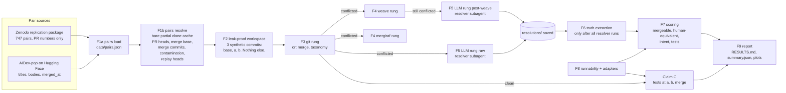
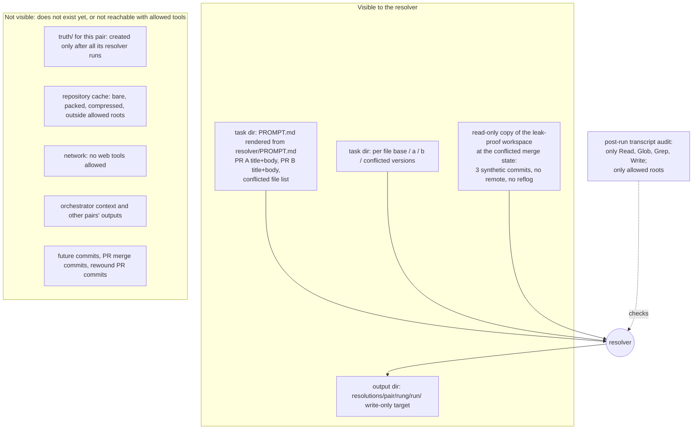

# PLAN

Status: v2, revised after the adversarial review in `PLAN_REVIEW.md`. The section
"Revisions after review" at the end lists every change from v1.

## 1. Claims, restated, with falsifiers

**Claim A (the ladder).** When two concurrent agent PRs conflict textually, free
structural merge drivers (weave, mergiraf) resolve most of the conflicts, and an LLM
given both PRs resolves most of what is left. "Resolve" means: the merged content of
every conflicted file is equivalent to what the human maintainers actually merged.

- *Holds* (fixed rule): structural-or-LLM produces a human-equivalent resolution for
  >= 90% of conflicting pairs that have a located human resolution.
- *Falsified*: that share is < 90%. The point estimate decides; the Wilson interval is
  always printed next to it so the reader can see how much the verdict depends on n.
- *Also falsified in its first half* if structural drivers do not resolve a majority
  of conflicting pairs (resolved = mergeable, then separately human-equivalent).

**Claim B (silent intent loss).** LLM resolutions often pass the combined test suite
while dropping a change one of the two PRs made, because agent-written tests are weak.

- *Holds* (fixed rule): the LLM drops at least one side's intent in >= 15% of
  conflicting pairs, or "tests pass AND intent dropped" occurs in >= 10% of conflicting
  pairs with a runnable test suite.
- *Falsified*: both rates below their thresholds.
- Intent is computed per PR against the base and the PR's own head, never against the
  human resolution, so Claim B has a larger denominator than Claim A.

**Claim C (passes alone, fails together).** Among concurrent agent PR pairs that
merge with no textual conflict, some fraction fails the combined test suite although
each PR passes alone.

- Not a hypothesis test: reported as a rate with a Wilson 95% interval and the
  denominator. Compared against the human-team base rate (about 1% small teams, up to
  12.5% large teams). If at or above it, the report notes that a merge queue already
  catches these and only automatic repair remains open.
- *Falsified as a "problem worth solving"* if the rate is 0 with an upper bound below 1%.

## 2. Pipeline

What a resolver subagent can and cannot see:

## 3. Features in build order

The spec's list is kept with three changes, each with a reason:

| # | Feature | Change vs. spec and reason |
|---|---------|----------------------------|
| F0 | Skeleton and shared contracts: `pyproject.toml`, CLI entry point, pydantic schemas for every artifact, path layout, git subprocess helper | Added. Parallel implementation lanes need one fixed contract, or every lane invents its own schema. Written by the main model. |
| P1 | Fixture repository (`fixtures/make-fixture.py`) | Spec Phase 1. Extended with an emulated GitHub origin (refs/pull/N/head, squash-merge commits with `(#N)` subjects and merged_at timestamps) and two extra scenarios (8: contaminated head that must be rewound; 9: clean control). Reason: reconnaissance showed 17 of 18 real both-merged conflicting pairs have a contaminated final head (see section 5.1). |
| F1a | Pair loader: `ladder pairs load` | Split from F1. Offline, reads vendored source extracts. |
| F1b | Ref resolution: `ladder pairs resolve` | Split from F1. Network-heavy: clone cache, PR heads, merge base, merge commits, contamination, replay heads. Separate because its failure modes (deleted refs, force pushes, rebases) are different data. |
| F2 | Leak-proof workspace | as spec |
| F3 | Git rung and taxonomy | as spec; runs on final heads (reconciliation) and on replay heads (evaluation) |
| F4 | Structural rungs (weave, mergiraf) | as spec |
| F5 | LLM rung protocol: prepare, guard, audit, ingest | as spec; the orchestrator spawns the subagent between `prepare` and `finalize` |
| F6 | Ground truth | as spec, with the truth commit rule in section 5.1 |
| F7 | Scoring (incl. tree-sitter equivalence and entity extraction) | as spec |
| F8 | Runnability classifier, test adapters, Claim C runner | as spec; Claim C runner lives here because it only composes adapters |
| F9 | Report and plots | as spec |
| S | Supplementary both-merged sample from AIDev | Added, cut second. The paper's set has only 23 conflicting pairs where both PRs merged, and after rewinding only about 6 of them still conflict, so Claim A has no usable denominator without it. Selection rule fixed in `DECISIONS.md` before any result is seen. |

## 4. Acceptance e2e test per feature (one sentence each)

All tests live in `e2e/`, run with `just e2e`, invoke the real `ladder` CLI as a
subprocess against real git repositories on disk, and assert only on exit codes,
files, JSON contents and numbers.

- **P1** `just fixture` run twice into two directories yields identical commit hashes for every ref, and every scenario's designed git outcome holds.
- **F1a** `ladder pairs load` on the vendored sources writes a schema-valid `pairs.json` with 747 pairs and prints per-stratum conflict counts 119/601 and 48/115 and type counts 952/442/249 that match the paper.
- **F1b** `ladder pairs resolve` on the fixture origin records head SHAs, merge base and merge commits equal to the fixture's ground truth, and rewinds scenario 8's contaminated head to the pre-absorption commit.
- **F2** `ladder workspace build fx01` yields a repo where `git rev-list --all` has exactly 3 commits, every stored object is reachable from them, `git remote -v` is empty, `objects/info/alternates`, `FETCH_HEAD` and `logs/` are absent, and `git log --all -p` plus a grep of the tree for the human-resolution marker string find nothing.
- **F3** `ladder rung git` on every fixture scenario reproduces the expected clean/conflicted status, conflicted paths and conflict types.
- **F4** `ladder rung structural --tool weave|mergiraf` resolves scenario 1 with parseable output under both drivers and leaves scenario 3 conflicted under both.
- **F5** `ladder resolve finalize` ingests a recorded real resolver run for scenario 3 whose output is AST-equivalent to `resolved/3`, records a recorded transcript containing an out-of-root Read as `protocol_violation`, and `ladder resolve prepare` exits non-zero on a workspace with an extra ref.
- **F6** `ladder truth extract fx03` yields content equal to `resolved/3`, and fails loudly when run before that pair's resolver outputs exist.
- **F7** `ladder score` marks scenario 7's trap as tests-pass and intent-dropped with B as the loser, and scenario 1's structural resolution as human-equivalent and intent-preserved for both sides.
- **F8** `ladder runnable` classifies the fixture as runnable with a passing suite at base and a deliberately broken copy as build-fails.
- **F9** `ladder report` on fixture results writes `RESULTS.md` and `summary.json` whose numbers equal the expected outcomes table.
- **S** `ladder pairs sample-supplementary` on a vendored candidate list is deterministic for a fixed seed.

## 5. Definitions

### 5.1 Pairs, heads, truth

- **Pair id**: `<owner>__<repo>__<prA>-<prB>`; fixture pairs are `fx01`..`fx09`.
  PR A is the paper's `prA`, PR B its `prB`. The merge is always "b into a".
- **Final head**: `refs/pull/N/head` at fetch time (SHA and fetch time recorded).
- **Contamination**: PR L's final head is contaminated by PR F if F was merged at time
  T_F and L's final head reaches (a) F's located merge commit, or (b) any commit on the
  default branch's first-parent chain whose committer time is >= T_F - 5 s. Either way
  L's head already contains a resolution of F vs. L. (First-parent chain, because a
  true-merged PR's own commits are reachable from the default branch through the second
  parent of its merge commit and must not count.)
- **Replay head**: the final head if not contaminated; otherwise the first commit on
  L's first-parent chain that is not contaminated. If that commit lies on the default
  branch's first-parent chain (the PR was rebased, so no pre-absorption PR commit exists,
  or main was the first parent of the absorbing merge), the pair is "unrecoverable:
  rebased after the other PR merged" and leaves the ladder set with that reason.
- **Base**: `git merge-base replay_head_a replay_head_b`. If more than one merge base
  exists the pair is flagged `criss_cross` and the first is used.
- **Ladder set**: pairs whose replay heads conflict under the git rung, drawn from all
  747 paper pairs (not only the paper's CONFLICT rows: rewinding can turn a paper-CLEAN
  pair into a real conflict) plus the supplementary sample S. The report prints the
  transition table paper label x final-head label x replay-head label.
- **Truth commit** (only when both PRs merged): let S be the PR merged second.
  If S's head was rewound, the truth commit is the absorption commit (the child of
  the replay head on S's first-parent chain; it is where the resolution was made).
  Otherwise it is S's merge commit on the default branch, located by (1) a default-
  branch commit with S's final head as a parent, else (2) a default-branch commit with
  committer time within 5 s of S's merged_at and `#<S>` in its subject, else (3) a
  unique default-branch commit with committer time within 5 s. The method is recorded.
  None found: "truth unlocated". The replay study used neither option (it never looked
  at merge commits); this choice is recorded in `DECISIONS.md`.
- **Truth content**: for each conflicted path, the blob at the truth commit, or
  "absent".
- **Truth is a rewrite** if either: (a) some file that A or B changed and that git
  merged cleanly has different content at the truth commit than in git's clean merge
  (the human touched files beyond the conflicted set), or (b) in some conflicted file
  the truth does not contain git's non-conflicting context chunks in order (the human
  edited outside the conflict regions). Human-equivalence is reported with and
  without rewrite pairs.

### 5.2 Rungs

- **git**: `git merge --no-edit b` on a fresh copy of the workspace, ort strategy,
  `merge.conflictStyle=diff3`, isolated git config. Records clean/conflicted, the
  conflicted paths, one type per `CONFLICT (<type>)` message (the paper's unit), and
  the marker-region count per file.
- **weave**, **mergiraf**: each on its own fresh copy, configured as a merge driver for
  every path, same merge command. Not chained.
- **llm-raw**: resolver subagent given git's conflicted state.
- **llm-post-weave**: resolver subagent given weave's partially resolved state, only for
  pairs weave leaves conflicted. If weave's output for the pair is byte-identical to
  git's, the raw run is reused and flagged `identical_input`.
- **trap** (fixture scenario 7 only): the planted wrong resolution, scored like a rung.

### 5.3 Scores (per rung output, per conflicting pair)

All text is normalized to LF line endings before any comparison.

1. **Mergeable**: no conflict markers (`<<<<<<<`, `=======` as a full line between
   markers, `>>>>>>>`) remain, every resolved file whose language has a tree-sitter
   pack parses with no ERROR or MISSING node, and no definition name appears more often
   in the resolution than in the base, A or B (catches "both sides concatenated").
   Files without a pack are checked for markers only and flagged `token_mode`.
2. **Human-equivalent** (pairs with a located truth): for every conflicted path, the
   resolution and the truth are both absent, or both present and AST-equivalent.
   AST-equivalent = equal normalized trees: tree-sitter parse, drop comment nodes,
   serialize as nested `(type children...)` with leaf text, so whitespace and comments
   never matter but string contents do. Without a pack: equal whitespace-split token
   sequences, flagged `token_mode`. Per-file similarity = `difflib.SequenceMatcher`
   ratio over the normalized token sequence, so near misses are visible.
   Secondary, reported beside it and never used by a decision rule: **human-equivalent
   up to definition order** (equal multisets of normalized top-level entities and equal
   normalized remainder outside entities).
3. **Intent preserved** (never uses the truth): entities = functions, classes, methods
   and other named top-level definitions, keyed by (path, qualified name); a file
   without a pack is one entity. For each conflicted path, compare base, A, B and the
   resolution:
   - changed only by A: the resolution's entity must be AST-equivalent to A's (absent
     if A deleted it). Symmetric for B.
   - changed by both and A's version equals B's: the resolution must equal it.
   - changed by both otherwise: violation if the resolution equals the base; violation
     if it equals exactly one side's version and the other side's change is not
     contained in the resolved state. Contained = every normalized statement line that
     the other side added to that entity (multiset difference vs. base) appears among
     the normalized lines of the resolved files.
   - Any violation = "intent dropped", recorded with path, entity and the losing PR,
     and whether the loser's change also touched files that are not conflicted (the
     resolver cannot write those; such drops are counted separately).
4. **Tests** (runnable repos only): full suite on the resolved state; then only the test
   files A added or modified, then only those B added or modified. Pass/fail counts.
   A failing run is re-run once; pass on retry = flaky, excluded from test metrics
   with the reason.
5. **Claim B cell**: tests pass AND intent dropped.

### 5.4 Ladder summaries

- **Practical ladder** (the Claim A decision metric): climb only while the output is
  not mergeable: git -> weave -> mergiraf -> llm-post-weave. The first mergeable output
  is accepted; the pair counts toward Claim A's 90% rule if that output is
  human-equivalent. LLM failures count as not resolved.
- **Oracle ladder**: climb while the output is not human-equivalent
  (git -> weave -> mergiraf -> llm-raw). Upper bound on what the ladder can deliver.
- Every rate: numerator/denominator, percentage, Wilson 95% interval.
- Every ladder metric is also broken down by file category (the paper's: source code,
  config and CI, manifest and lockfile, docs and text, other), by agent pair, and for the
  both-merged subset against the whole ladder set (to show selection bias).
- "Mergeable but not human-equivalent" is printed for every rung.
- LLM failures are shown by cause (input above cap, protocol violation, no output).
- Sensitivity cuts: without rewrite-truth pairs; without pairs whose PR text mentions
  conflicts, rebases or merging the default branch.

### 5.5 Claim C

Pairs clean at replay heads, in runnable repositories: run the suite at A, at B and at
the clean merge. "Fails together" = A passes, B passes, merge fails, after the flaky
rule. Report the rate, interval, denominator, and for each positive the failing tests
and the files each PR touched.

### 5.6 Resolver variance and calibration

- Variance: 30 conflicting pairs drawn with seed 42; llm-raw run twice; agreement =
  every conflicted file AST-equivalent between the runs.
- Calibration: the main model reads 20 random "intent dropped" and 20 random
  "human-equivalent" verdicts (seed 42) and records agree/disagree with a reason.

## 6. Cut order (if work must be dropped)

1. Claim C.
2. Supplementary sample S (stop at whatever size is done; never below what is already
   resolved and scored).
3. The mergiraf rung (weave is kept).
4. The resolver double run.
5. Calibration sample size, never below 10 each.

Never cut: the fixture, the leak-proof workspace, the git rung reconciliation, the
LLM rung, the intent-dropped metric, the honesty requirements.

## 7. Assumptions not yet verified

1. Every conflicted file of interest can be fetched from GitHub through the git proxy
   (`refs/pull/N/head` still exists for most pairs).
2. AIDev's `merged_at` is the time GitHub recorded and equals the merge commit's
   committer time within seconds.
3. PRs target the default branch.
4. A PR's own commits sit on its first-parent chain from the final head.
5. The resolver subagent follows the tool and path rules; the post-run transcript audit
   can detect it when it does not.
6. weave and mergiraf release binaries install from npm and crates.io in this
   environment; their output is deterministic for a pinned version.
7. tree-sitter official packs cover the bulk of conflicted source files by extension.
8. Node, Python and Go suites can be installed from public registries without secrets
   for a non-trivial fraction of repositories.
9. The orchestrator's subagent runs expose duration and token counts.
10. The fixture's hashes are stable across git versions (no signing, fixed dates).

## 8. Resolver audit rules (pre-registered)

- Allowed tools: Read, Glob, Grep, Write, and the hand-back call that ends the run.
  Anything else (Bash, WebFetch, WebSearch, Edit, NotebookEdit, Agent, ...) is a hard
  violation.
- Read, Glob and Grep must name a path inside the run's task directory or its workspace
  snapshot; a missing path argument or any other path is a hard violation.
- Write must target the run's output directory.
- The first user message of the transcript must equal the fixed spawn line.
- A hard violation records the run as "LLM: failed (protocol violation)". It is never
  re-run.

## Revisions after review

1. F2 acceptance also checks object reachability, alternates, FETCH_HEAD and reflogs.
2. Out-of-root reads by the resolver are hard violations (cross-pair leakage in the same
   repository); the audit also checks the spawn line (section 8).
3. Ladder set is defined at replay heads over all 747 pairs, with a transition table.
4. Supplementary sample S moved from cut-first to cut-second.
5. Claim A decision metric fixed to the practical ladder; oracle ladder is an upper bound.
6. Added: LF normalization, definition-order-insensitive secondary metric, breakdowns by
   file category and agent pair, both-merged selection-bias table, cap-failure counts,
   PR-text sensitivity cut, out-of-conflict-file intent drops.
7. Rewind requires a walk through PR-own commits; otherwise unrecoverable.
8. Post-hoc leak audit: no workspace side tree may equal its truth tree.
9. Reconciliation classifies each disagreement with the paper rather than reporting a
   net rate.
10. (Found while reviewing the fixture.) Contamination rule (b) and the unrecoverable
    test use the default branch's first-parent chain, not reachability from it.
