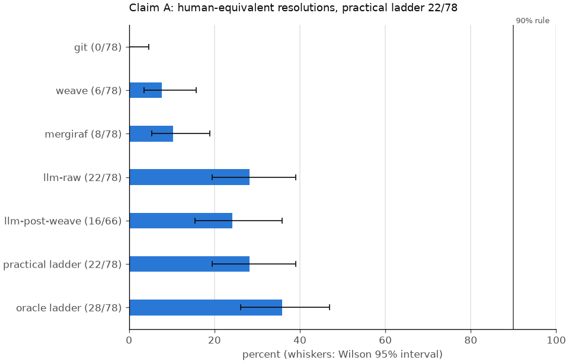
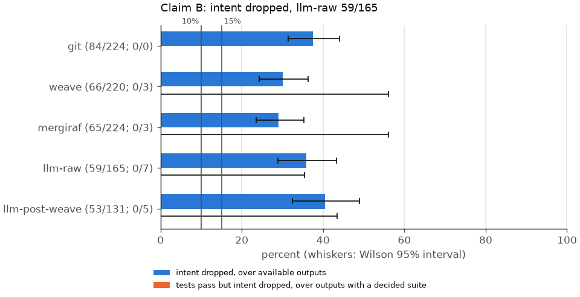
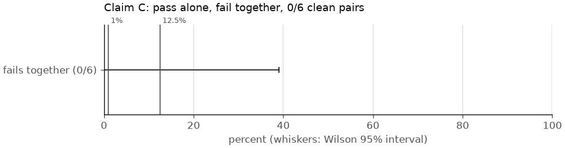

# Ladder results

Claim A is falsified: the practical ladder's accepted output was human-equivalent for 22/78 (28.2%, 95% CI [19.4%, 39.0%]) conflicting pairs with a located human resolution, below the 90% threshold. Claim A at its best-case bound (D20, D21) is falsified: counting every pair with an LLM run that failed only for reading its own output or for a cut-off transcript as human-equivalent, the practical ladder is human-equivalent on at most 31/78 (39.7%, 95% CI [29.6%, 50.8%]) conflicting pairs with a located human resolution, below the 90% threshold. Claim B holds on intent dropped: llm-raw outputs had intent dropped in 59/165 (35.8%, 95% CI [28.8%, 43.3%]), at or above 15%; tests pass but intent dropped in 0/7 (0.0%, 95% CI [0.0%, 35.4%]), below 10%. Calibration: the reviewer agreed with 0/6 (0.0%, 95% CI [0.0%, 39.0%]) intent-dropped verdicts on LLM outputs; if the metric's precision were the interval's upper end, llm-raw intent dropped would be 14.0%, below the 15% threshold, so calibration does not support this verdict. Claim C: 0/6 (0.0%, 95% CI [0.0%, 39.0%]) clean pairs pass alone and fail together, below the 1% human small-team base rate. With 6 decided pairs the interval reaches 39.0%, which covers the human base rates (1% for small teams, up to 12.5% for large ones), so the rate cannot be told apart from them.

Pairs attempted: 1249. Conflicting at replay heads (the ladder set): 224. Ladder pairs with a located human resolution: 78. Every rate is k/n (percent, Wilson 95% interval); decision rules are the pre-registered ones in PLAN.md section 1.

## Ladder

| rung | available | mergeable | human-equivalent | human-equivalent up to order | intent preserved both | intent dropped | tests pass | tests pass but intent dropped |
| --- | --- | --- | --- | --- | --- | --- | --- | --- |
| git | 224/224 (100.0%, [98.3%, 100.0%]) | 0/224 (0.0%, [0.0%, 1.7%]) | 0/78 (0.0%, [0.0%, 4.7%]) | 0/78 (0.0%, [0.0%, 4.7%]) | 140/224 (62.5%, [56.0%, 68.6%]) | 84/224 (37.5%, [31.4%, 44.0%]) | 0/0 (-) | 0/0 (-) |
| weave | 220/224 (98.2%, [95.5%, 99.3%]) | 31/224 (13.8%, [9.9%, 19.0%]) | 6/78 (7.7%, [3.6%, 15.8%]) | 6/78 (7.7%, [3.6%, 15.8%]) | 154/220 (70.0%, [63.6%, 75.7%]) | 66/220 (30.0%, [24.3%, 36.4%]) | 2/3 (66.7%, [20.8%, 93.9%]) | 0/3 (0.0%, [0.0%, 56.2%]) |
| mergiraf | 224/224 (100.0%, [98.3%, 100.0%]) | 42/224 (18.8%, [14.2%, 24.4%]) | 8/78 (10.3%, [5.3%, 19.0%]) | 9/78 (11.5%, [6.2%, 20.5%]) | 159/224 (71.0%, [64.7%, 76.5%]) | 65/224 (29.0%, [23.5%, 35.3%]) | 2/3 (66.7%, [20.8%, 93.9%]) | 0/3 (0.0%, [0.0%, 56.2%]) |
| llm-raw | 165/224 (73.7%, [67.5%, 79.0%]) | 158/224 (70.5%, [64.3%, 76.1%]) | 22/78 (28.2%, [19.4%, 39.0%]) | 22/78 (28.2%, [19.4%, 39.0%]) | 106/165 (64.2%, [56.7%, 71.2%]) | 59/165 (35.8%, [28.8%, 43.3%]) | 4/7 (57.1%, [25.0%, 84.2%]) | 0/7 (0.0%, [0.0%, 35.4%]) |
| llm-post-weave | 131/185 (70.8%, [63.9%, 76.9%]) | 124/185 (67.0%, [60.0%, 73.4%]) | 16/66 (24.2%, [15.5%, 35.8%]) | 16/66 (24.2%, [15.5%, 35.8%]) | 78/131 (59.5%, [51.0%, 67.6%]) | 53/131 (40.5%, [32.4%, 49.0%]) | 3/5 (60.0%, [23.1%, 88.2%]) | 0/5 (0.0%, [0.0%, 43.4%]) |

Each cell is k/n (percent, Wilson 95% interval). Available and mergeable are over the pairs a rung applies to: the ladder set for git, weave and mergiraf; ladder pairs whose resolver plan includes the rung for the LLM rungs; pairs with a planted trap for trap. Human-equivalent columns are over those pairs with a located human resolution. Intent columns are over available outputs. Test columns are over available outputs whose full suite passed or failed (flaky, capped, errored and not-run suites are excluded).

| rung | mergeable but not human-equivalent |
| --- | --- |
| git | 0/78 (0.0%, [0.0%, 4.7%]) |
| weave | 4/78 (5.1%, [2.0%, 12.5%]) |
| mergiraf | 13/78 (16.7%, [10.0%, 26.5%]) |
| llm-raw | 31/78 (39.7%, [29.6%, 50.8%]) |
| llm-post-weave | 30/66 (45.5%, [34.0%, 57.4%]) |

## Practical and oracle ladders

- Practical ladder (weave, mergiraf, then the LLM; first mergeable output accepted), human-equivalent: 22/78 (28.2%, [19.4%, 39.0%])
- Claim A best-case bound (D20, D21): the practical ladder's human-equivalent share when every pair with an LLM run that failed only for own output reads or a cut-off transcript also counts: 31/78 (39.7%, [29.6%, 50.8%])
- Practical ladder reaches a mergeable output: 165/224 (73.7%, [67.5%, 79.0%])
- Oracle ladder (any of git, weave, mergiraf, llm-raw, llm-post-weave human-equivalent): 28/78 (35.9%, [26.1%, 47.0%])
- Structural half (weave or mergiraf) mergeable over the ladder set: 57/224 (25.4%, [20.2%, 31.5%])
- Structural half human-equivalent over pairs with a located human resolution: 12/78 (15.4%, [9.0%, 25.0%])

| accepted at | pairs | human-equivalent |
| --- | ---: | ---: |
| weave | 10 | 6 |
| mergiraf | 12 | 6 |
| llm-post-weave | 36 | 8 |
| llm-raw | 3 | 2 |
| none | 17 | 0 |

## Conflict taxonomy

Over the git rung at replay heads.

### Conflict types

| type | CONFLICT messages |
| --- | ---: |
| content | 1220 |
| modify/delete | 459 |
| add/add | 176 |
| rename/delete | 12 |
| rename/rename | 6 |
| file location | 1 |

### Conflicted files by category

| category | conflicted files |
| --- | ---: |
| source | 1275 |
| manifest_lockfile | 377 |
| config_ci | 84 |
| other | 80 |
| docs_text | 58 |

### Agent pairs

| agent A / agent B | conflicting at replay heads |
| --- | --- |
| Copilot / Copilot | 67/459 (14.6%, [11.7%, 18.1%]) |
| OpenAI_Codex / OpenAI_Codex | 50/346 (14.5%, [11.1%, 18.5%]) |
| Devin / Devin | 37/118 (31.4%, [23.7%, 40.2%]) |
| Cursor / Cursor | 16/67 (23.9%, [15.3%, 35.3%]) |
| Claude_Code / Claude_Code | 6/26 (23.1%, [11.0%, 42.1%]) |
| OpenAI_Codex / Cursor | 15/25 (60.0%, [40.7%, 76.6%]) |
| OpenAI_Codex / Copilot | 3/17 (17.6%, [6.2%, 41.0%]) |
| Copilot / OpenAI_Codex | 4/15 (26.7%, [10.9%, 52.0%]) |
| Devin / OpenAI_Codex | 10/13 (76.9%, [49.7%, 91.8%]) |
| Cursor / OpenAI_Codex | 1/9 (11.1%, [2.0%, 43.5%]) |
| OpenAI_Codex / Devin | 3/9 (33.3%, [12.1%, 64.6%]) |
| OpenAI_Codex / Claude_Code | 4/7 (57.1%, [25.0%, 84.2%]) |
| Devin / Cursor | 0/6 (0.0%, [0.0%, 39.0%]) |
| Google_Jules / Google_Jules | 0/5 (0.0%, [0.0%, 43.4%]) |
| Claude_Code / Cursor | 2/4 (50.0%, [15.0%, 85.0%]) |
| Copilot / Claude_Code | 1/3 (33.3%, [6.1%, 79.2%]) |
| Copilot / Cursor | 1/3 (33.3%, [6.1%, 79.2%]) |
| Cursor / Copilot | 0/3 (0.0%, [0.0%, 56.2%]) |
| Claude_Code / Copilot | 2/2 (100.0%, [34.2%, 100.0%]) |
| Claude_Code / OpenAI_Codex | 1/2 (50.0%, [9.5%, 90.5%]) |
| Cursor / Claude_Code | 1/1 (100.0%, [20.7%, 100.0%]) |
| Cursor / Devin | 0/1 (0.0%, [0.0%, 79.3%]) |
| Devin / Claude_Code | 0/1 (0.0%, [0.0%, 79.3%]) |

## Reconciliation with the paper

Conflicting / (clean + conflicting); unavailable paper labels and git errors are excluded.

| stratum | paper | final heads | replay heads |
| --- | --- | --- | --- |
| same | 119/601 (19.8%, [16.8%, 23.2%]) | 218/1099 (19.8%, [17.6%, 22.3%]) | 176/1021 (17.2%, [15.0%, 19.7%]) |
| cross | 48/115 (41.7%, [33.1%, 50.9%]) | 52/126 (41.3%, [33.1%, 50.0%]) | 48/121 (39.7%, [31.4%, 48.6%]) |
| pool | 167/716 (23.3%, [20.4%, 26.6%]) | 270/1225 (22.0%, [19.8%, 24.4%]) | 224/1142 (19.6%, [17.4%, 22.0%]) |

### Transitions

| paper label | final heads | replay heads | pairs |
| --- | --- | --- | ---: |
| CLEAN | clean | absent | 15 |
| CLEAN | clean | clean | 525 |
| CLEAN | clean | conflicted | 9 |
| CONFLICT | clean | absent | 1 |
| CONFLICT | clean | clean | 6 |
| CONFLICT | conflicted | absent | 9 |
| CONFLICT | conflicted | clean | 7 |
| CONFLICT | conflicted | conflicted | 144 |
| UNAVAIL_fetch | absent | absent | 14 |
| UNAVAIL_fetch | clean | clean | 10 |
| UNAVAIL_fetch | conflicted | conflicted | 1 |
| UNAVAIL_nobase | absent | absent | 1 |
| UNAVAIL_nobase | clean | clean | 3 |
| UNAVAIL_nobase | conflicted | conflicted | 2 |
| absent | absent | absent | 9 |
| absent | clean | absent | 32 |
| absent | clean | clean | 334 |
| absent | clean | conflicted | 20 |
| absent | conflicted | absent | 26 |
| absent | conflicted | clean | 33 |
| absent | conflicted | conflicted | 48 |

## Resolve statuses

| resolve status | pairs |
| --- | ---: |
| fetch_failed | 23 |
| no_merge_base | 1 |
| ok | 1142 |
| unrecoverable_rebased | 83 |

| fact | pairs |
| --- | ---: |
| pairs with resolved refs | 1249 |
| contaminated (either head) | 409 |
| rewound (either head) | 409 |
| unrecoverable: rebased | 83 |
| truth commit located | 628 |
| truth commit not_both_merged | 527 |
| truth commit unlocated | 94 |
| ladder pairs with truth located | 78 |
| ladder pairs with truth not_both_merged | 138 |
| ladder pairs with truth unlocated | 8 |

## LLM failures

| cause | runs |
| --- | ---: |
| audit_impossible: transcript cut off | 4 |
| input_cap | 79 |
| protocol_violation: other | 2 |
| protocol_violation: own output reads only | 35 |

Protocol violations and impossible audits are split as D20 and D21 ask: `protocol_violation: own output reads only` when every violation is a Read, Grep or Glob outside the task directory whose path lies inside the run's own output directory; `audit_impossible: transcript cut off` when a transcript line is unparseable with `EOF while parsing`, which is what a transcript truncated mid-line looks like. A pair with a run that failed for either cause counts as human-equivalent in the Claim A best-case bound.

Planned resolver runs with no finalized record (not counting input-capped tasks and post-weave tasks that reused the raw run): 0.

## Resolver variance

Pairs where llm-raw runs 1 and 2 both finished ok; agreement means every conflicted file is AST-equivalent between the runs (deleted in both counts as equivalent). Agreement: 19/22 (86.4%, [66.7%, 95.3%]).

| pair | agree | differing files |
| --- | --- | --- |
| google-gemini__gemini-cli__3417-4286 | yes | - |
| azure-ai-foundry__foundry-samples__223-232 | yes | - |
| sam-goodwin__alchemy__239-253 | yes | - |
| OrchardCMS__OrchardCore__18179-18184 | yes | - |
| ant-design__ant-design__54316-54317 | yes | - |
| tokens-studio__figma-plugin__3360-3361 | yes | - |
| microsoft__AzureTRE__4551-4552 | yes | - |
| whitphx__stlite__1234-1245 | yes | - |
| Azure__awesome-azd__630-631 | yes | - |
| webgptorg__promptbook__274-276 | yes | - |
| livingbio__typed-ffmpeg__742-744 | no | src/ffmpeg/compile/compile_cli.py |
| microsoft__graphrag__1944-1956 | yes | - |
| neondatabase-labs__mcp-server-neon__41-51 | yes | - |
| Mail-0__Zero__1630-1665 | yes | - |
| sam-goodwin__alchemy__239-240 | yes | - |
| acoyfellow__UserDO__5-6 | no | bun.lock |
| kanisterio__kanister__3501-3505 | yes | - |
| oraios__serena__264-286 | yes | - |
| r-dbi__RPostgres__520-522 | yes | - |
| astronomer__airflow-ai-sdk__31-32 | yes | - |
| antiwork__shortest__349-352 | yes | - |
| rnwood__smtp4dev__1761-1763 | no | .github/copilot-instructions.md |

## Claim C: passes alone, fails together

Fails together: 0/6 (0.0%, [0.0%, 39.0%]), over Claim C records with a decided outcome (120 records in all).

Of 918 pairs that merge cleanly at replay heads (the Claim C pool), 120 were attempted in D19 order and 798 are `not attempted: cut`.

| excluded because | pairs |
| --- | ---: |
| a or b fails alone | 1 |
| capped | 1 |
| flaky | 1 |
| stopped at the free-disk floor | 2 |
| unrunnable: build_fails | 30 |
| unrunnable: exceeds_cap | 2 |
| unrunnable: missing_toolchain | 11 |
| unrunnable: needs_secrets | 1 |
| unrunnable: needs_services | 1 |
| unrunnable: other | 64 |

Merges that break dependency installation while A and B install are reported on their own, as D19 asks, and are not part of the rate: 0.

### Positive pairs

None.

## Runnability

| runnability | pairs |
| --- | ---: |
| runnable | 20 |
| runnable_with_modifications | 2 |
| unrunnable | 322 |
| unrunnable:build_fails | 78 |
| unrunnable:exceeds_cap | 13 |
| unrunnable:missing_toolchain | 29 |
| unrunnable:needs_secrets | 1 |
| unrunnable:needs_services | 1 |
| unrunnable:other | 200 |

### Runnable subset against the ladder set

Language is the one the runnability check detected; `unknown` when it was not run.

| characteristic | runnable ladder pairs | all ladder pairs |
| --- | ---: | ---: |
| pairs | 11 | 224 |
| language: cpp | 0 | 2 |
| language: csharp | 0 | 12 |
| language: dart | 0 | 2 |
| language: deno | 0 | 2 |
| language: elixir | 0 | 1 |
| language: go | 2 | 15 |
| language: java | 0 | 8 |
| language: node | 8 | 79 |
| language: php | 0 | 4 |
| language: python | 1 | 51 |
| language: ruby | 0 | 4 |
| language: rust | 0 | 6 |
| language: swift | 0 | 1 |
| language: unknown | 0 | 37 |
| conflicted files: 1 | 6 | 129 |
| conflicted files: 2-5 | 5 | 76 |
| conflicted files: 6 or more | 0 | 19 |
| conflicted files (total) | 16 | 1874 |

## Redone runs (D23)

Under D23, 122 records in 26 pairs whose test runs were stopped by the free-disk floor were deleted and run again once.

## Sensitivity cuts

| human-equivalent | all | without rewrite truth | without PR text about conflicts, rebases or merging |
| --- | --- | --- | --- |
| git | 0/78 (0.0%, [0.0%, 4.7%]) | 0/41 (0.0%, [0.0%, 8.6%]) | 0/71 (0.0%, [0.0%, 5.1%]) |
| weave | 6/78 (7.7%, [3.6%, 15.8%]) | 5/41 (12.2%, [5.3%, 25.5%]) | 5/71 (7.0%, [3.0%, 15.4%]) |
| mergiraf | 8/78 (10.3%, [5.3%, 19.0%]) | 5/41 (12.2%, [5.3%, 25.5%]) | 8/71 (11.3%, [5.8%, 20.7%]) |
| llm-raw | 22/78 (28.2%, [19.4%, 39.0%]) | 16/41 (39.0%, [25.7%, 54.3%]) | 18/71 (25.4%, [16.7%, 36.6%]) |
| llm-post-weave | 16/66 (24.2%, [15.5%, 35.8%]) | 12/35 (34.3%, [20.8%, 50.8%]) | 14/60 (23.3%, [14.4%, 35.4%]) |
| practical ladder | 22/78 (28.2%, [19.4%, 39.0%]) | 17/41 (41.5%, [27.8%, 56.6%]) | 20/71 (28.2%, [19.0%, 39.5%]) |
| oracle ladder | 28/78 (35.9%, [26.1%, 47.0%]) | 22/41 (53.7%, [38.7%, 67.9%]) | 23/71 (32.4%, [22.7%, 43.9%]) |

## By file category

Per conflicted file of available outputs. Human-equivalent is over files of pairs with a located human resolution; intent dropped counts files on which a drop was recorded.

### Human-equivalent files

| category | git | weave | mergiraf | llm-raw | llm-post-weave |
| --- | --- | --- | --- | --- | --- |
| source | 0/98 (0.0%, [0.0%, 3.8%]) | 6/98 (6.1%, [2.8%, 12.7%]) | 6/98 (6.1%, [2.8%, 12.7%]) | 21/43 (48.8%, [34.6%, 63.2%]) | 14/34 (41.2%, [26.4%, 57.8%]) |
| config_ci | 0/25 (0.0%, [0.0%, 13.3%]) | 3/24 (12.5%, [4.3%, 31.0%]) | 1/25 (4.0%, [0.7%, 19.5%]) | 2/9 (22.2%, [6.3%, 54.7%]) | 2/7 (28.6%, [8.2%, 64.1%]) |
| manifest_lockfile | 0/15 (0.0%, [0.0%, 20.4%]) | 2/14 (14.3%, [4.0%, 39.9%]) | 3/15 (20.0%, [7.0%, 45.2%]) | 0/0 (-) | 0/0 (-) |
| docs_text | 0/30 (0.0%, [0.0%, 11.4%]) | 0/30 (0.0%, [0.0%, 11.4%]) | 1/30 (3.3%, [0.6%, 16.7%]) | 16/24 (66.7%, [46.7%, 82.0%]) | 16/25 (64.0%, [44.5%, 79.8%]) |
| other | 10/16 (62.5%, [38.6%, 81.5%]) | 0/6 (0.0%, [0.0%, 39.0%]) | 10/16 (62.5%, [38.6%, 81.5%]) | 2/3 (66.7%, [20.8%, 93.9%]) | 2/3 (66.7%, [20.8%, 93.9%]) |

### Files with intent dropped

| category | git | weave | mergiraf | llm-raw | llm-post-weave |
| --- | --- | --- | --- | --- | --- |
| source | 770/1275 (60.4%, [57.7%, 63.0%]) | 741/1271 (58.3%, [55.6%, 61.0%]) | 671/1275 (52.6%, [49.9%, 55.4%]) | 64/181 (35.4%, [28.8%, 42.6%]) | 50/136 (36.8%, [29.1%, 45.1%]) |
| config_ci | 30/84 (35.7%, [26.3%, 46.4%]) | 6/82 (7.3%, [3.4%, 15.1%]) | 9/84 (10.7%, [5.7%, 19.1%]) | 9/29 (31.0%, [17.3%, 49.2%]) | 10/25 (40.0%, [23.4%, 59.3%]) |
| manifest_lockfile | 6/377 (1.6%, [0.7%, 3.4%]) | 3/372 (0.8%, [0.3%, 2.3%]) | 6/377 (1.6%, [0.7%, 3.4%]) | 2/15 (13.3%, [3.7%, 37.9%]) | 2/14 (14.3%, [4.0%, 39.9%]) |
| docs_text | 3/58 (5.2%, [1.8%, 14.1%]) | 3/58 (5.2%, [1.8%, 14.1%]) | 3/58 (5.2%, [1.8%, 14.1%]) | 9/45 (20.0%, [10.9%, 33.8%]) | 10/45 (22.2%, [12.5%, 36.3%]) |
| other | 11/80 (13.8%, [7.9%, 23.0%]) | 1/69 (1.4%, [0.3%, 7.8%]) | 11/80 (13.8%, [7.9%, 23.0%]) | 7/20 (35.0%, [18.1%, 56.7%]) | 5/16 (31.2%, [14.2%, 55.6%]) |

## Calibration

Seed 42, 40 verdicts read.

| metric | reviewer agrees |
| --- | --- |
| human_equivalent | 20/20 (100.0%, [83.9%, 100.0%]) |
| intent_dropped | 12/20 (60.0%, [38.7%, 78.1%]) |

Split by the rungs that produced the output, as D24 asks: LLM rungs are those whose name starts with `llm`; git and structural rungs are git, weave, mergiraf and the trap.

| metric | outputs | reviewer agrees |
| --- | --- | --- |
| human_equivalent | LLM rungs | 18/18 (100.0%, [82.4%, 100.0%]) |
| human_equivalent | git and structural rungs | 2/2 (100.0%, [34.2%, 100.0%]) |
| intent_dropped | LLM rungs | 0/6 (0.0%, [0.0%, 39.0%]) |
| intent_dropped | git and structural rungs | 12/14 (85.7%, [60.1%, 96.0%]) |

### Disagreements

| pair | rung | run | metric | harness verdict | note |
| --- | --- | ---: | --- | --- | --- |
| CapSoftware__Cap__571-574 | weave | 1 | intent_dropped | yes | False positive. Weave's output has B's Caps component verbatim and B's new imports. The only B change not in effect is a semicolon on 'metadata?: VideoMetadata;', inside one unresolved conflict in the VideoData type, plus a weave hint comment. The output has markers and does not parse (score: parses false), so entity extraction cannot see Caps and reports B's version of Caps and <rest> as lost. Entity-level drops on conflicted, unparseable outputs can be artifacts. |
| Rello__analytics__517-518 | llm-post-weave | 1 | intent_dropped | yes | False positive. B's only change adds the guard rootListId !== 'section-favorites' to the parent-nesting condition. The output, which is A's file verbatim, has the same guard (lines 374-378), with 'if (' on its own line and A's new 'dataset-<type>-<parent>' id. B's added lines do not occur verbatim, so the line-containment check reports a loss, but B's intent is in the output. Line-level containment over-reports drops when the other side rewrote the same lines. |
| Rello__audioplayer__616-617 | llm-raw | 1 | intent_dropped | yes | Revised under the intent rubric (does the output lack the PR's behaviour change?). Both PRs made the same refactor, moving streaming into MusicService, in two competing ways: A with AudioStreamResponse, B with AudioStream->start(). The output keeps A's. B's exact lines are gone, but no feature of B is lost; the merge picked one of two implementations of the same change. |
| Swofty-Developments__HypixelSkyBlock__509-511 | git | 1 | intent_dropped | yes | Revised under the intent rubric. The flagged paths are Gradle build-cache binaries (.gradle/8.7/*.bin, *.lock) that both PRs committed by accident. Git keeps A's copies, so B's bytes are absent, but no PR intent is carried by build caches. |
| acoyfellow__UserDO__5-6 | llm-raw | 2 | intent_dropped | yes | False positive under the intent rubric. A adds a try block to /logout that decodes the token and calls the DO's logout(). The output, B's file verbatim, already has the same thing in B's own words (tokenParts check, getMyAppDO(...).logout()). A's exact lines are absent, so line containment flags a drop, but A's behaviour is in the output. |
| hyperlight-dev__hyperlight__510-512 | llm-raw | 1 | intent_dropped | yes | False positive. The output is B's copilot-instructions.md verbatim, and B already contains A's additions. 8 of A's 10 added lines are there exactly. The other 2 are there with B's typo fixes: the docs/github-labels.md path instead of A's 'docs\\github-labels,md', and a trailing period. Exact line matching misses near-identical lines, but A's intent is fully present. |
| vercel__hyper-site__314-315 | llm-post-weave | 1 | intent_dropped | yes | Competing implementations of the same change. Both PRs moved the site to Next.js's app router. The output keeps B's layout.js and page.js: full metadata, SearchProvider, GoogleTagManager with GA_TRACKING_ID, and a home page that refetches releases with revalidate 60*60*24. A's versions (a Providers wrapper, a gtag Script, and a page re-exporting pages/index with revalidate 60*60*24) are absent line for line. But every behaviour A's versions provide (analytics, daily regeneration, the home page) is in B's. No feature of A is lost. |
| whitphx__stlite__1234-1245 | llm-raw | 2 | intent_dropped | yes | False positive; the resolver combined both intents. B adds packages/browser/package.json with '@streamlit/app': '1.41.0'. A changed '@streamlit/app' from '1.41.0' to '*' in every other package (desktop, kernel, mountable, sharing). The output keeps B's new file but applies A's '*' convention to it, which is the right merge. The harness compares only with B's version of a file only B touched, so it reports B's version as lost. |

## Every pair attempted

| pair | resolve | git final -> replay | rungs with output | truth | runnability | outcome | blocker |
| --- | --- | --- | --- | --- | --- | --- | --- |
| reeze__php-leveldb__52-54 | ok | clean -> clean | - | - | - | clean | Claim C not attempted: cut |
| RSamaium__CanvasEngine__40-46 | ok | conflicted -> conflicted | git, weave, mergiraf, llm-raw | not_both_merged | runnable | weave: mergeable | truth not_both_merged |
| OpenSprinkler__OpenSprinkler-App__250-251 | ok | clean -> clean | - | - | unrunnable: build_fails | clean | Claim C excluded: unrunnable: build_fails (test runner produced no results at base: 0 passed, 0 failed, 0 errors, 0 skipped; runner exited 1 without a readable report; output tail: 14)     at Module._compile (node:internal/modules/cjs/loader:1706:14)     at Object..js (node:internal/modules/cjs/loader:1839:10)     at Module.load (node:internal/modules/cjs/loader:1441:32)     at Function._load (node:internal/modules/cjs/loader:1263:12)     at TracingChannel.traceSync (node:diagnostics_channel:328:14)     at wrapModuleLoad (node:internal/modules/cjs/loader:237:24)     at cjsLoader (node:internal/modules/esm/translators:309:5)     at ModuleWrap.<anonymous> (node:internal/modules) |
| bmander__graphserver__32-34 | ok | clean -> clean | - | - | unrunnable: other | clean | Claim C excluded: unrunnable: other (no recognised project manifest) |
| rsyslog__rsyslog__5688-5793 | ok | conflicted -> conflicted | git, weave, mergiraf, llm-raw, llm-post-weave | not_both_merged | unrunnable: other | no rung mergeable | truth not_both_merged |
| EduMIPS64__edumips64__1364-1378 | ok | clean -> clean | - | - | - | clean | Claim C not attempted: cut |
| devitocodes__devito__2625-2682 | ok | clean -> clean | - | - | - | clean | Claim C not attempted: cut |
| vercel__vercel__13444-13578 | ok | clean -> clean | - | - | - | clean | Claim C not attempted: cut |
| bcherny__json-schema-to-typescript__658-663 | ok | clean -> clean | - | - | - | clean | Claim C not attempted: cut |
| sakaiproject__sakai__13751-13874 | ok | clean -> clean | - | - | - | clean | Claim C not attempted: cut |
| benwbrum__fromthepage__4696-4750 | ok | clean -> clean | - | - | unrunnable: other | clean | Claim C excluded: unrunnable: other (ruby project; no adapter for ruby (bundle is installed)) |
| vercel__hyper-site__314-315 | ok | conflicted -> conflicted | git, weave, mergiraf, llm-raw, llm-post-weave | not_both_merged | unrunnable: other | llm-post-weave: mergeable | truth not_both_merged |
| OHIF__Viewers__4958-5097 | ok | conflicted -> conflicted | git, weave, mergiraf, llm-raw | not_both_merged | unrunnable: other | weave: mergeable | truth not_both_merged |
| pytorch__pytorch__155658-157447 | ok | clean -> clean | - | - | - | clean | Claim C not attempted: cut |
| elsa-workflows__elsa-core__6669-6675 | ok | clean -> clean | - | - | - | clean | Claim C not attempted: cut |
| shopware__shopware__10496-11072 | ok | conflicted -> conflicted | git, weave, mergiraf, llm-raw, llm-post-weave | not_both_merged | unrunnable: other | llm-post-weave: mergeable | truth not_both_merged |
| superfly__flyctl__4456-4463 | ok | conflicted -> conflicted | git, weave, mergiraf, llm-raw | not_both_merged | runnable | weave: mergeable | truth not_both_merged |
| go-vikunja__vikunja__945-1154 | ok | clean -> clean | - | - | - | clean | Claim C not attempted: cut |
| ray-project__ray__53690-54238 | ok | clean -> clean | - | - | - | clean | Claim C not attempted: cut |
| mautic__mautic__15078-15249 | ok | conflicted -> conflicted | git, weave, mergiraf, llm-raw, llm-post-weave | not_both_merged | unrunnable: other | llm-post-weave: mergeable | truth not_both_merged |
| celestiaorg__celestia-core__1902-2046 | ok | clean -> clean | - | - | - | clean | Claim C not attempted: cut |
| Rello__analytics__517-518 | ok | conflicted -> conflicted | git, weave, mergiraf, llm-post-weave | located (rewrite) | unrunnable: other | llm-post-weave: not human-equivalent | - |
| gofiber__fiber__3508-3582 | ok | clean -> clean | - | - | - | clean | Claim C not attempted: cut |
| yytypescript__book__981-987 | ok | clean -> clean | - | - | - | clean | Claim C not attempted: cut |
| kingstinct__react-native-healthkit__183-184 | ok | clean -> clean | - | - | - | clean | Claim C not attempted: cut |
| specmatic__specmatic__1924-1947 | ok | clean -> clean | - | - | - | clean | Claim C not attempted: cut |
| nrwl__nx__31591-32088 | ok | clean -> clean | - | - | unrunnable: build_fails | clean | Claim C excluded: unrunnable: build_fails (suite does not load at base: 827 errors) |
| tokens-studio__figma-plugin__3366-3391 | ok | conflicted -> conflicted | git, weave, mergiraf, llm-raw | not_both_merged | unrunnable: other | weave: mergeable | truth not_both_merged |
| microsoft__playwright__36050-36366 | ok | clean -> clean | - | - | - | clean | Claim C not attempted: cut |
| johnlindquist__kit__1589-1590 | ok | clean -> clean | - | - | - | clean | Claim C not attempted: cut |
| huggingface__huggingface_hub__3106-3108 | ok | clean -> clean | - | - | - | clean | Claim C not attempted: cut |
| Skyscanner__turbolift__173-176 | ok | clean -> clean | - | - | - | clean | Claim C not attempted: cut |
| YunaiV__ruoyi-vue-pro__906-907 | ok | clean -> clean | - | - | unrunnable: other | clean | Claim C excluded: unrunnable: other (java project; no adapter for java (mvn is installed)) |
| tldraw__tldraw__6214-6284 | ok | clean -> clean | - | - | - | clean | Claim C not attempted: cut |
| mlflow__mlflow__16057-16442 | ok | conflicted -> conflicted | git, weave, mergiraf, llm-raw | not_both_merged | unrunnable: build_fails | weave: mergeable | truth not_both_merged |
| liveblocks__liveblocks__2522-2523 | ok | clean -> clean | - | - | - | clean | Claim C not attempted: cut |
| faros-ai__airbyte-connectors__2142-2143 | fetch_failed | absent -> absent | - | - | - | - | fetch_failed |
| novuhq__novu__8441-8443 | ok | clean -> clean | - | - | - | clean | Claim C not attempted: cut |
| onflow__flow-go__7551-7555 | ok | conflicted -> conflicted | git, weave, mergiraf | not_both_merged | unrunnable: exceeds_cap | no rung mergeable | truth not_both_merged |
| softmaple__softmaple__244-246 | ok | conflicted -> conflicted | git, weave, mergiraf, llm-raw, llm-post-weave | not_both_merged | unrunnable: other | llm-post-weave: mergeable | truth not_both_merged |
| ElectNewt__Distribt__44-48 | ok | clean -> clean | - | - | - | clean | Claim C not attempted: cut |
| skypilot-org__skypilot__5796-6067 | ok | clean -> clean | - | - | - | clean | Claim C not attempted: cut |
| airbytehq__airbyte__61490-61695 | ok | conflicted -> conflicted | git, weave, mergiraf, llm-raw | not_both_merged | unrunnable: other | weave: mergeable | truth not_both_merged |
| PRQL__prql__5286-5287 | ok | clean -> clean | - | - | runnable | clean | Claim C excluded: error at a: dependency manifests differ from base (prqlc/prqlc/Cargo.toml); installed again; install failed: build: stopped, free disk below the 3 GiB floor; error at merge: dependency manifests differ from base (prqlc/prqlc/Cargo.toml); installed again; install failed: build: stopped, free disk below the 3 GiB floor |
| manifoldmarkets__manifold__3582-3599 | ok | clean -> clean | - | - | unrunnable: other | clean | Claim C excluded: unrunnable: other (no jest, vitest or mocha test runner in package.json) |
| ar-io__ar-io-node__398-426 | ok | clean -> clean | - | - | - | clean | Claim C not attempted: cut |
| oven-sh__bun__19743-20217 | ok | clean -> clean | - | - | - | clean | Claim C not attempted: cut |
| odigos-io__odigos__2962-3049 | ok | conflicted -> conflicted | git, weave, mergiraf, llm-raw, llm-post-weave | not_both_merged | unrunnable: other | no rung mergeable | truth not_both_merged |
| openfga__openfga__2563-2565 | ok | conflicted -> conflicted | git, weave, mergiraf, llm-raw, llm-post-weave | not_both_merged | unrunnable: other | llm-post-weave: mergeable | truth not_both_merged |
| gtg922r__obsidian-numerals__100-102 | ok | clean -> clean | - | - | - | clean | Claim C not attempted: cut |
| jdx__mise__5638-5828 | unrecoverable_rebased | conflicted -> absent | - | - | - | - | unrecoverable_rebased |
| coder__coder__18587-18634 | ok | clean -> clean | - | - | - | clean | Claim C not attempted: cut |
| get-convex__convex-helpers__516-600 | ok | conflicted -> conflicted | git, weave, mergiraf | not_both_merged | runnable | no rung mergeable | truth not_both_merged |
| langbot-app__LangBot__1407-1514 | ok | clean -> clean | - | - | unrunnable: other | clean | Claim C excluded: unrunnable: other (suite fails at base: 1 failed, 0 errors) |
| risingwavelabs__risingwave__21925-22637 | ok | clean -> clean | - | - | - | clean | Claim C not attempted: cut |
| quarylabs__sqruff__1643-1664 | unrecoverable_rebased | conflicted -> absent | - | - | - | - | unrecoverable_rebased |
| formbricks__formbricks__6082-6085 | ok | clean -> clean | - | - | - | clean | Claim C not attempted: cut |
| elsa-workflows__elsa-studio__521-526 | ok | conflicted -> conflicted | git, weave, mergiraf, llm-raw | not_both_merged | unrunnable: missing_toolchain | no rung mergeable | truth not_both_merged |
| shiosyakeyakini-info__miria__750-764 | ok | conflicted -> conflicted | git, weave, mergiraf, llm-raw, llm-post-weave | not_both_merged | unrunnable: missing_toolchain | llm-post-weave: mergeable | truth not_both_merged |
| sgb-io__fta__236-237 | ok | clean -> clean | - | - | - | clean | Claim C not attempted: cut |
| microsoft__vscode__249711-252589 | ok | clean -> clean | - | - | - | clean | Claim C not attempted: cut |
| vllm-project__vllm__18317-19396 | ok | conflicted -> conflicted | git, weave, mergiraf, llm-raw, llm-post-weave | not_both_merged | unrunnable: build_fails | llm-post-weave: mergeable | truth not_both_merged |
| langfuse__langfuse__7352-7354 | ok | clean -> clean | - | - | - | clean | Claim C not attempted: cut |
| exa-labs__exa-py__81-99 | ok | conflicted -> conflicted | git, weave, mergiraf | not_both_merged | unrunnable: build_fails | no rung mergeable | truth not_both_merged |
| Sls0n__Prismify__39-42 | ok | conflicted -> conflicted | git, weave, mergiraf, llm-raw, llm-post-weave | located | unrunnable: other | mergiraf: not human-equivalent | - |
| 567-labs__instructor__1636-1650 | ok | clean -> clean | - | - | - | clean | Claim C not attempted: cut |
| Significant-Gravitas__AutoGPT__9958-10340 | ok | conflicted -> conflicted | git, weave, mergiraf, llm-raw, llm-post-weave | not_both_merged | unrunnable: other | no rung mergeable | truth not_both_merged |
| 514-labs__moose__2466-2499 | ok | clean -> clean | - | - | - | clean | Claim C not attempted: cut |
| selfxyz__self__727-755 | ok | conflicted -> conflicted | git, weave, mergiraf, llm-raw, llm-post-weave | not_both_merged | unrunnable: other | llm-post-weave: mergeable | truth not_both_merged |
| open-metadata__OpenMetadata__21940-22304 | ok | clean -> clean | - | - | - | clean | Claim C not attempted: cut |
| HumanSignal__label-studio__7687-7850 | ok | conflicted -> conflicted | git, weave, mergiraf, llm-raw, llm-post-weave | not_both_merged | unrunnable: build_fails | llm-post-weave: mergeable | truth not_both_merged |
| bruin-data__bruin__760-818 | ok | conflicted -> conflicted | git, weave, mergiraf, llm-raw, llm-post-weave | not_both_merged | unrunnable: exceeds_cap | llm-post-weave: mergeable | truth not_both_merged |
| promptfoo__promptfoo__2956-4050 | ok | conflicted -> conflicted | git, weave, mergiraf | not_both_merged | unrunnable: other | no rung mergeable | truth not_both_merged |
| different-ai__note-companion__406-407 | ok | clean -> clean | - | - | - | clean | Claim C not attempted: cut |
| assistant-ui__assistant-ui__2124-2125 | ok | clean -> clean | - | - | - | clean | Claim C not attempted: cut |
| estruyf__vscode-demo-time__147-157 | ok | conflicted -> conflicted | git, weave, mergiraf, llm-raw, llm-post-weave | not_both_merged | runnable | mergiraf: mergeable | truth not_both_merged |
| langfuse__langfuse-docs__1505-1535 | ok | conflicted -> conflicted | git, weave, mergiraf, llm-raw, llm-post-weave | not_both_merged | unrunnable: other | llm-post-weave: mergeable | truth not_both_merged |
| BerriAI__litellm__13110-13122 | ok | clean -> clean | - | - | - | clean | Claim C not attempted: cut |
| bruin-data__ingestr__251-299 | ok | conflicted -> conflicted | git, weave, mergiraf, llm-raw, llm-post-weave | not_both_merged | unrunnable: build_fails | llm-post-weave: mergeable | truth not_both_merged |
| unsend-dev__unsend__170-189 | ok | clean -> clean | - | - | - | clean | Claim C not attempted: cut |
| Helicone__helicone__3875-4046 | ok | clean -> clean | - | - | - | clean | Claim C not attempted: cut |
| moonbitlang__core__2267-2422 | ok | conflicted -> conflicted | git, weave, mergiraf, llm-raw, llm-post-weave | not_both_merged | unrunnable: other | llm-post-weave: mergeable | truth not_both_merged |
| AgentOps-AI__agentops__1064-1065 | ok | clean -> clean | - | - | runnable | clean, passes together | - |
| dcSpark__shinkai-local-ai-agents__901-902 | ok | clean -> clean | - | - | - | clean | Claim C not attempted: cut |
| MervinPraison__PraisonAI__984-1021 | ok | clean -> clean | - | - | - | clean | Claim C not attempted: cut |
| vltpkg__vltpkg__851-852 | ok | clean -> clean | - | - | - | clean | Claim C not attempted: cut |
| ai-shifu__ai-shifu__465-475 | ok | clean -> clean | - | - | unrunnable: other | clean | Claim C excluded: unrunnable: other (no recognised project manifest) |
| unclecode__crawl4ai__1124-1152 | ok | clean -> clean | - | - | - | clean | Claim C not attempted: cut |
| zuplo__zudoku__1114-1115 | ok | clean -> clean | - | - | - | clean | Claim C not attempted: cut |
| elizaOS__eliza__5565-5572 | ok | clean -> clean | - | - | - | clean | Claim C not attempted: cut |
| liam-hq__liam__1599-1610 | ok | clean -> clean | - | - | - | clean | Claim C not attempted: cut |
| giselles-ai__giselle__870-902 | ok | clean -> clean | - | - | - | clean | Claim C not attempted: cut |
| wvlet__wvlet__967-980 | ok | clean -> clean | - | - | unrunnable: other | clean | Claim C excluded: unrunnable: other (no jest, vitest or mocha test runner in package.json) |
| mendableai__firecrawl__1420-1742 | ok | clean -> clean | - | - | - | clean | Claim C not attempted: cut |
| aipotheosis-labs__aci__520-549 | ok | clean -> clean | - | - | - | clean | Claim C not attempted: cut |
| browser-use__browser-use__2159-2166 | ok | clean -> clean | - | - | - | clean | Claim C not attempted: cut |
| microsoft__fabric-cicd__342-343 | ok | clean -> clean | - | - | - | clean | Claim C not attempted: cut |
| CapSoftware__Cap__559-717 | ok | clean -> clean | - | - | - | clean | Claim C not attempted: cut |
| onlook-dev__onlook__1849-2041 | ok | conflicted -> conflicted | git, mergiraf | not_both_merged | unrunnable: other | no rung mergeable | truth not_both_merged |
| 567-labs__kura__69-75 | ok | conflicted -> conflicted | git, weave, mergiraf, llm-raw, llm-post-weave | not_both_merged | unrunnable: build_fails | llm-post-weave: mergeable | truth not_both_merged |
| different-ai__zero-finance__116-117 | ok | clean -> conflicted | git, weave, mergiraf, llm-raw, llm-post-weave | located (rewrite) | unrunnable: build_fails | llm-post-weave: not human-equivalent | - |
| berachain__beacon-kit__2840-2841 | ok | conflicted -> conflicted | git, weave, mergiraf, llm-raw, llm-post-weave | not_both_merged | unrunnable: build_fails | no rung mergeable | truth not_both_merged |
| willccbb__verifiers__147-160 | ok | conflicted -> conflicted | git, weave, mergiraf, llm-raw, llm-post-weave | not_both_merged | runnable | llm-post-weave: mergeable | truth not_both_merged |
| gensx-inc__gensx__736-766 | ok | conflicted -> conflicted | git, weave, mergiraf, llm-raw, llm-post-weave | not_both_merged | unrunnable: other | llm-post-weave: mergeable | truth not_both_merged |
| nodetool-ai__nodetool__86-157 | ok | conflicted -> conflicted | git, weave, mergiraf, llm-raw, llm-post-weave | not_both_merged | unrunnable: other | llm-post-weave: mergeable | truth not_both_merged |
| antiwork__flexile__394-584 | fetch_failed | absent -> absent | - | - | - | - | fetch_failed |
| codegen-sh__codegen__1164-1168 | ok | clean -> clean | - | - | - | clean | Claim C not attempted: cut |
| kodustech__kodus-ai__73-75 | ok | clean -> clean | - | - | - | clean | Claim C not attempted: cut |
| google-gemini__gemini-cli__3417-4286 | ok | conflicted -> conflicted | git, weave, mergiraf, llm-raw, llm-raw run 2, llm-post-weave | not_both_merged | unrunnable: other | llm-post-weave: mergeable | truth not_both_merged |
| theopenco__llmgateway__208-354 | ok | conflicted -> conflicted | git, weave, mergiraf | located (rewrite) | unrunnable: other | no rung mergeable | - |
| MCPJam__inspector__190-191 | ok | conflicted -> conflicted | git, weave, mergiraf | not_both_merged | unrunnable: other | no rung mergeable | truth not_both_merged |
| acoyfellow__UserDO__16-18 | ok | conflicted -> conflicted | git, weave, mergiraf, llm-raw, llm-post-weave | not_both_merged | unrunnable: other | llm-post-weave: mergeable | truth not_both_merged |
| voideditor__void__724-844 | ok | clean -> clean | - | - | - | clean | Claim C not attempted: cut |
| WorkflowAI__WorkflowAI__371-449 | ok | conflicted -> conflicted | git, weave, mergiraf, llm-raw, llm-post-weave | not_both_merged | unrunnable: exceeds_cap | llm-post-weave: mergeable | truth not_both_merged |
| openai__openai-agents-js__111-119 | ok | conflicted -> conflicted | git, weave, mergiraf, llm-raw, llm-post-weave | not_both_merged | unrunnable: other | llm-post-weave: mergeable | truth not_both_merged |
| djacobs__PyAPNs__216-217 | ok | conflicted -> conflicted | git, weave, mergiraf, llm-raw | not_both_merged | unrunnable: other | weave: mergeable | truth not_both_merged |
| pushpak1300__ai-chat__8-10 | ok | clean -> clean | - | - | - | clean | Claim C not attempted: cut |
| sst__opencode__371-1186 | ok | conflicted -> conflicted | git, weave, mergiraf, llm-raw | not_both_merged | unrunnable: other | no rung mergeable | truth not_both_merged |
| ryokun6__ryos__40-59 | ok | conflicted -> conflicted | git, weave, mergiraf, llm-raw, llm-post-weave | not_both_merged | unrunnable: other | llm-post-weave: mergeable | truth not_both_merged |
| azure-ai-foundry__foundry-samples__223-232 | ok | conflicted -> conflicted | git, weave, mergiraf, llm-raw, llm-raw run 2, llm-post-weave | not_both_merged | unrunnable: other | llm-post-weave: mergeable | truth not_both_merged |
| aavetis__PRarena__20-36 | ok | conflicted -> conflicted | git, weave, mergiraf, llm-raw, llm-post-weave | not_both_merged | unrunnable: other | llm-post-weave: mergeable | truth not_both_merged |
| amantus-ai__vibetunnel__134-165 | unrecoverable_rebased | conflicted -> absent | - | - | - | - | unrecoverable_rebased |
| sam-goodwin__alchemy__239-253 | ok | conflicted -> conflicted | git, weave, mergiraf, llm-raw, llm-raw run 2, llm-post-weave | not_both_merged | unrunnable: other | llm-post-weave: mergeable | truth not_both_merged |
| stefankoegl__python-json-patch__163-164 | ok | clean -> clean | - | - | - | clean | Claim C not attempted: cut |
| stefankoegl__python-json-pointer__65-66 | ok | conflicted -> conflicted | git, weave, mergiraf, llm-post-weave | not_both_merged | unrunnable: other | llm-post-weave: mergeable | truth not_both_merged |
| Kaljurand__K6nele__119-120 | ok | clean -> clean | - | - | unrunnable: other | clean | Claim C excluded: unrunnable: other (java project; no adapter for java (gradle is installed)) |
| opendocument-app__OpenDocument.droid__406-407 | ok | clean -> clean | - | - | - | clean | Claim C not attempted: cut |
| SirVer__ultisnips__1574-1575 | ok | clean -> clean | - | - | - | clean | Claim C not attempted: cut |
| propelorm__Propel2__2049-2050 | ok | clean -> clean | - | - | - | clean | Claim C not attempted: cut |
| middleman__middleman-blog__393-394 | ok | conflicted -> conflicted | git, weave, mergiraf, llm-raw, llm-post-weave | not_both_merged | unrunnable: other | llm-post-weave: mergeable | truth not_both_merged |
| mattiasw__ExifReader__526-527 | ok | clean -> clean | - | - | - | clean | Claim C not attempted: cut |
| traccar__traccar__5560-5568 | ok | clean -> clean | - | - | - | clean | Claim C not attempted: cut |
| JuliaLang__julia__58506-58542 | ok | clean -> clean | - | - | - | clean | Claim C not attempted: cut |
| GradleUp__shadow__1497-1500 | ok | clean -> clean | - | - | - | clean | Claim C not attempted: cut |
| liuyanghejerry__painttyWidget__79-80 | fetch_failed | absent -> absent | - | - | - | - | fetch_failed |
| cloudfoundry__cloud_controller_ng__4394-4442 | unrecoverable_rebased | clean -> absent | - | - | - | - | unrecoverable_rebased |
| nanvix__nanvix__706-707 | unrecoverable_rebased | clean -> absent | - | - | - | - | unrecoverable_rebased |
| pixijs__pixijs__11429-11430 | ok | clean -> clean | - | - | - | clean | Claim C not attempted: cut |
| nemtsov__json-mask__173-174 | ok | clean -> clean | - | - | - | clean | Claim C not attempted: cut |
| evandempsey__fp-growth__30-31 | ok | conflicted -> conflicted | git, weave, mergiraf, llm-raw, llm-post-weave | not_both_merged | unrunnable: build_fails | llm-raw: mergeable | truth not_both_merged |
| OpenSprinkler__OpenSprinkler-App__231-232 | ok | clean -> clean | - | - | - | clean | Claim C not attempted: cut |
| jdereg__json-io__385-386 | ok | clean -> clean | - | - | - | clean | Claim C not attempted: cut |
| OpenHFT__Java-Thread-Affinity__138-139 | ok | clean -> clean | - | - | - | clean | Claim C not attempted: cut |
| getsentry__sentry-javascript__16539-16553 | ok | clean -> clean | - | - | unrunnable: build_fails | clean | Claim C excluded: unrunnable: build_fails (install: exit 1 in 6.4 s:     at ClientRequest.emit (node:events:519:28) \|     at HTTPParser.parserOnIncomingClient (node:_http_client:772:27) \|     at HTTPParser.parserOnHeadersComplete (node:_http_common:122:17) \|     at TLSSocket.socketOnData (node:_http_client:614:22) \|     at TLSSocket.emit (node:events:519:28) \| info Visit https://yarnpkg.com/en/docs/cli/install for documentation about this command.) |
| EduMIPS64__edumips64__1360-1361 | ok | clean -> clean | - | - | - | clean | Claim C not attempted: cut |
| rsyslog__rsyslog__5656-5660 | ok | clean -> clean | - | - | - | clean | Claim C not attempted: cut |
| log4cplus__log4cplus__648-649 | ok | clean -> clean | - | - | - | clean | Claim C not attempted: cut |
| mnsami__composer-custom-directory-installer__36-37 | ok | clean -> clean | - | - | - | clean | Claim C not attempted: cut |
| jsforce__jsforce__1734-1735 | ok | clean -> clean | - | - | unrunnable: other | clean | Claim C excluded: unrunnable: other (suite fails at base: 0 failed, 18 errors) |
| FastLED__FastLED__1956-1957 | ok | clean -> clean | - | - | - | clean | Claim C not attempted: cut |
| effekseer__Effekseer__1043-1044 | ok | clean -> clean | - | - | unrunnable: other | clean | Claim C excluded: unrunnable: other (cpp project; no adapter for cpp (cmake is installed)) |
| getsentry__sentry__93127-93150 | ok | clean -> clean | - | - | unrunnable: build_fails | clean | Claim C excluded: unrunnable: build_fails (test runner produced no results at base: 0 passed, 0 failed, 0 errors, 0 skipped; runner exited 1 without a readable report; output tail: ggy/_callers.py", line 116, in _multicall     next(function_gen)  # first yield     ~~~~^^^^^^^^^^^^^^   File "/home/user/ladder/work/runtime/getsentry__sentry__93127-93150/envs/base/lib/python3.13/site-packages/_pytest/warnings.py", line 126, in pytest_load_initial_conftests     with catch_warnings_for_item(          ~~~~~~~~~~~~~~~~~~~~~~~^         config=early_config, ihook=early_config.hook, when="config", item=None         ^^^^^^^^^^^^^^^^^^^^^^^^^^^^^^^^^^^^^^^^^^^^^^^^^^^^^^^^^^^^^^^^^^^^^^ ) |
| mihneadb__node-directory-tree__131-132 | ok | clean -> clean | - | - | unrunnable: other | clean | Claim C excluded: unrunnable: other (suite fails at base: 1 failed, 0 errors) |
| cubicdaiya__nginx-build__203-204 | ok | clean -> clean | - | - | - | clean | Claim C not attempted: cut |
| xtermjs__xterm.js__5360-5361 | ok | clean -> clean | - | - | - | clean | Claim C not attempted: cut |
| voku__portable-utf8__225-226 | ok | clean -> clean | - | - | unrunnable: other | clean | Claim C excluded: unrunnable: other (php project; no adapter for php (composer is installed)) |
| dashpay__dash-wallet__1394-1395 | ok | clean -> clean | - | - | unrunnable: other | clean | Claim C excluded: unrunnable: other (java project; no adapter for java (gradle is installed)) |
| licensee__licensee__852-853 | ok | clean -> clean | - | - | unrunnable: other | clean | Claim C excluded: unrunnable: other (ruby project; no adapter for ruby (bundle is installed)) |
| wolfSSL__wolfssl-examples__489-490 | ok | clean -> clean | - | - | - | clean | Claim C not attempted: cut |
| dotnet__aspnetcore__62027-62034 | ok | clean -> clean | - | - | - | clean | Claim C not attempted: cut |
| numbagg__numbagg__384-385 | ok | clean -> clean | - | - | - | clean | Claim C not attempted: cut |
| apache__pinot__16078-16085 | ok | clean -> clean | - | - | - | clean | Claim C not attempted: cut |
| yiisoft-contrib__yiiframework.com__1178-1179 | ok | clean -> clean | - | - | unrunnable: other | clean | Claim C excluded: unrunnable: other (no jest, vitest or mocha test runner in package.json) |
| CitizensFoundation__your-priorities-app__173-174 | ok | clean -> clean | - | - | - | clean | Claim C not attempted: cut |
| microsoft__ApplicationInsights-Java__4252-4254 | ok | clean -> clean | - | - | - | clean | Claim C not attempted: cut |
| thrasher-corp__gocryptotrader__1956-1976 | ok | clean -> clean | - | - | - | clean | Claim C not attempted: cut |
| addok__addok__891-892 | ok | clean -> clean | - | - | - | clean | Claim C not attempted: cut |
| OrchardCMS__OrchardCore__18179-18184 | ok | conflicted -> conflicted | git, weave, mergiraf, llm-raw, llm-raw run 2 | not_both_merged | unrunnable: other | weave: mergeable | truth not_both_merged |
| StockSharp__StockSharp__465-466 | ok | clean -> clean | - | - | - | clean | Claim C not attempted: cut |
| EasyCorp__EasyAdminBundle__6964-6965 | ok | clean -> clean | - | - | - | clean | Claim C not attempted: cut |
| OpenHFT__Chronicle-Threads__274-275 | ok | clean -> clean | - | - | - | clean | Claim C not attempted: cut |
| OpenHFT__Chronicle-Values__61-62 | ok | clean -> clean | - | - | - | clean | Claim C not attempted: cut |
| zeroc-ice__ice-demos__492-494 | ok | clean -> clean | - | - | - | clean | Claim C not attempted: cut |
| Azure__autorest__5115-5116 | ok | clean -> clean | - | - | - | clean | Claim C not attempted: cut |
| kern__filepizza__277-278 | ok | conflicted -> conflicted | git, weave, mergiraf, llm-post-weave | not_both_merged | unrunnable: other | mergiraf: mergeable | truth not_both_merged |
| dasch__avro_turf__224-225 | ok | clean -> clean | - | - | - | clean | Claim C not attempted: cut |
| microsoft__TypeScript__61854-61855 | ok | clean -> clean | - | - | - | clean | Claim C not attempted: cut |
| sakaiproject__sakai__13751-13754 | ok | clean -> clean | - | - | - | clean | Claim C not attempted: cut |
| nunit__nunit3-vs-adapter__1274-1275 | ok | clean -> clean | - | - | unrunnable: missing_toolchain | clean | Claim C excluded: unrunnable: missing_toolchain (csharp project; dotnet is not installed) |
| microsoft__ApplicationInsights-JS__2532-2533 | ok | clean -> clean | - | - | - | clean | Claim C not attempted: cut |
| hmislk__hmis__12752-12753 | ok | clean -> clean | - | - | - | clean | Claim C not attempted: cut |
| root-gg__plik__532-533 | ok | clean -> clean | - | - | - | clean | Claim C not attempted: cut |
| ant-design__ant-design__54316-54317 | ok | conflicted -> conflicted | git, weave, mergiraf, llm-raw, llm-raw run 2, llm-post-weave | not_both_merged | unrunnable: build_fails | llm-post-weave: mergeable | truth not_both_merged |
| dotnet__Nerdbank.GitVersioning__1208-1209 | ok | clean -> clean | - | - | unrunnable: missing_toolchain | clean | Claim C excluded: unrunnable: missing_toolchain (csharp project; dotnet is not installed) |
| dotnet__fsharp__18575-18576 | ok | conflicted -> conflicted | git, weave, mergiraf | not_both_merged | unrunnable: missing_toolchain | no rung mergeable | truth not_both_merged |
| microsoft__perfview__2202-2203 | ok | clean -> clean | - | - | - | clean | Claim C not attempted: cut |
| hackmdio__codimd__1923-1926 | ok | conflicted -> conflicted | git, weave, mergiraf | not_both_merged | unrunnable: build_fails | no rung mergeable | truth not_both_merged |
| Azure__azure-sdk-for-java__45590-45595 | ok | clean -> clean | - | - | - | clean | Claim C not attempted: cut |
| graphistry__pygraphistry__706-707 | ok | clean -> clean | - | - | - | clean | Claim C not attempted: cut |
| getsentry__sentry-docs__13951-13959 | ok | clean -> clean | - | - | - | clean | Claim C not attempted: cut |
| evergreen-ci__evergreen__9033-9034 | ok | clean -> clean | - | - | unrunnable: needs_services | clean | Claim C excluded: unrunnable: needs_services (output mentions a service: localhost:27017, Type: Unknown, Last error: dial tcp 127.0.0.1:27017: connect: connection refused) |
| microsoft__Qcodes__7213-7222 | unrecoverable_rebased | clean -> absent | - | - | - | - | unrecoverable_rebased |
| movim__movim__1449-1450 | ok | clean -> clean | - | - | - | clean | Claim C not attempted: cut |
| coturn__coturn__1721-1722 | ok | clean -> clean | - | - | unrunnable: other | clean | Claim C excluded: unrunnable: other (cpp project; no adapter for cpp (cmake is installed)) |
| gojiplus__tuber__143-144 | ok | clean -> clean | - | - | unrunnable: other | clean | Claim C excluded: unrunnable: other (no recognised project manifest) |
| microsoft__GSL__1206-1208 | ok | clean -> clean | - | - | - | clean | Claim C not attempted: cut |
| prebid__Prebid.js__13134-13135 | ok | conflicted -> clean | - | - | - | clean | Claim C not attempted: cut |
| reneschulte__WriteableBitmapEx__94-95 | ok | clean -> clean | - | - | - | clean | Claim C not attempted: cut |
| camunda__camunda-modeler__5146-5148 | ok | clean -> clean | - | - | unrunnable: other | clean | Claim C excluded: unrunnable: other (no tests found at base) |
| dotnet__msbuild__11874-11887 | ok | clean -> clean | - | - | - | clean | Claim C not attempted: cut |
| microsoft__pict__132-133 | ok | clean -> clean | - | - | - | clean | Claim C not attempted: cut |
| microsoft__Windows-classic-samples__385-386 | ok | clean -> clean | - | - | - | clean | Claim C not attempted: cut |
| AMICI-dev__AMICI__2746-2749 | ok | clean -> clean | - | - | - | clean | Claim C not attempted: cut |
| unbug__codelf__141-142 | ok | conflicted -> conflicted | git, weave, mergiraf, llm-raw, llm-post-weave | not_both_merged | unrunnable: other | llm-raw: mergeable | truth not_both_merged |
| binarywang__WxJava__3646-3647 | ok | clean -> clean | - | - | - | clean | Claim C not attempted: cut |
| transloadit__uppy__5800-5801 | ok | clean -> clean | - | - | - | clean | Claim C not attempted: cut |
| navidrome__navidrome__4099-4100 | ok | clean -> clean | - | - | - | clean | Claim C not attempted: cut |
| OHIF__Viewers__4958-4998 | ok | clean -> clean | - | - | - | clean | Claim C not attempted: cut |
| Azure__azure-container-networking__3671-3672 | ok | clean -> clean | - | - | - | clean | Claim C not attempted: cut |
| mariotoffia__FluentDocker__321-322 | ok | conflicted -> conflicted | git, weave, mergiraf, llm-raw, llm-post-weave | not_both_merged | unrunnable: missing_toolchain | llm-post-weave: mergeable | truth not_both_merged |
| sunbeam-labs__sunbeam__533-534 | ok | clean -> conflicted | git, weave, mergiraf, llm-raw, llm-post-weave | not_both_merged | unrunnable: other | no rung mergeable | truth not_both_merged |
| parse-community__parse-dashboard__2872-2873 | ok | clean -> clean | - | - | - | clean | Claim C not attempted: cut |
| wechaty__wechaty__2809-2810 | ok | clean -> clean | - | - | - | clean | Claim C not attempted: cut |
| Rello__audioplayer__616-617 | ok | conflicted -> conflicted | git, weave, mergiraf, llm-raw, llm-post-weave | not_both_merged | unrunnable: other | llm-post-weave: mergeable | truth not_both_merged |
| OWASP-BLT__BLT__4238-4240 | fetch_failed | absent -> absent | - | - | - | - | fetch_failed |
| microsoft__vscode-mssql__19567-19577 | ok | clean -> clean | - | - | - | clean | Claim C not attempted: cut |
| econ-ark__HARK__1555-1556 | ok | clean -> clean | - | - | - | clean | Claim C not attempted: cut |
| wvlet__airframe__3930-3931 | ok | clean -> clean | - | - | - | clean | Claim C not attempted: cut |
| maplibre__maputnik__1258-1259 | ok | conflicted -> conflicted | git, weave, mergiraf, llm-raw, llm-post-weave | not_both_merged | unrunnable: other | mergiraf: mergeable | truth not_both_merged |
| microsoft__BotFramework-WebChat__5483-5499 | ok | conflicted -> conflicted | git, weave, mergiraf | not_both_merged | unrunnable: other | no rung mergeable | truth not_both_merged |
| obophenotype__cell-ontology__3184-3198 | ok | clean -> clean | - | - | - | clean | Claim C not attempted: cut |
| microsoft__vcpkg__45922-45923 | ok | clean -> clean | - | - | - | clean | Claim C not attempted: cut |
| joewandy__hlda__47-48 | ok | clean -> clean | - | - | - | clean | Claim C not attempted: cut |
| pytorch__pytorch__155615-155658 | ok | clean -> clean | - | - | - | clean | Claim C not attempted: cut |
| DistroAV__DistroAV__1314-1317 | ok | conflicted -> conflicted | git, weave, mergiraf, llm-raw | not_both_merged | unrunnable: other | no rung mergeable | truth not_both_merged |
| benbalter__jekyll-relative-links__96-97 | ok | clean -> clean | - | - | - | clean | Claim C not attempted: cut |
| vercel__vercel__13444-13445 | ok | clean -> clean | - | - | - | clean | Claim C not attempted: cut |
| imgntn__j360__23-24 | ok | conflicted -> conflicted | git, weave, mergiraf, llm-raw, llm-post-weave | not_both_merged | unrunnable: other | llm-post-weave: mergeable | truth not_both_merged |
| hetrixtools__agent__76-77 | ok | clean -> clean | - | - | - | clean | Claim C not attempted: cut |
| pardeike__Harmony__675-676 | ok | conflicted -> conflicted | git, weave, mergiraf, llm-raw, llm-post-weave | not_both_merged | unrunnable: missing_toolchain | llm-post-weave: mergeable | truth not_both_merged |
| Sumukh__Ignite__508-509 | ok | clean -> clean | - | - | - | clean | Claim C not attempted: cut |
| camunda__camunda__34153-34168 | ok | clean -> clean | - | - | - | clean | Claim C not attempted: cut |
| MikePopoloski__slang__1393-1394 | ok | clean -> clean | - | - | - | clean | Claim C not attempted: cut |
| JuliaLang__Pkg.jl__4299-4304 | unrecoverable_rebased | clean -> absent | - | - | - | - | unrecoverable_rebased |
| alexanderjeurissen__ranger_devicons__125-126 | ok | clean -> clean | - | - | - | clean | Claim C not attempted: cut |
| dotnet__sdk__49090-49166 | ok | clean -> clean | - | - | - | clean | Claim C not attempted: cut |
| appknox__pyaxmlparser__88-90 | ok | conflicted -> conflicted | git, weave, mergiraf, llm-raw | not_both_merged | unrunnable: build_fails | no rung mergeable | truth not_both_merged |
| OWASP__mastg__3372-3373 | ok | clean -> clean | - | - | - | clean | Claim C not attempted: cut |
| QL-Win__QuickLook__1712-1713 | ok | clean -> clean | - | - | - | clean | Claim C not attempted: cut |
| vercel__next.js__79523-80002 | ok | clean -> clean | - | - | - | clean | Claim C not attempted: cut |
| commaai__opendbc__2269-2290 | ok | clean -> clean | - | - | - | clean | Claim C not attempted: cut |
| MetaMask__metamask-extension__34098-34489 | unrecoverable_rebased | clean -> absent | - | - | - | - | unrecoverable_rebased |
| box__boxcli__564-565 | ok | conflicted -> conflicted | git, weave, mergiraf, llm-raw | not_both_merged | unrunnable: other | weave: mergeable | truth not_both_merged |
| DataDog__dd-trace-java__8984-8985 | unrecoverable_rebased | clean -> absent | - | - | - | - | unrecoverable_rebased |
| gmathi__NovelLibrary__243-244 | ok | conflicted -> conflicted | git, weave, mergiraf, llm-raw, llm-post-weave | not_both_merged | unrunnable: other | llm-post-weave: mergeable | truth not_both_merged |
| Voxelum__minecraft-launcher-core-node__321-322 | ok | clean -> clean | - | - | runnable_with_modifications | clean | Claim C excluded: b fails alone |
| Voxelum__x-minecraft-launcher__1020-1021 | ok | clean -> clean | - | - | - | clean | Claim C not attempted: cut |
| shader-slang__slang__7585-7588 | ok | clean -> clean | - | - | - | clean | Claim C not attempted: cut |
| microsoft__OpenAPI.NET__2375-2376 | ok | clean -> clean | - | - | - | clean | Claim C not attempted: cut |
| CJ-Systems__gitflow-cjs__92-93 | ok | clean -> clean | - | - | - | clean | Claim C not attempted: cut |
| worknenjoy__gitpay__1214-1215 | no_merge_base | absent -> absent | - | - | - | - | no_merge_base |
| box__box-ui-elements__3822-3824 | ok | clean -> clean | - | - | - | clean | Claim C not attempted: cut |
| microsoft__MSBuildLocator__332-333 | ok | clean -> clean | - | - | - | clean | Claim C not attempted: cut |
| getsentry__sentry-dart__3079-3080 | ok | clean -> clean | - | - | - | clean | Claim C not attempted: cut |
| NG-ZORRO__ng-zorro-antd__9277-9278 | ok | clean -> clean | - | - | unrunnable: other | clean | Claim C excluded: unrunnable: other (no jest, vitest or mocha test runner in package.json) |
| onnx__onnx__7055-7056 | ok | clean -> clean | - | - | - | clean | Claim C not attempted: cut |
| Azure__azure-storage-fuse__1780-1809 | ok | conflicted -> clean | - | - | - | clean | Claim C not attempted: cut |
| robertmartin8__KindleClippings__10-11 | ok | clean -> clean | - | - | - | clean | Claim C not attempted: cut |
| NethermindEth__nethermind__8828-8829 | ok | clean -> clean | - | - | - | clean | Claim C not attempted: cut |
| vercel__hyper-site__314-317 | ok | clean -> clean | - | - | - | clean | Claim C not attempted: cut |
| Azure__autorest.csharp__5327-5329 | ok | clean -> clean | - | - | unrunnable: other | clean | Claim C excluded: unrunnable: other (no jest, vitest or mocha test runner in package.json) |
| electerm__electerm__3979-3980 | ok | conflicted -> conflicted | git, weave, mergiraf, llm-raw, llm-post-weave | not_both_merged | unrunnable: other | llm-post-weave: mergeable | truth not_both_merged |
| microsoft__vscode-python__25103-25156 | ok | clean -> clean | - | - | - | clean | Claim C not attempted: cut |
| nextcloud__desktop__8395-8406 | unrecoverable_rebased | clean -> absent | - | - | - | - | unrecoverable_rebased |
| mautic__mautic__15249-15250 | ok | conflicted -> conflicted | git, weave, mergiraf | not_both_merged | unrunnable: other | no rung mergeable | truth not_both_merged |
| pnp__cli-microsoft365__6811-6813 | ok | clean -> clean | - | - | - | clean | Claim C not attempted: cut |
| getsentry__sentry-wizard__1040-1041 | ok | clean -> clean | - | - | - | clean | Claim C not attempted: cut |
| robinp7720__Oblecto__125-126 | ok | clean -> clean | - | - | - | clean | Claim C not attempted: cut |
| kanisterio__kanister__3501-3502 | ok | clean -> conflicted | git, weave, mergiraf, llm-raw | located | unrunnable: exceeds_cap | weave: human-equivalent | - |
| browserless__browserless__4669-4670 | ok | clean -> clean | - | - | - | clean | Claim C not attempted: cut |
| Azure__azure-storage-azcopy__3060-3061 | ok | clean -> clean | - | - | - | clean | Claim C not attempted: cut |
| philosowaffle__peloton-to-garmin__773-775 | unrecoverable_rebased | conflicted -> absent | - | - | - | - | unrecoverable_rebased |
| rsyslog__rsyslog-docker__69-71 | ok | clean -> clean | - | - | - | clean | Claim C not attempted: cut |
| DavidBelicza__TextRank__15-16 | ok | clean -> clean | - | - | - | clean | Claim C not attempted: cut |
| BlueWallet__BlueWallet__7988-7989 | ok | clean -> clean | - | - | unrunnable: build_fails | clean | Claim C excluded: unrunnable: build_fails (install: exit 128 in 89.3 s: (Use `node --trace-warnings ...` to show where the warning was created) \| npm error code 128 \| npm error An unknown git error occurred \| npm error command git --no-replace-objects ls-remote ssh://git@github.com/BlueWallet/rn-qr-generator.git \| npm error fatal: could not read Username for 'https://github.com': terminal prompts disabled \| npm error A complete log of this run can be found in: /root/.npm/_logs/2026-10-05T10_16_12_828Z-debug-0.log) |
| orangecoding__fredy__130-131 | ok | clean -> clean | - | - | - | clean | Claim C not attempted: cut |
| fatedier__fft__22-23 | ok | clean -> clean | - | - | unrunnable: other | clean | Claim C excluded: unrunnable: other (no tests found at base) |
| static-frame__static-frame__1068-1069 | ok | clean -> clean | - | - | - | clean | Claim C not attempted: cut |
| Azure__azure-sdk-for-js__34446-34476 | ok | clean -> clean | - | - | - | clean | Claim C not attempted: cut |
| lordmauve__pgzero__360-366 | ok | clean -> conflicted | git, weave, mergiraf, llm-raw, llm-post-weave | not_both_merged | unrunnable: build_fails | mergiraf: mergeable | truth not_both_merged |
| kiwicom__orbit__4567-4572 | ok | clean -> clean | - | - | - | clean | Claim C not attempted: cut |
| microsoft__PSRule__2973-2974 | unrecoverable_rebased | conflicted -> absent | - | - | - | - | unrecoverable_rebased |
| primer__react__6066-6069 | ok | clean -> clean | - | - | - | clean | Claim C not attempted: cut |
| elixir-lsp__elixir-ls__1183-1184 | ok | clean -> clean | - | - | - | clean | Claim C not attempted: cut |
| halo-dev__halo__7644-7645 | ok | clean -> clean | - | - | - | clean | Claim C not attempted: cut |
| celestiaorg__rsmt2d__361-363 | ok | clean -> clean | - | - | - | clean | Claim C not attempted: cut |
| zwave-js__zwave-js__7994-8017 | ok | clean -> clean | - | - | - | clean | Claim C not attempted: cut |
| RevenueCat__purchases-android__2463-2490 | ok | clean -> clean | - | - | - | clean | Claim C not attempted: cut |
| reown-com__appkit__4354-4359 | ok | clean -> clean | - | - | unrunnable: other | clean | Claim C excluded: unrunnable: other (suite fails at base: 0 failed, 161 errors) |
| DivineOmega__uxdm__41-42 | ok | clean -> clean | - | - | unrunnable: other | clean | Claim C excluded: unrunnable: other (php project; no adapter for php (composer is installed)) |
| microsoft__git__754-755 | ok | clean -> clean | - | - | - | clean | Claim C not attempted: cut |
| netket__netket__2046-2047 | ok | clean -> clean | - | - | - | clean | Claim C not attempted: cut |
| wieslawsoltes__Dock__425-426 | ok | clean -> clean | - | - | - | clean | Claim C not attempted: cut |
| umasteeringgroup__UMA__492-494 | ok | clean -> clean | - | - | - | clean | Claim C not attempted: cut |
| nf-core__chipseq__470-472 | ok | clean -> clean | - | - | - | clean | Claim C not attempted: cut |
| pulumi__docs__15113-15140 | ok | clean -> clean | - | - | - | clean | Claim C not attempted: cut |
| puemos__hls-downloader__425-426 | ok | clean -> clean | - | - | - | clean | Claim C not attempted: cut |
| Apollon77__ioBroker.alexa2__1234-1235 | ok | conflicted -> conflicted | git, weave, mergiraf, llm-raw, llm-post-weave | located (rewrite) | unrunnable: other | llm-post-weave: not human-equivalent | - |
| PrefectHQ__prefect__18098-18099 | ok | conflicted -> conflicted | git, weave, mergiraf, llm-raw, llm-post-weave | not_both_merged | unrunnable: exceeds_cap | llm-post-weave: mergeable | truth not_both_merged |
| Azure__azure-cli-extensions__8771-8779 | ok | clean -> clean | - | - | - | clean | Claim C not attempted: cut |
| etchdroid__etchdroid__291-292 | ok | clean -> clean | - | - | - | clean | Claim C not attempted: cut |
| EdgeTranslate__EdgeTranslate__634-636 | ok | clean -> clean | - | - | - | clean | Claim C not attempted: cut |
| mvisonneau__gitlab-ci-pipelines-exporter__1006-1007 | ok | clean -> clean | - | - | - | clean | Claim C not attempted: cut |
| monarch-initiative__mondo__8843-8868 | ok | clean -> clean | - | - | - | clean | Claim C not attempted: cut |
| callstack__react-native-testing-library__1791-1792 | ok | clean -> clean | - | - | - | clean | Claim C not attempted: cut |
| CycloneDX__cyclonedx-dotnet__955-956 | ok | clean -> clean | - | - | - | clean | Claim C not attempted: cut |
| wolfSSL__wolfBoot__550-552 | ok | clean -> clean | - | - | - | clean | Claim C not attempted: cut |
| elsa-workflows__elsa-core__6654-6655 | ok | clean -> clean | - | - | - | clean | Claim C not attempted: cut |
| vectordotdev__vector__23345-23357 | ok | clean -> clean | - | - | unrunnable: build_fails | clean | Claim C excluded: unrunnable: build_fails (install: exit 101 in 6.7 s: ge `mlua v0.10.5` \|     ... which satisfies dependency `mlua = "^0.10.5"` of package `vector v0.48.0 (/home/user/ladder/work/runtime/vectordotdev__vector__23345-23357/trees/base)` \| Only one package in the dependency graph may specify the same links value. This helps ensure that only one copy of a native library is linked in the final binary. Try to adjust your dependencies so that only one package uses the `links = "lua"` value. For more information, see https://doc.rust-lang.org/cargo/reference/resolver.html#links. \| failed to select a version for `mlua-sys` which could resolve this conflict) |
| near__nearcore__13126-13127 | ok | conflicted -> conflicted | git, weave, mergiraf, llm-post-weave | not_both_merged | unrunnable: exceeds_cap | llm-post-weave: mergeable | truth not_both_merged |
| mixcore__mix.core__786-787 | ok | clean -> clean | - | - | - | clean | Claim C not attempted: cut |
| dagster-io__dagster__30486-30487 | ok | clean -> clean | - | - | - | clean | Claim C not attempted: cut |
| python__python-docs-zh-tw__1102-1103 | ok | clean -> clean | - | - | - | clean | Claim C not attempted: cut |
| mlflow__mlflow__15828-15839 | ok | clean -> clean | - | - | - | clean | Claim C not attempted: cut |
| imbhargav5__rooks__1795-1796 | ok | clean -> clean | - | - | - | clean | Claim C not attempted: cut |
| microsoft__WinUI-Gallery__1973-1974 | ok | clean -> clean | - | - | - | clean | Claim C not attempted: cut |
| pomerium__pomerium__5619-5620 | ok | clean -> clean | - | - | - | clean | Claim C not attempted: cut |
| whitphx__vscode-emacs-mcx__2145-2146 | ok | clean -> clean | - | - | unrunnable: other | clean | Claim C excluded: unrunnable: other (no tests found at base) |
| dotnet__winforms__13489-13490 | ok | clean -> clean | - | - | - | clean | Claim C not attempted: cut |
| go-vikunja__vikunja__868-871 | ok | conflicted -> conflicted | git, weave, mergiraf, llm-raw | not_both_merged | unrunnable: build_fails | weave: mergeable | truth not_both_merged |
| TanStack__router__4699-4700 | ok | clean -> clean | - | - | unrunnable: other | clean | Claim C excluded: unrunnable: other (suite fails at base: 10 failed, 136 errors) |
| mitsuhiko__insta__760-761 | ok | clean -> clean | - | - | - | clean | Claim C not attempted: cut |
| elixir-lsp__vscode-elixir-ls__465-466 | ok | clean -> clean | - | - | - | clean | Claim C not attempted: cut |
| saturday06__VRM-Addon-for-Blender__788-789 | ok | conflicted -> conflicted | git, weave, mergiraf, llm-raw | not_both_merged | unrunnable: other | weave: mergeable | truth not_both_merged |
| cberner__raptorq__176-177 | unrecoverable_rebased | conflicted -> absent | - | - | - | - | unrecoverable_rebased |
| Azure__AppConfiguration__1061-1065 | ok | clean -> clean | - | - | - | clean | Claim C not attempted: cut |
| miguel5612__MQSensorsLib__77-78 | ok | clean -> clean | - | - | - | clean | Claim C not attempted: cut |
| kubernetes-sigs__azuredisk-csi-driver__3200-3201 | ok | clean -> clean | - | - | - | clean | Claim C not attempted: cut |
| leoafarias__fvm__849-850 | ok | clean -> clean | - | - | - | clean | Claim C not attempted: cut |
| lawrencegripper__azbrowse__640-641 | ok | clean -> clean | - | - | - | clean | Claim C not attempted: cut |
| hacs__integration__4693-4694 | ok | clean -> clean | - | - | - | clean | Claim C not attempted: cut |
| Fastbyte01__KeepIt__88-89 | ok | clean -> clean | - | - | unrunnable: build_fails | clean | Claim C excluded: unrunnable: build_fails (build: exit 1 in 0.1 s: go: warning: "./..." matched no packages \| no packages to test) |
| microsoft__lisa__3811-3816 | ok | clean -> clean | - | - | - | clean | Claim C not attempted: cut |
| ikamensh__flynt__217-218 | ok | clean -> clean | - | - | - | clean | Claim C not attempted: cut |
| CodingAleCR__http_interceptor__161-162 | ok | conflicted -> conflicted | git, weave, mergiraf, llm-raw, llm-post-weave | not_both_merged | unrunnable: missing_toolchain | llm-post-weave: mergeable | truth not_both_merged |
| dotnet__vscode-dotnet-runtime__2287-2289 | ok | clean -> clean | - | - | unrunnable: other | clean | Claim C excluded: unrunnable: other (no jest, vitest or mocha test runner in package.json) |
| dsfsi__textaugment__36-37 | ok | clean -> clean | - | - | - | clean | Claim C not attempted: cut |
| spcl__dace__2019-2024 | ok | conflicted -> clean | - | - | - | clean | Claim C not attempted: cut |
| bentoml__BentoML__5176-5194 | ok | conflicted -> conflicted | git, weave, mergiraf, llm-raw, llm-post-weave | not_both_merged | unrunnable: build_fails | mergiraf: mergeable | truth not_both_merged |
| zapier__zapier-platform__1075-1077 | unrecoverable_rebased | clean -> absent | - | - | - | - | unrecoverable_rebased |
| kubernetes-sigs__blob-csi-driver__2066-2067 | ok | clean -> clean | - | - | - | clean | Claim C not attempted: cut |
| CoreWCF__CoreWCF__1606-1612 | ok | clean -> clean | - | - | - | clean | Claim C not attempted: cut |
| azerothcore__Keira3__3370-3371 | ok | clean -> clean | - | - | - | clean | Claim C not attempted: cut |
| open-telemetry__opentelemetry-cpp__3513-3514 | ok | clean -> clean | - | - | - | clean | Claim C not attempted: cut |
| filecoin-project__lotus__13202-13204 | ok | clean -> clean | - | - | - | clean | Claim C not attempted: cut |
| lordmauve__wasabi2d__80-81 | unrecoverable_rebased | clean -> absent | - | - | - | - | unrecoverable_rebased |
| microsoft__PowerToys__39779-39787 | ok | clean -> clean | - | - | - | clean | Claim C not attempted: cut |
| 3rdIteration__btcrecover__601-602 | ok | clean -> clean | - | - | - | clean | Claim C not attempted: cut |
| dreadl0ck__netcap__38-41 | ok | conflicted -> conflicted | git, mergiraf | not_both_merged | unrunnable: build_fails | no rung mergeable | truth not_both_merged |
| Kanaries__Rath__432-433 | ok | clean -> clean | - | - | - | clean | Claim C not attempted: cut |
| Rello__analytics__445-446 | ok | clean -> clean | - | - | - | clean | Claim C not attempted: cut |
| estruyf__vscode-front-matter__956-960 | ok | clean -> clean | - | - | - | clean | Claim C not attempted: cut |
| lgallard__terraform-aws-backup__127-129 | ok | conflicted -> conflicted | git, weave, mergiraf, llm-raw | not_both_merged | unrunnable: other | mergiraf: mergeable | truth not_both_merged |
| microsoft__react-native-windows-samples__1055-1056 | ok | clean -> clean | - | - | - | clean | Claim C not attempted: cut |
| huggingface__tokenizers__1780-1782 | ok | conflicted -> conflicted | git, weave, mergiraf, llm-raw | not_both_merged | unrunnable: other | no rung mergeable | truth not_both_merged |
| microsoft__Microsoft365DSC__6154-6228 | ok | clean -> clean | - | - | - | clean | Claim C not attempted: cut |
| microsoft__msquic__5127-5128 | ok | conflicted -> conflicted | git, weave, mergiraf, llm-raw, llm-post-weave | not_both_merged | unrunnable: build_fails | no rung mergeable | truth not_both_merged |
| lostintangent__gistpad__390-391 | ok | clean -> clean | - | - | - | clean | Claim C not attempted: cut |
| microsoft__playwright__36012-36014 | ok | clean -> clean | - | - | - | clean | Claim C not attempted: cut |
| serilog-contrib__serilog-enrichers-clientinfo__54-55 | ok | conflicted -> conflicted | git, weave, mergiraf, llm-raw | not_both_merged | unrunnable: missing_toolchain | weave: mergeable | truth not_both_merged |
| gluesql__gluesql__1611-1612 | ok | clean -> clean | - | - | - | clean | Claim C not attempted: cut |
| microsoft__onnxruntime__24931-24947 | ok | clean -> clean | - | - | - | clean | Claim C not attempted: cut |
| dotnet__android-libraries__1160-1162 | ok | clean -> clean | - | - | - | clean | Claim C not attempted: cut |
| yytypescript__book__979-980 | ok | clean -> clean | - | - | - | clean | Claim C not attempted: cut |
| jcputney__scorm-again__974-975 | ok | clean -> clean | - | - | - | clean | Claim C not attempted: cut |
| net-daemon__netdaemon__1316-1317 | ok | clean -> clean | - | - | - | clean | Claim C not attempted: cut |
| sirk123au__ArrTools__29-30 | ok | conflicted -> conflicted | git, weave, mergiraf, llm-raw, llm-post-weave | not_both_merged | unrunnable: other | llm-raw: mergeable | truth not_both_merged |
| gofiber__fiber__3463-3464 | ok | clean -> clean | - | - | - | clean | Claim C not attempted: cut |
| HumanSignal__label-studio__7850-7861 | ok | clean -> clean | - | - | - | clean | Claim C not attempted: cut |
| DaveSkender__Stock.Indicators__1342-1343 | ok | clean -> clean | - | - | - | clean | Claim C not attempted: cut |
| PepperDash__Essentials__1291-1295 | ok | conflicted -> conflicted | git, weave, mergiraf | not_both_merged | unrunnable: missing_toolchain | mergiraf: mergeable | truth not_both_merged |
| magiclabs__magic-js__873-874 | ok | conflicted -> conflicted | git, weave, mergiraf | located (rewrite) | unrunnable: build_fails | no rung mergeable | - |
| hirosystems__explorer__2241-2242 | ok | clean -> clean | - | - | - | clean | Claim C not attempted: cut |
| specmatic__specmatic__1855-1856 | ok | clean -> clean | - | - | - | clean | Claim C not attempted: cut |
| aztfmod__terraform-provider-azurecaf__301-302 | ok | clean -> conflicted | git, weave, mergiraf, llm-post-weave | located (rewrite) | unrunnable: other | llm-post-weave: not human-equivalent | - |
| ethereum-optimism__optimism__16385-16397 | ok | conflicted -> conflicted | git, weave, mergiraf | not_both_merged | unrunnable: build_fails | no rung mergeable | truth not_both_merged |
| tufanbarisyildirim__gonginx__71-72 | ok | clean -> clean | - | - | - | clean | Claim C not attempted: cut |
| EvotecIT__Mailozaurr__68-69 | ok | clean -> clean | - | - | - | clean | Claim C not attempted: cut |
| phel-lang__phel-lang__813-814 | ok | clean -> clean | - | - | - | clean | Claim C not attempted: cut |
| AliAkhtari78__SpotifyScraper__31-33 | ok | clean -> clean | - | - | - | clean | Claim C not attempted: cut |
| vitejs__vite__20460-20468 | ok | clean -> clean | - | - | - | clean | Claim C not attempted: cut |
| johnpapa__shopathome__217-219 | ok | conflicted -> conflicted | git, weave, mergiraf | not_both_merged | unrunnable: other | mergiraf: mergeable | truth not_both_merged |
| thomasloupe__Slackord__113-114 | ok | conflicted -> conflicted | git, weave, mergiraf, llm-raw | not_both_merged | unrunnable: other | weave: mergeable | truth not_both_merged |
| nnstreamer__nntrainer__3298-3312 | ok | conflicted -> conflicted | git, weave, mergiraf | not_both_merged | unrunnable: other | no rung mergeable | truth not_both_merged |
| tokens-studio__figma-plugin__3360-3361 | ok | conflicted -> conflicted | git, weave, mergiraf, llm-raw, llm-raw run 2, llm-post-weave | not_both_merged | unrunnable: other | mergiraf: mergeable | truth not_both_merged |
| dotnet__runtime__115732-115733 | ok | clean -> clean | - | - | - | clean | Claim C not attempted: cut |
| dotnet__maui__29578-29580 | ok | clean -> clean | - | - | unrunnable: missing_toolchain | clean | Claim C excluded: unrunnable: missing_toolchain (csharp project; dotnet is not installed) |
| mlco2__codecarbon__883-884 | unrecoverable_rebased | conflicted -> absent | - | - | - | - | unrecoverable_rebased |
| microsoft__Windows-Containers__598-599 | ok | clean -> clean | - | - | - | clean | Claim C not attempted: cut |
| Yamashou__gqlgenc__289-290 | ok | clean -> clean | - | - | runnable | clean, passes together | - |
| owncast__owncast__4354-4355 | ok | clean -> clean | - | - | - | clean | Claim C not attempted: cut |
| vespa-engine__pyvespa__1097-1099 | ok | clean -> conflicted | git, weave, mergiraf, llm-post-weave | located (rewrite) | unrunnable: build_fails | llm-post-weave: not human-equivalent | - |
| pseudosavant__player.html__28-29 | ok | clean -> clean | - | - | - | clean | Claim C not attempted: cut |
| launchql__pgsql-parser__162-163 | ok | conflicted -> conflicted | git, weave, mergiraf, llm-post-weave | not_both_merged | unrunnable: build_fails | llm-post-weave: mergeable | truth not_both_merged |
| mehah__otclient__1236-1237 | ok | clean -> clean | - | - | - | clean | Claim C not attempted: cut |
| kingstinct__react-native-healthkit__184-185 | ok | clean -> clean | - | - | - | clean | Claim C not attempted: cut |
| huggingface__blog__2871-2872 | ok | clean -> clean | - | - | - | clean | Claim C not attempted: cut |
| arturboyun__AiogramBotTemplate__40-41 | ok | clean -> clean | - | - | - | clean | Claim C not attempted: cut |
| microsoft__DacFx__635-640 | ok | conflicted -> conflicted | git, weave, mergiraf, llm-raw, llm-post-weave | not_both_merged | unrunnable: missing_toolchain | llm-post-weave: mergeable | truth not_both_merged |
| microsoft__P.808__76-77 | ok | clean -> clean | - | - | - | clean | Claim C not attempted: cut |
| CosmWasm__wasmvm__671-672 | ok | clean -> clean | - | - | - | clean | Claim C not attempted: cut |
| dailydotdev__apps__4632-4633 | ok | clean -> clean | - | - | - | clean | Claim C not attempted: cut |
| getsentry__sentry-kotlin-multiplatform__433-434 | ok | conflicted -> conflicted | git, weave, mergiraf, llm-raw | not_both_merged | unrunnable: other | weave: mergeable | truth not_both_merged |
| microsoft__react-native-gallery__572-573 | ok | clean -> clean | - | - | - | clean | Claim C not attempted: cut |
| stingle__stingle-photos-android__152-153 | ok | clean -> clean | - | - | - | clean | Claim C not attempted: cut |
| dotnet__docs-desktop__2099-2100 | ok | clean -> clean | - | - | - | clean | Claim C not attempted: cut |
| copper-project__copper-rs__409-410 | ok | conflicted -> conflicted | git, weave, mergiraf, llm-raw | located | unrunnable: other | weave: human-equivalent | - |
| OWASP__wrongsecrets__2121-2127 | ok | clean -> clean | - | - | - | clean | Claim C not attempted: cut |
| airbytehq__airbyte__52064-52129 | ok | clean -> clean | - | - | - | clean | Claim C not attempted: cut |
| appsmithorg__appsmith__38335-38336 | ok | clean -> clean | - | - | - | clean | Claim C not attempted: cut |
| microsoft__vscode-jupyter__16724-16725 | ok | clean -> clean | - | - | - | clean | Claim C not attempted: cut |
| stargately__beancount-mobile__80-81 | ok | clean -> clean | - | - | - | clean | Claim C not attempted: cut |
| vladfi1__slippi-ai__34-35 | ok | clean -> clean | - | - | - | clean | Claim C not attempted: cut |
| taiga-family__taiga-ui__11338-11339 | ok | clean -> clean | - | - | - | clean | Claim C not attempted: cut |
| sblom__RegExtract__25-27 | ok | clean -> clean | - | - | - | clean | Claim C not attempted: cut |
| Thomvis__Construct__9-10 | ok | clean -> clean | - | - | - | clean | Claim C not attempted: cut |
| MicrosoftLearning__AZ400-DesigningandImplementingMicrosoftDevOpsSolutions__671-673 | ok | clean -> clean | - | - | - | clean | Claim C not attempted: cut |
| backstage__backstage__30547-30548 | ok | clean -> clean | - | - | - | clean | Claim C not attempted: cut |
| osmosis-labs__osmosis__9027-9029 | ok | clean -> clean | - | - | - | clean | Claim C not attempted: cut |
| JuliaSymbolics__Symbolics.jl__1598-1599 | ok | clean -> clean | - | - | unrunnable: other | clean | Claim C excluded: unrunnable: other (no recognised project manifest) |
| huggingface__huggingface_hub__3108-3107 | ok | clean -> clean | - | - | - | clean | Claim C not attempted: cut |
| ajthinking__data-story__466-468 | ok | clean -> clean | - | - | - | clean | Claim C not attempted: cut |
| evstack__ev-node__2289-2290 | ok | clean -> clean | - | - | - | clean | Claim C not attempted: cut |
| microsoft__AzureTRE__4551-4552 | ok | clean -> conflicted | git, weave, mergiraf, llm-raw, llm-raw run 2, llm-post-weave | located (rewrite) | unrunnable: build_fails | llm-post-weave: not human-equivalent | - |
| gacela-project__gacela__325-326 | ok | clean -> clean | - | - | unrunnable: other | clean | Claim C excluded: unrunnable: other (php project; no adapter for php (composer is installed)) |
| YunaiV__ruoyi-vue-pro__907-908 | ok | clean -> clean | - | - | - | clean | Claim C not attempted: cut |
| remotion-dev__remotion__5363-5364 | ok | clean -> clean | - | - | - | clean | Claim C not attempted: cut |
| zenml-io__zenml__3375-3487 | ok | conflicted -> conflicted | git, weave, mergiraf, llm-raw, llm-post-weave | not_both_merged | unrunnable: exceeds_cap | mergiraf: mergeable | truth not_both_merged |
| Skyscanner__turbolift__172-173 | ok | clean -> clean | - | - | - | clean | Claim C not attempted: cut |
| thedevdojo__wave__245-247 | ok | clean -> clean | - | - | - | clean | Claim C not attempted: cut |
| microsoft__ebpf-for-windows__4462-4466 | ok | clean -> clean | - | - | - | clean | Claim C not attempted: cut |
| microsoft__fluentui-blazor__3857-3858 | ok | clean -> clean | - | - | - | clean | Claim C not attempted: cut |
| monosans__proxy-scraper-checker__695-696 | ok | clean -> clean | - | - | unrunnable: other | clean | Claim C excluded: unrunnable: other (no tests found at base) |
| dongaba__TVerRec__272-273 | ok | clean -> clean | - | - | - | clean | Claim C not attempted: cut |
| syntasso__kratix__498-499 | ok | clean -> clean | - | - | - | clean | Claim C not attempted: cut |
| oven-sh__bun__19742-19743 | ok | clean -> clean | - | - | - | clean | Claim C not attempted: cut |
| JacobLinCool__LeetCode-Stats-Card__160-161 | ok | clean -> clean | - | - | - | clean | Claim C not attempted: cut |
| medplum__medplum__6613-6615 | ok | clean -> clean | - | - | - | clean | Claim C not attempted: cut |
| jihadkhawaja__Egroo__211-212 | ok | clean -> clean | - | - | - | clean | Claim C not attempted: cut |
| tldraw__tldraw__6210-6211 | ok | clean -> clean | - | - | unrunnable: other | clean | Claim C excluded: unrunnable: other (suite fails at base: 0 failed, 227 errors) |
| btwld__mix__622-624 | ok | conflicted -> clean | - | - | - | clean | Claim C not attempted: cut |
| freenet__freenet-core__1584-1585 | ok | clean -> clean | - | - | - | clean | Claim C not attempted: cut |
| altive__flutter_app_template__563-564 | ok | clean -> clean | - | - | - | clean | Claim C not attempted: cut |
| liveblocks__liveblocks__2523-2524 | ok | clean -> clean | - | - | - | clean | Claim C not attempted: cut |
| rainbow-me__rainbowkit__2408-2409 | ok | clean -> clean | - | - | - | clean | Claim C not attempted: cut |
| apideck-libraries__postman-to-k6__148-149 | ok | clean -> clean | - | - | unrunnable: build_fails | clean | Claim C excluded: unrunnable: build_fails (install: exit 1 in 14.8 s: [4/4] Building fresh packages... \| $ node scripts/bundle.js \| $ husky install \| .git can't be found (see https://git.io/Jc3F9) \| error Command failed with exit code 1. \| info Visit https://yarnpkg.com/en/docs/cli/install for documentation about this command.) |
| lightdash__lightdash__13224-13245 | ok | clean -> clean | - | - | - | clean | Claim C not attempted: cut |
| Aiko-IT-Systems__DisCatSharp__698-699 | ok | clean -> clean | - | - | - | clean | Claim C not attempted: cut |
| AlexGladkov__JetHabit__16-17 | ok | clean -> clean | - | - | - | clean | Claim C not attempted: cut |
| calcom__cal.com__18376-18378 | ok | clean -> clean | - | - | runnable | clean | Claim C excluded: error at merge: dependency manifests differ from base (apps/web/package.json); installed again; install failed: install: stopped, free disk below the 3 GiB floor; a fails alone |
| novuhq__novu__8303-8304 | ok | clean -> clean | - | - | - | clean | Claim C not attempted: cut |
| activeguild__vite-plugin-sass-dts__114-115 | ok | clean -> clean | - | - | - | clean | Claim C not attempted: cut |
| APPFL__APPFL__316-317 | ok | clean -> clean | - | - | - | clean | Claim C not attempted: cut |
| Pikachuxxxx__Razix__424-426 | ok | clean -> clean | - | - | - | clean | Claim C not attempted: cut |
| microsoft__sarif-tools__92-93 | ok | clean -> clean | - | - | - | clean | Claim C not attempted: cut |
| owid__etl__4426-4427 | ok | clean -> clean | - | - | - | clean | Claim C not attempted: cut |
| FerretDB__FerretDB__5183-5356 | ok | clean -> clean | - | - | unrunnable: other | clean | Claim C excluded: unrunnable: other (suite fails at base: 5 failed, 0 errors) |
| pdfme__pdfme__713-714 | ok | clean -> clean | - | - | - | clean | Claim C not attempted: cut |
| sapphi-red__vite-plugin-static-copy__191-192 | ok | clean -> clean | - | - | - | clean | Claim C not attempted: cut |
| ElectNewt__Distribt__44-47 | ok | conflicted -> conflicted | git, weave, mergiraf, llm-post-weave | not_both_merged | unrunnable: missing_toolchain | llm-post-weave: mergeable | truth not_both_merged |
| softmaple__softmaple__216-218 | ok | clean -> clean | - | - | - | clean | Claim C not attempted: cut |
| andrewlock__NetEscapades.EnumGenerators__156-157 | ok | clean -> clean | - | - | - | clean | Claim C not attempted: cut |
| Cogmasters__concord__209-210 | ok | clean -> clean | - | - | - | clean | Claim C not attempted: cut |
| pyth-network__pyth-crosschain__2258-2269 | ok | clean -> clean | - | - | - | clean | Claim C not attempted: cut |
| SaveTheRbtz__zstd-seekable-format-go__188-189 | ok | clean -> clean | - | - | - | clean | Claim C not attempted: cut |
| Expensify__App__65545-65546 | ok | clean -> clean | - | - | - | clean | Claim C not attempted: cut |
| tomhrr__cosh__167-168 | ok | clean -> clean | - | - | - | clean | Claim C not attempted: cut |
| PRQL__prql__5286-5289 | ok | clean -> clean | - | - | - | clean | Claim C not attempted: cut |
| amplitude__Amplitude-TypeScript__1104-1105 | ok | clean -> clean | - | - | - | clean | Claim C not attempted: cut |
| ika-rwth-aachen__mqtt_client__83-84 | ok | clean -> clean | - | - | - | clean | Claim C not attempted: cut |
| aldinokemal__go-whatsapp-web-multidevice__313-314 | ok | conflicted -> conflicted | git, weave, mergiraf, llm-raw, llm-post-weave | located | unrunnable: other | llm-post-weave: human-equivalent | - |
| Azure__bicep-registry-modules__5600-5601 | ok | clean -> clean | - | - | - | clean | Claim C not attempted: cut |
| tinyplex__tinybase__250-251 | ok | clean -> clean | - | - | - | clean | Claim C not attempted: cut |
| canvasxyz__canvas__492-493 | ok | clean -> clean | - | - | - | clean | Claim C not attempted: cut |
| PaloAltoNetworks__docusaurus-openapi-docs__1166-1168 | ok | clean -> clean | - | - | - | clean | Claim C not attempted: cut |
| green-coding-solutions__green-metrics-tool__1253-1255 | ok | clean -> clean | - | - | - | clean | Claim C not attempted: cut |
| jaseci-labs__jaseci__1885-1886 | ok | clean -> clean | - | - | - | clean | Claim C not attempted: cut |
| Bandit-HaxUnit__haxunit__35-36 | ok | clean -> clean | - | - | - | clean | Claim C not attempted: cut |
| seasonedcc__remix-forms__306-307 | ok | clean -> clean | - | - | - | clean | Claim C not attempted: cut |
| microsoft__onnxscript__2381-2382 | ok | clean -> clean | - | - | unrunnable: build_fails | clean | Claim C excluded: unrunnable: build_fails (suite does not load at base: 6 errors) |
| coder__coder__17940-17971 | ok | clean -> clean | - | - | unrunnable: build_fails | clean | Claim C excluded: unrunnable: build_fails (build: exit 1 in 442.4 s: ok  	github.com/coder/coder/v2/tailnet/tailnettest	0.023s [no tests to run] \| ?   	github.com/coder/coder/v2/tailnet/test	[no test files] \| ok  	github.com/coder/coder/v2/tailnet/test/integration	0.019s \| ok  	github.com/coder/coder/v2/testutil	0.009s [no tests to run] \| ok  	github.com/coder/coder/v2/vpn	0.024s [no tests to run] \| FAIL) |
| seasonedcc__composable-functions__178-179 | ok | clean -> clean | - | - | - | clean | Claim C not attempted: cut |
| ar-io__ar-io-node__390-391 | ok | clean -> clean | - | - | - | clean | Claim C not attempted: cut |
| autumn-library__autumn__121-123 | ok | clean -> clean | - | - | - | clean | Claim C not attempted: cut |
| safe-global__safe-wallet-monorepo__5920-5944 | ok | clean -> clean | - | - | - | clean | Claim C not attempted: cut |
| web-infra-dev__rspack__10963-10964 | ok | clean -> clean | - | - | - | clean | Claim C not attempted: cut |
| cloudwego__pilota__314-316 | unrecoverable_rebased | clean -> absent | - | - | - | - | unrecoverable_rebased |
| rocket-admin__rocketadmin__1231-1241 | ok | clean -> clean | - | - | - | clean | Claim C not attempted: cut |
| whitphx__stlite__1234-1245 | ok | conflicted -> conflicted | git, weave, mergiraf, llm-raw, llm-raw run 2, llm-post-weave | not_both_merged | unrunnable: build_fails | llm-post-weave: mergeable | truth not_both_merged |
| StarRocks__starrocks__61219-61224 | ok | clean -> clean | - | - | - | clean | Claim C not attempted: cut |
| microsoft__sbom-tool__1092-1094 | ok | clean -> clean | - | - | - | clean | Claim C not attempted: cut |
| stanford-crfm__levanter__996-1004 | ok | conflicted -> conflicted | git, weave, mergiraf, llm-raw, llm-post-weave | not_both_merged | unrunnable: build_fails | mergiraf: mergeable | truth not_both_merged |
| briangu__klongpy__11-12 | ok | clean -> clean | - | - | - | clean | Claim C not attempted: cut |
| odigos-io__odigos__2962-2997 | ok | conflicted -> conflicted | git, weave, mergiraf, llm-raw | not_both_merged | unrunnable: other | llm-raw: mergeable | truth not_both_merged |
| fireship-io__flamethrower__95-96 | ok | clean -> clean | - | - | - | clean | Claim C not attempted: cut |
| obi1kenobi__cargo-semver-checks__1298-1299 | ok | clean -> clean | - | - | - | clean | Claim C not attempted: cut |
| LIT-Protocol__js-sdk__754-755 | fetch_failed | absent -> absent | - | - | - | - | fetch_failed |
| cornerstonejs__cornerstone3D__1998-1999 | ok | clean -> clean | - | - | - | clean | Claim C not attempted: cut |
| dotnet__dev-proxy__1267-1274 | ok | clean -> clean | - | - | - | clean | Claim C not attempted: cut |
| valkey-io__valkey-glide__4262-4263 | ok | clean -> clean | - | - | - | clean | Claim C not attempted: cut |
| formbricks__formbricks__5819-5829 | ok | clean -> clean | - | - | - | clean | Claim C not attempted: cut |
| opsmill__infrahub__6753-6754 | ok | clean -> clean | - | - | - | clean | Claim C not attempted: cut |
| Azure__awesome-azd__630-631 | ok | conflicted -> conflicted | git, weave, mergiraf, llm-raw, llm-raw run 2, llm-post-weave | located (rewrite) | unrunnable: other | llm-post-weave: not human-equivalent | - |
| lukasoppermann__style-dictionary-utils__116-118 | ok | clean -> clean | - | - | - | clean | Claim C not attempted: cut |
| TobikoData__sqlmesh__4720-4725 | ok | clean -> clean | - | - | - | clean | Claim C not attempted: cut |
| invoke-ai__InvokeAI__8167-8168 | unrecoverable_rebased | clean -> absent | - | - | - | - | unrecoverable_rebased |
| neondatabase__autoscaling__1352-1353 | ok | clean -> clean | - | - | unrunnable: other | clean | Claim C excluded: unrunnable: other (suite fails at base: 4 failed, 0 errors) |
| barter-rs__barter-rs__186-188 | ok | clean -> clean | - | - | - | clean | Claim C not attempted: cut |
| microsoft__SqlScriptDOM__129-131 | ok | clean -> clean | - | - | - | clean | Claim C not attempted: cut |
| orbitalapi__orbital__19-21 | ok | clean -> clean | - | - | - | clean | Claim C not attempted: cut |
| reflex-dev__reflex__5211-5213 | ok | clean -> clean | - | - | - | clean | Claim C not attempted: cut |
| rainbow-me__browser-extension__1908-1909 | ok | clean -> clean | - | - | - | clean | Claim C not attempted: cut |
| Azure__azqr__490-491 | ok | clean -> clean | - | - | - | clean | Claim C not attempted: cut |
| public-ui__kolibri__7896-7898 | ok | clean -> clean | - | - | - | clean | Claim C not attempted: cut |
| langchain-ai__langchain__32160-32161 | ok | conflicted -> clean | - | - | - | clean | Claim C not attempted: cut |
| Cap-go__capgo__1012-1036 | ok | conflicted -> conflicted | git, mergiraf | not_both_merged | unrunnable: other | no rung mergeable | truth not_both_merged |
| ydb-platform__ydb__21739-21740 | ok | clean -> clean | - | - | unrunnable: other | clean | Claim C excluded: unrunnable: other (no recognised project manifest) |
| adrgs__requestrepo__65-66 | ok | clean -> clean | - | - | - | clean | Claim C not attempted: cut |
| ESPresense__ESPresense-companion__1155-1156 | ok | clean -> clean | - | - | - | clean | Claim C not attempted: cut |
| iopsystems__rezolus__521-522 | ok | clean -> clean | - | - | - | clean | Claim C not attempted: cut |
| joamag__boytacean__13-14 | ok | clean -> clean | - | - | - | clean | Claim C not attempted: cut |
| get-convex__convex-helpers__516-559 | ok | conflicted -> conflicted | git, weave, mergiraf | not_both_merged | runnable | no rung mergeable | truth not_both_merged |
| epicweb-dev__epicshop__254-255 | ok | conflicted -> conflicted | git, weave, mergiraf, llm-raw | not_both_merged | unrunnable: other | mergiraf: mergeable | truth not_both_merged |
| reorx__jsoncv__12-14 | ok | clean -> clean | - | - | - | clean | Claim C not attempted: cut |
| microsoft__qsharp__2468-2469 | ok | clean -> clean | - | - | - | clean | Claim C not attempted: cut |
| reflex-dev__reflex-web__1300-1301 | ok | clean -> conflicted | git, weave, mergiraf, llm-raw | located | unrunnable: build_fails | weave: human-equivalent | - |
| christianhelle__refitter__685-689 | ok | clean -> clean | - | - | - | clean | Claim C not attempted: cut |
| quarylabs__sqruff__1611-1628 | ok | clean -> clean | - | - | - | clean | Claim C not attempted: cut |
| elevenlabs__elevenlabs-docs__1289-1290 | fetch_failed | absent -> absent | - | - | - | - | fetch_failed |
| twentyhq__twenty__12640-12641 | ok | clean -> clean | - | - | unrunnable: needs_secrets | clean | Claim C excluded: unrunnable: needs_secrets (output mentions a secret: no credentials) |
| xiaoxx970__chatgpt-in-terminal__65-66 | ok | clean -> clean | - | - | - | clean | Claim C not attempted: cut |
| dropseed__plain__31-32 | ok | clean -> clean | - | - | unrunnable: build_fails | clean | Claim C excluded: unrunnable: build_fails (suite does not load at base: 13 errors) |
| akto-api-security__akto__2620-2624 | ok | clean -> clean | - | - | - | clean | Claim C not attempted: cut |
| keephq__keep__5001-5002 | ok | clean -> clean | - | - | - | clean | Claim C not attempted: cut |
| elsa-workflows__elsa-studio__521-523 | ok | clean -> clean | - | - | - | clean | Claim C not attempted: cut |
| OpenAdaptAI__OpenAdapt__946-947 | ok | conflicted -> conflicted | git, weave, mergiraf, llm-raw, llm-post-weave | not_both_merged | unrunnable: build_fails | llm-post-weave: mergeable | truth not_both_merged |
| ublue-os__bluefin__2853-2854 | ok | clean -> clean | - | - | - | clean | Claim C not attempted: cut |
| Mr-Quin__danmaku-anywhere__80-82 | ok | clean -> clean | - | - | - | clean | Claim C not attempted: cut |
| lidofinance__diffyscan__90-91 | ok | clean -> clean | - | - | - | clean | Claim C not attempted: cut |
| Equationzhao__g__250-251 | ok | clean -> clean | - | - | - | clean | Claim C not attempted: cut |
| reown-com__appkit-react-native__351-361 | ok | conflicted -> conflicted | git, weave, mergiraf, llm-raw | not_both_merged | unrunnable: other | weave: mergeable | truth not_both_merged |
| shesha-io__shesha-framework__3281-3282 | ok | clean -> clean | - | - | - | clean | Claim C not attempted: cut |
| onyx-dot-app__onyx__3710-3711 | ok | clean -> clean | - | - | - | clean | Claim C not attempted: cut |
| SplittyDev__spacebadgers__62-63 | ok | clean -> clean | - | - | - | clean | Claim C not attempted: cut |
| jkroepke__openvpn-auth-oauth2__512-513 | ok | clean -> clean | - | - | runnable | clean, passes together | - |
| Significant-Gravitas__AutoGPT__9958-9959 | ok | conflicted -> conflicted | git, weave, mergiraf, llm-raw, llm-post-weave | not_both_merged | unrunnable: other | llm-post-weave: mergeable | truth not_both_merged |
| PromtEngineer__localGPT__845-846 | ok | clean -> clean | - | - | - | clean | Claim C not attempted: cut |
| port-labs__ocean__1286-1289 | ok | clean -> clean | - | - | runnable | clean | Claim C excluded: capped at a |
| promptfoo__promptfoo__2709-2710 | ok | conflicted -> clean | - | - | unrunnable: other | clean | Claim C excluded: unrunnable: other (suite fails at base: 30 failed, 2 errors) |
| goniszewski__grimoire__193-195 | ok | conflicted -> conflicted | git, weave, mergiraf, llm-raw, llm-post-weave | not_both_merged | unrunnable: other | llm-post-weave: mergeable | truth not_both_merged |
| ShaunLawrie__PwshSpectreConsole__97-99 | ok | clean -> clean | - | - | - | clean | Claim C not attempted: cut |
| alchemyplatform__aa-sdk__1786-1790 | ok | clean -> clean | - | - | - | clean | Claim C not attempted: cut |
| wealthsimple__llm-gateway__78-80 | fetch_failed | absent -> absent | - | - | - | - | fetch_failed |
| stanford-crfm__haliax__138-142 | ok | clean -> clean | - | - | - | clean | Claim C not attempted: cut |
| prosekit__prosekit__1051-1052 | ok | clean -> clean | - | - | - | clean | Claim C not attempted: cut |
| andrewm4894__anomstack__159-160 | ok | clean -> clean | - | - | unrunnable: build_fails | clean | Claim C excluded: unrunnable: build_fails (suite does not load at base: 1 errors) |
| davidmigloz__langchain_dart__717-723 | ok | clean -> clean | - | - | - | clean | Claim C not attempted: cut |
| o1-labs__openmina__1256-1257 | ok | clean -> clean | - | - | - | clean | Claim C not attempted: cut |
| elie222__inbox-zero__494-498 | ok | clean -> clean | - | - | - | clean | Claim C not attempted: cut |
| mostafaalagamy__Metrolist__984-985 | ok | clean -> clean | - | - | - | clean | Claim C not attempted: cut |
| mem0ai__mem0__2925-3183 | ok | clean -> clean | - | - | unrunnable: build_fails | clean | Claim C excluded: unrunnable: build_fails (suite does not load at base: 96 errors) |
| microsoft__project-oagents__107-108 | ok | clean -> clean | - | - | unrunnable: missing_toolchain | clean | Claim C excluded: unrunnable: missing_toolchain (csharp project; dotnet is not installed) |
| assaydepot__red-candle__26-27 | ok | clean -> clean | - | - | - | clean | Claim C not attempted: cut |
| bruin-data__bruin__733-735 | ok | clean -> clean | - | - | unrunnable: exceeds_cap | clean | Claim C excluded: unrunnable: exceeds_cap (suite stopped, free disk below the 3 GiB floor; first run error: 118 passed, 0 failed, 0 errors, 0 skipped) |
| microsoft__autogen__6563-6565 | ok | clean -> clean | - | - | - | clean | Claim C not attempted: cut |
| selfxyz__self__605-616 | ok | clean -> clean | - | - | - | clean | Claim C not attempted: cut |
| roboflow__inference__1295-1296 | ok | clean -> clean | - | - | - | clean | Claim C not attempted: cut |
| TypedDevs__bashunit__403-404 | ok | clean -> clean | - | - | - | clean | Claim C not attempted: cut |
| rezaakb__pinns-torch__18-19 | ok | clean -> clean | - | - | - | clean | Claim C not attempted: cut |
| different-ai__note-companion__296-297 | ok | clean -> clean | - | - | - | clean | Claim C not attempted: cut |
| AfterShip__clickhouse-sql-parser__170-171 | unrecoverable_rebased | conflicted -> absent | - | - | - | - | unrecoverable_rebased |
| AgentOps-AI__agentops__603-605 | ok | conflicted -> conflicted | git, weave, mergiraf, llm-raw, llm-post-weave | not_both_merged | unrunnable: build_fails | llm-post-weave: mergeable | truth not_both_merged |
| ObservedObserver__streamlit-shadcn-ui__45-46 | ok | clean -> clean | - | - | - | clean | Claim C not attempted: cut |
| astral-sh__uv__14731-14733 | ok | clean -> clean | - | - | - | clean | Claim C not attempted: cut |
| OpenAgentsInc__openagents__1030-1031 | ok | clean -> clean | - | - | - | clean | Claim C not attempted: cut |
| praveenjuge__mynaui-icons__18-19 | ok | clean -> clean | - | - | unrunnable: other | clean | Claim C excluded: unrunnable: other (no jest, vitest or mocha test runner in package.json) |
| chainwayxyz__citrea__2542-2543 | ok | clean -> clean | - | - | - | clean | Claim C not attempted: cut |
| BoundaryML__baml__2027-2029 | ok | clean -> clean | - | - | - | clean | Claim C not attempted: cut |
| LayerZero-Labs__devtools__1504-1506 | ok | clean -> clean | - | - | - | clean | Claim C not attempted: cut |
| Stratus-Security__Subdominator__13-14 | ok | clean -> clean | - | - | - | clean | Claim C not attempted: cut |
| webgptorg__promptbook__274-276 | ok | conflicted -> conflicted | git, weave, mergiraf, llm-raw, llm-raw run 2, llm-post-weave | not_both_merged | unrunnable: other | mergiraf: mergeable | truth not_both_merged |
| assistant-ui__assistant-ui__2124-2127 | ok | clean -> clean | - | - | - | clean | Claim C not attempted: cut |
| espresso3389__pdfrx__382-383 | ok | clean -> clean | - | - | unrunnable: missing_toolchain | clean | Claim C excluded: unrunnable: missing_toolchain (dart project; dart is not installed) |
| estruyf__vscode-demo-time__120-121 | ok | clean -> clean | - | - | - | clean | Claim C not attempted: cut |
| cloudwalk__stratus__2019-2020 | ok | clean -> clean | - | - | - | clean | Claim C not attempted: cut |
| icehouse-ventures__laravel-chartjs__35-36 | ok | conflicted -> conflicted | git, weave, mergiraf, llm-raw, llm-post-weave | not_both_merged | unrunnable: other | llm-post-weave: mergeable | truth not_both_merged |
| crewAIInc__crewAI-tools__163-164 | ok | conflicted -> conflicted | git, weave, mergiraf | not_both_merged | unrunnable: build_fails | no rung mergeable | truth not_both_merged |
| dotnet__docs-aspire__3710-3711 | ok | clean -> clean | - | - | - | clean | Claim C not attempted: cut |
| moonbitlang__core__2247-2248 | unrecoverable_rebased | conflicted -> absent | - | - | - | - | unrecoverable_rebased |
| sqlrooms__sqlrooms__56-57 | ok | clean -> clean | - | - | unrunnable: build_fails | clean | Claim C excluded: unrunnable: build_fails (suite does not load at base: 3 errors) |
| LeagueAkari__LeagueAkari__253-254 | ok | clean -> clean | - | - | - | clean | Claim C not attempted: cut |
| airbytehq__PyAirbyte__582-587 | ok | clean -> clean | - | - | - | clean | Claim C not attempted: cut |
| kubetail-org__kubetail__381-382 | unrecoverable_rebased | clean -> absent | - | - | - | - | unrecoverable_rebased |
| moxin-org__moly__521-522 | ok | clean -> clean | - | - | - | clean | Claim C not attempted: cut |
| microsoft__retina__1617-1624 | ok | clean -> clean | - | - | - | clean | Claim C not attempted: cut |
| bruin-data__ingestr__235-236 | ok | clean -> clean | - | - | - | clean | Claim C not attempted: cut |
| google-deepmind__gemma__322-323 | ok | conflicted -> conflicted | git, weave, mergiraf, llm-raw, llm-post-weave | not_both_merged | unrunnable: build_fails | llm-post-weave: mergeable | truth not_both_merged |
| livingbio__typed-ffmpeg__742-744 | ok | conflicted -> conflicted | git, weave, mergiraf, llm-raw, llm-raw run 2, llm-post-weave | not_both_merged | unrunnable: build_fails | llm-post-weave: mergeable | truth not_both_merged |
| oss-apps__split-pro__260-262 | ok | clean -> clean | - | - | - | clean | Claim C not attempted: cut |
| Myriad-Dreamin__tinymist__1887-1888 | ok | clean -> clean | - | - | - | clean | Claim C not attempted: cut |
| lingodotdev__lingo.dev__693-694 | ok | clean -> clean | - | - | - | clean | Claim C not attempted: cut |
| dcSpark__shinkai-local-ai-agents__702-703 | ok | clean -> clean | - | - | - | clean | Claim C not attempted: cut |
| AIDotNet__Thor__72-77 | ok | clean -> clean | - | - | - | clean | Claim C not attempted: cut |
| nandyalu__trailarr__259-267 | ok | conflicted -> conflicted | git, weave, mergiraf, llm-raw, llm-post-weave | located (rewrite) | unrunnable: other | llm-post-weave: not human-equivalent | - |
| colorstackorg__oyster__692-693 | ok | clean -> clean | - | - | - | clean | Claim C not attempted: cut |
| simonw__tools__33-34 | ok | clean -> clean | - | - | - | clean | Claim C not attempted: cut |
| marin-community__marin__1392-1400 | ok | clean -> clean | - | - | - | clean | Claim C not attempted: cut |
| tegnike__aituber-kit__330-331 | ok | clean -> clean | - | - | - | clean | Claim C not attempted: cut |
| microsoft__graphrag__1944-1956 | ok | clean -> conflicted | git, weave, mergiraf, llm-raw, llm-raw run 2, llm-post-weave | located (rewrite) | unrunnable: other | llm-post-weave: human-equivalent | - |
| vltpkg__vltpkg__845-847 | ok | clean -> clean | - | - | unrunnable: other | clean | Claim C excluded: unrunnable: other (no jest, vitest or mocha test runner in package.json) |
| janbjorge__pgqueuer__397-398 | ok | clean -> clean | - | - | - | clean | Claim C not attempted: cut |
| nbonamy__witsy__320-321 | fetch_failed | absent -> absent | - | - | - | - | fetch_failed |
| receptron__graphai__1158-1159 | ok | clean -> clean | - | - | - | clean | Claim C not attempted: cut |
| wandb__openui__235-237 | ok | conflicted -> conflicted | git, weave, mergiraf | not_both_merged | unrunnable: other | no rung mergeable | truth not_both_merged |
| Blaizzy__mlx-vlm__356-357 | ok | clean -> clean | - | - | - | clean | Claim C not attempted: cut |
| openvm-org__openvm__1731-1732 | ok | clean -> clean | - | - | - | clean | Claim C not attempted: cut |
| enviodev__hyperindex__579-608 | ok | clean -> clean | - | - | - | clean | Claim C not attempted: cut |
| unclecode__crawl4ai__1124-1137 | ok | clean -> clean | - | - | - | clean | Claim C not attempted: cut |
| afadil__wealthfolio__306-307 | ok | clean -> clean | - | - | - | clean | Claim C not attempted: cut |
| julep-ai__julep__1370-1371 | ok | clean -> clean | - | - | - | clean | Claim C not attempted: cut |
| tomquist__b2500-meter__126-127 | ok | clean -> clean | - | - | - | clean | Claim C not attempted: cut |
| erpc__erpc__243-244 | ok | clean -> clean | - | - | - | clean | Claim C not attempted: cut |
| debloper__piosk__88-89 | ok | clean -> clean | - | - | - | clean | Claim C not attempted: cut |
| iterative__datachain__1190-1191 | ok | clean -> clean | - | - | - | clean | Claim C not attempted: cut |
| sysadminsmedia__homebox__861-862 | ok | clean -> clean | - | - | - | clean | Claim C not attempted: cut |
| kargnas__laravel-ai-translator__23-24 | ok | conflicted -> conflicted | git, weave, mergiraf, llm-raw, llm-post-weave | not_both_merged | unrunnable: other | llm-post-weave: mergeable | truth not_both_merged |
| onlook-dev__onlook__938-943 | ok | clean -> clean | - | - | - | clean | Claim C not attempted: cut |
| wcandillon__react-native-webgpu__233-234 | ok | clean -> clean | - | - | - | clean | Claim C not attempted: cut |
| getAlby__hub__1477-1478 | ok | clean -> clean | - | - | - | clean | Claim C not attempted: cut |
| CommunityToolkit__Aspire__710-711 | ok | clean -> clean | - | - | - | clean | Claim C not attempted: cut |
| trueai-org__midjourney-proxy__86-87 | ok | clean -> clean | - | - | unrunnable: missing_toolchain | clean | Claim C excluded: unrunnable: missing_toolchain (csharp project; dotnet is not installed) |
| OpenRouterTeam__ai-sdk-provider__76-77 | ok | conflicted -> conflicted | git, weave, mergiraf, llm-raw, llm-post-weave | not_both_merged | unrunnable: build_fails | mergiraf: mergeable | truth not_both_merged |
| e2b-dev__fragments__150-152 | ok | clean -> clean | - | - | - | clean | Claim C not attempted: cut |
| retrage__svc-hook__22-23 | unrecoverable_rebased | clean -> absent | - | - | - | - | unrecoverable_rebased |
| irsyadadl__intentui__420-421 | ok | clean -> clean | - | - | - | clean | Claim C not attempted: cut |
| hikettei__Caten__428-430 | ok | clean -> clean | - | - | - | clean | Claim C not attempted: cut |
| GMPrakhar__MAUI-Designer__49-51 | ok | clean -> clean | - | - | - | clean | Claim C not attempted: cut |
| Skyvern-AI__skyvern__2399-2401 | ok | clean -> clean | - | - | - | clean | Claim C not attempted: cut |
| elizaOS__eliza__2548-2549 | ok | conflicted -> conflicted | git, weave, mergiraf | not_both_merged | unrunnable: build_fails | no rung mergeable | truth not_both_merged |
| princeton-pli__hal-harness__95-96 | ok | clean -> clean | - | - | - | clean | Claim C not attempted: cut |
| ai-shifu__ai-shifu__341-345 | ok | conflicted -> conflicted | git, weave, mergiraf, llm-raw, llm-post-weave | not_both_merged | unrunnable: other | llm-post-weave: mergeable | truth not_both_merged |
| swarmzero__swarmzero__36-38 | ok | clean -> clean | - | - | - | clean | Claim C not attempted: cut |
| liam-hq__liam__685-689 | ok | clean -> clean | - | - | unrunnable: other | clean | Claim C excluded: unrunnable: other (no jest, vitest or mocha test runner in package.json) |
| microsoft__generative-ai-with-javascript__120-122 | ok | clean -> clean | - | - | - | clean | Claim C not attempted: cut |
| mastra-ai__mastra__4308-4309 | ok | conflicted -> conflicted | git, weave, mergiraf, llm-raw, llm-post-weave | not_both_merged | unrunnable: other | llm-post-weave: mergeable | truth not_both_merged |
| dotnet__dotnet__646-649 | ok | clean -> clean | - | - | - | clean | Claim C not attempted: cut |
| buster-so__buster__409-410 | fetch_failed | absent -> absent | - | - | - | - | fetch_failed |
| haydenbleasel__kibo__164-165 | ok | clean -> clean | - | - | - | clean | Claim C not attempted: cut |
| orbitinghail__graft__132-133 | ok | clean -> clean | - | - | - | clean | Claim C not attempted: cut |
| w-okada__ttsclient__13-14 | ok | clean -> clean | - | - | - | clean | Claim C not attempted: cut |
| bolna-ai__bolna__218-219 | ok | conflicted -> conflicted | git, weave, mergiraf, llm-raw, llm-post-weave | not_both_merged | unrunnable: build_fails | llm-post-weave: mergeable | truth not_both_merged |
| synth-inc__onit__184-186 | ok | conflicted -> conflicted | git, weave, mergiraf | not_both_merged | unrunnable: other | no rung mergeable | truth not_both_merged |
| antiwork__shortest__332-333 | ok | conflicted -> conflicted | git, weave, mergiraf | not_both_merged | unrunnable: other | no rung mergeable | truth not_both_merged |
| modelcontextprotocol__inspector__125-126 | ok | clean -> clean | - | - | - | clean | Claim C not attempted: cut |
| kavishdevar__librepods__177-179 | ok | clean -> clean | - | - | - | clean | Claim C not attempted: cut |
| kdroidFilter__ComposeNativeTray__179-180 | ok | clean -> clean | - | - | - | clean | Claim C not attempted: cut |
| syncfusion__maui-toolkit__199-202 | ok | clean -> clean | - | - | unrunnable: missing_toolchain | clean | Claim C excluded: unrunnable: missing_toolchain (csharp project; dotnet is not installed) |
| docling-project__docling__1925-1926 | ok | clean -> clean | - | - | - | clean | Claim C not attempted: cut |
| FritzAndFriends__SharpSite__340-342 | ok | clean -> clean | - | - | - | clean | Claim C not attempted: cut |
| bespokelabsai__curator__292-304 | ok | conflicted -> conflicted | git, weave, mergiraf | not_both_merged | unrunnable: exceeds_cap | no rung mergeable | truth not_both_merged |
| laiso__askrepo__8-9 | ok | conflicted -> conflicted | git, weave, mergiraf, llm-raw, llm-post-weave | not_both_merged | unrunnable: missing_toolchain | llm-post-weave: mergeable | truth not_both_merged |
| fredrikburmester__streamystats__187-189 | ok | clean -> clean | - | - | - | clean | Claim C not attempted: cut |
| vlm-run__vlmrun-hub__52-54 | unrecoverable_rebased | clean -> absent | - | - | - | - | unrecoverable_rebased |
| microsoft__debug-gym__126-129 | ok | clean -> clean | - | - | - | clean | Claim C not attempted: cut |
| kortix-ai__suna__953-954 | ok | clean -> clean | - | - | - | clean | Claim C not attempted: cut |
| hyperlight-dev__hyperlight__510-512 | ok | conflicted -> conflicted | git, weave, mergiraf, llm-raw, llm-post-weave | not_both_merged | unrunnable: other | llm-post-weave: mergeable | truth not_both_merged |
| voideditor__void__715-724 | ok | clean -> clean | - | - | - | clean | Claim C not attempted: cut |
| neondatabase-labs__mcp-server-neon__41-51 | ok | conflicted -> conflicted | git, weave, mergiraf, llm-raw, llm-raw run 2 | not_both_merged | unrunnable: other | weave: mergeable | truth not_both_merged |
| jlowin__fastmcp__490-492 | ok | clean -> clean | - | - | - | clean | Claim C not attempted: cut |
| ag2ai__build-with-ag2__8-9 | ok | clean -> clean | - | - | - | clean | Claim C not attempted: cut |
| test-zeus-ai__testzeus-hercules__60-61 | ok | conflicted -> conflicted | git, weave, mergiraf | not_both_merged | unrunnable: other | no rung mergeable | truth not_both_merged |
| mendableai__firecrawl-mcp-server__72-73 | ok | clean -> clean | - | - | runnable | clean, passes together | - |
| logiscape__mcp-sdk-php__27-28 | ok | clean -> clean | - | - | - | clean | Claim C not attempted: cut |
| BasedHardware__omi__2006-2009 | ok | conflicted -> conflicted | git, weave, mergiraf, llm-raw, llm-post-weave | not_both_merged | unrunnable: other | llm-post-weave: mergeable | truth not_both_merged |
| sunithvs__devb.io__98-99 | ok | clean -> clean | - | - | - | clean | Claim C not attempted: cut |
| ag2ai__ag2__693-711 | ok | clean -> clean | - | - | - | clean | Claim C not attempted: cut |
| appdotbuild__agent__75-76 | fetch_failed | absent -> absent | - | - | - | - | fetch_failed |
| pgdogdev__pgdog__234-235 | ok | clean -> clean | - | - | - | clean | Claim C not attempted: cut |
| hotovo__aider-desk__159-163 | ok | clean -> clean | - | - | - | clean | Claim C not attempted: cut |
| WorkflowAI__WorkflowAI__370-371 | ok | clean -> clean | - | - | - | clean | Claim C not attempted: cut |
| grll__mcpadapt__57-58 | ok | clean -> clean | - | - | - | clean | Claim C not attempted: cut |
| openai__openai-realtime-agents__56-58 | ok | clean -> clean | - | - | - | clean | Claim C not attempted: cut |
| ngo275__app-agent__5-6 | ok | clean -> clean | - | - | unrunnable: build_fails | clean | Claim C excluded: unrunnable: build_fails (test runner produced no results at base: run-2: /home/user/ladder/work/runtime/ngo275__app-agent__5-6/trees/base/node_modules/.bin/jest not found; first run error: 0 passed, 0 failed, 0 errors, 0 skipped) |
| carverauto__serviceradar__954-955 | ok | clean -> clean | - | - | - | clean | Claim C not attempted: cut |
| antiwork__iffy__14-15 | fetch_failed | absent -> absent | - | - | - | - | fetch_failed |
| haydenbleasel__eververse__32-33 | ok | clean -> clean | - | - | - | clean | Claim C not attempted: cut |
| metacraft-labs__codetracer__140-147 | ok | clean -> clean | - | - | - | clean | Claim C not attempted: cut |
| groupultra__telegram-search__245-246 | ok | conflicted -> conflicted | git, weave, mergiraf | located | unrunnable: build_fails | no rung mergeable | - |
| jabrena__cursor-rules-java__113-114 | ok | clean -> clean | - | - | - | clean | Claim C not attempted: cut |
| laude-institute__terminal-bench__429-432 | ok | clean -> clean | - | - | - | clean | Claim C not attempted: cut |
| jina-ai__deepsearch-ui__18-21 | ok | conflicted -> conflicted | git, weave, mergiraf | not_both_merged | unrunnable: other | no rung mergeable | truth not_both_merged |
| microsoft__typescript-go__1086-1093 | ok | clean -> clean | - | - | - | clean | Claim C not attempted: cut |
| dvcrn__mcp-server-siri-shortcuts__6-8 | unrecoverable_rebased | clean -> absent | - | - | - | - | unrecoverable_rebased |
| rcourtman__Pulse__191-192 | ok | clean -> clean | - | - | - | clean | Claim C not attempted: cut |
| Wan-Video__Wan2.1__108-126 | ok | conflicted -> conflicted | git, weave, mergiraf, llm-raw | not_both_merged | unrunnable: build_fails | weave: mergeable | truth not_both_merged |
| luohy15__y-gui__3-4 | ok | conflicted -> conflicted | git, weave, mergiraf, llm-raw | not_both_merged | unrunnable: other | no rung mergeable | truth not_both_merged |
| Mail-0__Zero__1630-1665 | ok | conflicted -> conflicted | git, weave, mergiraf, llm-raw, llm-raw run 2, llm-post-weave | not_both_merged | unrunnable: other | llm-post-weave: mergeable | truth not_both_merged |
| block__goose__2620-2621 | ok | conflicted -> conflicted | git, weave, mergiraf, llm-raw | not_both_merged | unrunnable: exceeds_cap | weave: mergeable | truth not_both_merged |
| harrisonwang__docxy__1-2 | ok | clean -> clean | - | - | - | clean | Claim C not attempted: cut |
| mcpgod__cli__7-8 | ok | clean -> clean | - | - | - | clean | Claim C not attempted: cut |
| lynx-family__lynx-stack__1183-1197 | ok | clean -> clean | - | - | - | clean | Claim C not attempted: cut |
| leonardsellem__n8n-mcp-server__25-26 | ok | clean -> clean | - | - | - | clean | Claim C not attempted: cut |
| openai__openai-agents-python__736-737 | ok | clean -> clean | - | - | - | clean | Claim C not attempted: cut |
| openops-cloud__openops__666-668 | ok | clean -> clean | - | - | unrunnable: build_fails | clean | Claim C excluded: unrunnable: build_fails (suite does not load at base: 311 errors) |
| Automattic__wp-feature-api__53-54 | ok | clean -> clean | - | - | - | clean | Claim C not attempted: cut |
| Azure-Samples__azure-ai-travel-agents__75-77 | ok | clean -> clean | - | - | - | clean | Claim C not attempted: cut |
| PV-Bhat__vibe-check-mcp-server__8-9 | ok | conflicted -> conflicted | git, weave, mergiraf, llm-raw, llm-post-weave | not_both_merged | unrunnable: other | llm-raw: mergeable | truth not_both_merged |
| badtuxx__girus-cli__96-97 | ok | clean -> clean | - | - | - | clean | Claim C not attempted: cut |
| Osly-AI__PocketManus__2-3 | ok | clean -> clean | - | - | unrunnable: build_fails | clean | Claim C excluded: unrunnable: build_fails (install: exit 2 in 0.5 s:   File "/home/user/ladder/work/runtime/Osly-AI__PocketManus__2-3/scratch/uv-cache/builds-v0/.tmpNN3iJM/lib/python3.12/site-packages/setuptools/build_meta.py", line 317, in run_setup \|     exec(code, locals())  # noqa: S102 # exec is intentional here \|     ^^^^^^^^^^^^^^^^^^^^ \|   File "<string>", line 3, in <module> \| FileNotFoundError: [Errno 2] No such file or directory: 'README.md' \| hint: This usually indicates a problem with the package or the build environment.) |
| antiwork__flexile__77-78 | fetch_failed | absent -> absent | - | - | - | - | fetch_failed |
| oraios__serena__167-168 | ok | clean -> clean | - | - | - | clean | Claim C not attempted: cut |
| plexguide__Huntarr.io__471-472 | fetch_failed | absent -> absent | - | - | - | - | fetch_failed |
| ryokun6__ryos__13-14 | ok | conflicted -> conflicted | git, weave, mergiraf, llm-raw, llm-post-weave | not_both_merged | unrunnable: other | llm-post-weave: mergeable | truth not_both_merged |
| f__mcptools__57-58 | ok | clean -> clean | - | - | - | clean | Claim C not attempted: cut |
| boldsoftware__sketch__111-112 | ok | clean -> clean | - | - | - | clean | Claim C not attempted: cut |
| disler__just-prompt__12-13 | ok | clean -> clean | - | - | - | clean | Claim C not attempted: cut |
| langchain-ai__agents-from-scratch__31-32 | ok | conflicted -> conflicted | git, weave, mergiraf | not_both_merged | unrunnable: other | no rung mergeable | truth not_both_merged |
| smat-dev__jinni__8-9 | ok | clean -> clean | - | - | - | clean | Claim C not attempted: cut |
| jacksonkasi1__tnks-data-table__19-20 | ok | clean -> clean | - | - | - | clean | Claim C not attempted: cut |
| CEPT-VZG__digipin__21-22 | ok | conflicted -> conflicted | git, weave, mergiraf | not_both_merged | unrunnable: other | no rung mergeable | truth not_both_merged |
| mediar-ai__terminator__31-32 | ok | clean -> clean | - | - | - | clean | Claim C not attempted: cut |
| Shopify__roast__244-245 | unrecoverable_rebased | clean -> absent | - | - | - | - | unrecoverable_rebased |
| StephenDev0__StikDebug__204-206 | ok | conflicted -> conflicted | git, weave, mergiraf, llm-raw | not_both_merged | unrunnable: other | no rung mergeable | truth not_both_merged |
| antiwork__gumroad__114-144 | ok | clean -> clean | - | - | - | clean | Claim C not attempted: cut |
| sam-goodwin__alchemy__239-240 | ok | conflicted -> conflicted | git, weave, mergiraf, llm-raw, llm-raw run 2, llm-post-weave | located (rewrite) | unrunnable: other | llm-post-weave: not human-equivalent | - |
| microsoft__ai-agents-for-beginners__244-245 | ok | clean -> clean | - | - | - | clean | Claim C not attempted: cut |
| ref-tools__ref-tools-mcp__3-4 | ok | clean -> clean | - | - | - | clean | Claim C not attempted: cut |
| project-numina__kimina-lean-server__20-21 | ok | clean -> clean | - | - | unrunnable: other | clean | Claim C excluded: unrunnable: other (suite fails at base: 1 failed, 0 errors) |
| Azure__azure-mcp__361-362 | ok | clean -> clean | - | - | - | clean | Claim C not attempted: cut |
| rockbite__localforge__26-27 | ok | clean -> clean | - | - | - | clean | Claim C not attempted: cut |
| team-mirai__policy__4-5 | ok | clean -> clean | - | - | unrunnable: other | clean | Claim C excluded: unrunnable: other (no recognised project manifest) |
| acoyfellow__UserDO__5-6 | ok | conflicted -> conflicted | git, weave, mergiraf, llm-raw, llm-raw run 2, llm-post-weave | not_both_merged | unrunnable: other | no rung mergeable | truth not_both_merged |
| microsoft__magentic-ui__54-55 | ok | clean -> clean | - | - | - | clean | Claim C not attempted: cut |
| DragonJAR__n8n-workflows-es__10-11 | fetch_failed | absent -> absent | - | - | - | - | fetch_failed |
| lwyBZss8924d__DeepSearchAgents__9-14 | ok | conflicted -> conflicted | git, weave, mergiraf, llm-raw, llm-post-weave | not_both_merged | unrunnable: other | llm-post-weave: mergeable | truth not_both_merged |
| unibeck__solstatus__63-65 | ok | clean -> clean | - | - | - | clean | Claim C not attempted: cut |
| githubnext__awesome-continuous-ai__4-6 | ok | clean -> clean | - | - | unrunnable: other | clean | Claim C excluded: unrunnable: other (no recognised project manifest) |
| pushpak1300__ai-chat__4-5 | ok | conflicted -> conflicted | git, weave, mergiraf, llm-raw | not_both_merged | unrunnable: other | weave: mergeable | truth not_both_merged |
| RchGrav__claudebox__10-11 | ok | conflicted -> conflicted | git, weave, mergiraf, llm-raw, llm-post-weave | not_both_merged | unrunnable: other | llm-post-weave: mergeable | truth not_both_merged |
| SuperClaude-Org__SuperClaude_Framework__37-69 | ok | clean -> clean | - | - | - | clean | Claim C not attempted: cut |
| BeehiveInnovations__zen-mcp-server__83-95 | ok | clean -> clean | - | - | - | clean | Claim C not attempted: cut |
| siteboon__claudecodeui__57-129 | ok | clean -> clean | - | - | - | clean | Claim C not attempted: cut |
| aavetis__PRarena__20-23 | ok | conflicted -> conflicted | git, weave, mergiraf, llm-raw, llm-post-weave | not_both_merged | unrunnable: other | llm-post-weave: mergeable | truth not_both_merged |
| ruvnet__ruv-FANN__59-68 | ok | clean -> clean | - | - | - | clean | Claim C not attempted: cut |
| KenYu910645__MapleStoryAutoLevelUp__175-176 | ok | clean -> clean | - | - | - | clean | Claim C not attempted: cut |
| theopenco__llmgateway__77-78 | ok | conflicted -> clean | - | - | - | clean | Claim C not attempted: cut |
| Automattic__wordpress-mcp__29-30 | ok | conflicted -> conflicted | git, weave, mergiraf, llm-raw, llm-post-weave | not_both_merged | unrunnable: other | llm-post-weave: mergeable | truth not_both_merged |
| Kevinrob__guzzle-cache-middleware__200-201 | ok | clean -> clean | - | - | - | clean | Claim C not attempted: cut |
| github-copilot-resources__copilot-metrics-viewer__216-217 | ok | clean -> clean | - | - | - | clean | Claim C not attempted: cut |
| microsoft__lisa__3824-3826 | ok | clean -> clean | - | - | - | clean | Claim C not attempted: cut |
| github__issue-metrics__570-571 | ok | clean -> clean | - | - | - | clean | Claim C not attempted: cut |
| katspaugh__wavesurfer.js__4105-4106 | ok | clean -> clean | - | - | - | clean | Claim C not attempted: cut |
| pyth-network__pyth-crosschain__2352-2353 | ok | clean -> clean | - | - | - | clean | Claim C not attempted: cut |
| bennycode__trading-signals__806-808 | ok | conflicted -> clean | - | - | - | clean | Claim C not attempted: cut |
| microsoft__vscode-mssql__19567-19579 | ok | clean -> clean | - | - | - | clean | Claim C not attempted: cut |
| deepmodeling__dpgen__1801-1802 | ok | clean -> clean | - | - | - | clean | Claim C not attempted: cut |
| mitsuhiko__insta__778-779 | ok | clean -> clean | - | - | unrunnable: other | clean | Claim C excluded: unrunnable: other (suite fails at base: 2 failed, 0 errors) |
| evan-liu__karabiner.ts__186-187 | ok | clean -> clean | - | - | - | clean | Claim C not attempted: cut |
| owasp-noir__noir__650-660 | ok | clean -> clean | - | - | - | clean | Claim C not attempted: cut |
| Azure__azure-functions-templates__1698-1701 | ok | conflicted -> conflicted | git, weave, mergiraf | located | unrunnable: other | no rung mergeable | - |
| open5e__open5e-api__735-736 | ok | clean -> clean | - | - | - | clean | Claim C not attempted: cut |
| dotnet__core__10023-10029 | ok | conflicted -> clean | - | - | unrunnable: other | clean | Claim C excluded: unrunnable: other (no recognised project manifest) |
| goat-sdk__goat__173-175 | ok | clean -> clean | - | - | - | clean | Claim C not attempted: cut |
| PyLabRobot__pylabrobot__537-549 | ok | conflicted -> clean | - | - | unrunnable: build_fails | clean | Claim C excluded: unrunnable: build_fails (suite does not load at base: 8 errors) |
| keepsuit__laravel-opentelemetry__48-50 | ok | clean -> clean | - | - | - | clean | Claim C not attempted: cut |
| nevalang__neva__918-919 | ok | clean -> clean | - | - | - | clean | Claim C not attempted: cut |
| railmapgen__rmp__1149-1154 | ok | conflicted -> clean | - | - | - | clean | Claim C not attempted: cut |
| shortlink-org__shortlink__22041-22063 | ok | clean -> clean | - | - | - | clean | Claim C not attempted: cut |
| pulumi__docs__15465-15469 | unrecoverable_rebased | conflicted -> absent | - | - | - | - | unrecoverable_rebased |
| seasonedcc__remix-forms__344-345 | unrecoverable_rebased | clean -> absent | - | - | - | - | unrecoverable_rebased |
| marcocesarato__php-conventional-changelog__82-83 | ok | clean -> clean | - | - | unrunnable: other | clean | Claim C excluded: unrunnable: other (php project; no adapter for php (composer is installed)) |
| orangecoding__fredy__131-133 | ok | clean -> clean | - | - | - | clean | Claim C not attempted: cut |
| llama-farm__llamafarm__82-87 | ok | conflicted -> clean | - | - | - | clean | Claim C not attempted: cut |
| featureform__enrichmcp__45-46 | ok | conflicted -> conflicted | git, weave, mergiraf, llm-raw | unlocated | unrunnable: build_fails | no rung mergeable | truth unlocated |
| SwitchbackTech__compass__702-703 | ok | clean -> clean | - | - | - | clean | Claim C not attempted: cut |
| l5yth__potato-mesh__30-31 | ok | clean -> clean | - | - | unrunnable: other | clean | Claim C excluded: unrunnable: other (no recognised project manifest) |
| pinpoint-apm__pinpoint__12965-12967 | ok | conflicted -> conflicted | git, weave, mergiraf | unlocated | unrunnable: other | no rung mergeable | truth unlocated |
| gitbutlerapp__gitbutler__10474-10479 | ok | clean -> clean | - | - | unrunnable: build_fails | clean | Claim C excluded: unrunnable: build_fails (install: exit 101 in 16.8 s:     Updating git repository `https://github.com/GitoxideLabs/gitoxide` \|     Updating git repository `https://github.com/gitbutlerapp/tauri-plugin-trafficlights-positioner` \| error: failed to select a version for the requirement `gix = "^0.73.0"` \| candidate versions found which didn't match: 0.88.0 \| location searched: Git repository https://github.com/GitoxideLabs/gitoxide?branch=main \| required by package `gitbutler-branch v0.0.0 (/home/user/ladder/work/runtime/gitbutlerapp__gitbutler__10474-10479/trees/base/crates/gitbutler-branch)`) |
| cloudamqp__amqp-client.js__147-149 | unrecoverable_rebased | conflicted -> absent | - | - | - | - | unrecoverable_rebased |
| Azure__azure-sdk-tools__10842-10850 | ok | clean -> clean | - | - | - | clean | Claim C not attempted: cut |
| microsoft__fluentui__34730-34752 | ok | clean -> clean | - | - | - | clean | Claim C not attempted: cut |
| haydenbleasel__kibo__164-167 | ok | clean -> clean | - | - | - | clean | Claim C not attempted: cut |
| dotnet__maui__30270-30313 | unrecoverable_rebased | conflicted -> absent | - | - | - | - | unrecoverable_rebased |
| homebridge-plugins__homebridge-camera-ffmpeg__1511-1513 | ok | clean -> clean | - | - | - | clean | Claim C not attempted: cut |
| zeroc-ice__ice__4104-4108 | ok | clean -> clean | - | - | - | clean | Claim C not attempted: cut |
| getsentry__sentry-dart__3079-3084 | ok | conflicted -> conflicted | git, weave, mergiraf, llm-raw, llm-post-weave | located (rewrite) | unrunnable: other | llm-post-weave: not human-equivalent | - |
| langgenius__webapp-conversation__182-183 | ok | clean -> conflicted | git, weave, mergiraf, llm-raw, llm-post-weave | located (rewrite) | unrunnable: other | llm-post-weave: not human-equivalent | - |
| fregante__chrome-webstore-upload__107-108 | ok | conflicted -> conflicted | git, weave, mergiraf, llm-raw, llm-post-weave | located | runnable | llm-post-weave: not human-equivalent | - |
| OPCFoundation__UA-.NETStandard__3252-3254 | ok | clean -> clean | - | - | - | clean | Claim C not attempted: cut |
| firecrawl__firecrawl__1413-1423 | ok | conflicted -> clean | - | - | - | clean | Claim C not attempted: cut |
| dianlight__hassio-addons__521-522 | ok | clean -> clean | - | - | - | clean | Claim C not attempted: cut |
| invoke-ai__InvokeAI__8210-8215 | unrecoverable_rebased | clean -> absent | - | - | - | - | unrecoverable_rebased |
| CapSoftware__Cap__571-574 | ok | conflicted -> conflicted | git, weave, mergiraf, llm-raw, llm-post-weave | located | unrunnable: build_fails | mergiraf: human-equivalent | - |
| openvm-org__openvm__1732-1735 | ok | clean -> clean | - | - | - | clean | Claim C not attempted: cut |
| cynkra__dm__2298-2299 | ok | clean -> clean | - | - | - | clean | Claim C not attempted: cut |
| swingerman__ha-dual-smart-thermostat__399-401 | ok | clean -> clean | - | - | - | clean | Claim C not attempted: cut |
| stipsan__ioredis-mock__1385-1393 | ok | conflicted -> clean | - | - | - | clean | Claim C not attempted: cut |
| department-of-veterans-affairs__vets-api__24645-24673 | fetch_failed | absent -> absent | - | - | - | - | fetch_failed |
| jkroepke__openvpn-auth-oauth2__535-537 | ok | clean -> clean | - | - | - | clean | Claim C not attempted: cut |
| kyryl-opens-ml__no-ocr__11-12 | ok | clean -> clean | - | - | - | clean | Claim C not attempted: cut |
| PrunaAI__pruna__143-144 | unrecoverable_rebased | conflicted -> absent | - | - | - | - | unrecoverable_rebased |
| ad-si__awesome-3d-printing__56-57 | ok | clean -> clean | - | - | - | clean | Claim C not attempted: cut |
| elie222__inbox-zero__494-504 | ok | clean -> clean | - | - | - | clean | Claim C not attempted: cut |
| transloadit__uppy__5957-5958 | ok | clean -> clean | - | - | unrunnable: other | clean | Claim C excluded: unrunnable: other (no jest, vitest or mocha test runner in package.json) |
| crewAIInc__crewAI__1818-1820 | ok | clean -> clean | - | - | - | clean | Claim C not attempted: cut |
| frostwire__frostwire__1110-1111 | unrecoverable_rebased | clean -> absent | - | - | - | - | unrecoverable_rebased |
| ioBroker__ioBroker.js-controller__3082-3083 | ok | clean -> clean | - | - | - | clean | Claim C not attempted: cut |
| prosekit__prosekit__1055-1057 | ok | clean -> clean | - | - | - | clean | Claim C not attempted: cut |
| stellar__quickstart__702-704 | ok | conflicted -> clean | - | - | - | clean | Claim C not attempted: cut |
| julep-ai__julep__1370-1373 | ok | clean -> clean | - | - | - | clean | Claim C not attempted: cut |
| unoplatform__uno__21382-21391 | unrecoverable_rebased | clean -> absent | - | - | - | - | unrecoverable_rebased |
| vllm-project__vllm__22138-22776 | unrecoverable_rebased | clean -> absent | - | - | - | - | unrecoverable_rebased |
| microsoft__WinUI-Gallery__1973-1975 | ok | clean -> clean | - | - | - | clean | Claim C not attempted: cut |
| go-co-op__gocron__864-866 | ok | clean -> clean | - | - | runnable | clean | Claim C excluded: flaky at merge |
| Z3Prover__z3__7961-7966 | ok | clean -> clean | - | - | unrunnable: other | clean | Claim C excluded: unrunnable: other (cpp project; no adapter for cpp (cmake is installed)) |
| microsoft__CCF__7210-7211 | ok | clean -> clean | - | - | - | clean | Claim C not attempted: cut |
| jlucaso1__whatsapp-rust__12-14 | ok | clean -> clean | - | - | - | clean | Claim C not attempted: cut |
| felipebarcelospro__igniter-js__31-34 | ok | clean -> clean | - | - | - | clean | Claim C not attempted: cut |
| Azure__azqr__490-493 | ok | clean -> clean | - | - | - | clean | Claim C not attempted: cut |
| Marker-Inc-Korea__AutoRAG__1144-1146 | ok | clean -> clean | - | - | - | clean | Claim C not attempted: cut |
| antiwork__smallbets__11-12 | fetch_failed | absent -> absent | - | - | - | - | fetch_failed |
| TanStack__db__198-203 | ok | clean -> clean | - | - | - | clean | Claim C not attempted: cut |
| ar-io__ar-io-node__402-403 | unrecoverable_rebased | clean -> absent | - | - | - | - | unrecoverable_rebased |
| emoncms__emoncms__1942-1943 | ok | clean -> clean | - | - | - | clean | Claim C not attempted: cut |
| ethereum-optimism__specs__819-820 | ok | clean -> clean | - | - | unrunnable: other | clean | Claim C excluded: unrunnable: other (no jest, vitest or mocha test runner in package.json) |
| Azure__azure-sdk-for-net__50505-50516 | ok | conflicted -> clean | - | - | - | clean | Claim C not attempted: cut |
| CERTCC__SSVC__1010-1013 | ok | clean -> clean | - | - | - | clean | Claim C not attempted: cut |
| dsccommunity__SqlServerDsc__2108-2123 | ok | conflicted -> conflicted | git, weave, mergiraf, llm-raw, llm-post-weave | located (rewrite) | unrunnable: other | llm-post-weave: not human-equivalent | - |
| obophenotype__cell-ontology__3184-3200 | ok | conflicted -> conflicted | git, weave, mergiraf | located | unrunnable: other | no rung mergeable | - |
| mui__mui-x__19334-19423 | ok | clean -> clean | - | - | - | clean | Claim C not attempted: cut |
| stack-auth__stack-auth__465-466 | ok | conflicted -> clean | - | - | - | clean | Claim C not attempted: cut |
| langchain-ai__langchain-google__1143-1145 | ok | clean -> clean | - | - | - | clean | Claim C not attempted: cut |
| jdx__mise__5591-5616 | unrecoverable_rebased | clean -> absent | - | - | - | - | unrecoverable_rebased |
| magicbug__Cloudlog__3324-3326 | ok | clean -> clean | - | - | - | clean | Claim C not attempted: cut |
| reneschulte__WriteableBitmapEx__105-106 | ok | clean -> conflicted | git, weave, mergiraf, llm-raw, llm-post-weave | located | unrunnable: other | llm-post-weave: human-equivalent | - |
| JioTV-Go__jiotv_go__575-576 | ok | conflicted -> conflicted | git, weave, mergiraf, llm-raw | unlocated | runnable | weave: mergeable | truth unlocated |
| peass-ng__PEASS-ng__476-477 | ok | clean -> clean | - | - | - | clean | Claim C not attempted: cut |
| nanvix__nanvix__808-810 | unrecoverable_rebased | clean -> absent | - | - | - | - | unrecoverable_rebased |
| getsentry__sentry-javascript__16557-16558 | ok | clean -> clean | - | - | unrunnable: build_fails | clean | Claim C excluded: unrunnable: build_fails (install: exit 1 in 3.6 s:     at ClientRequest.emit (node:events:519:28) \|     at HTTPParser.parserOnIncomingClient (node:_http_client:772:27) \|     at HTTPParser.parserOnHeadersComplete (node:_http_common:122:17) \|     at TLSSocket.socketOnData (node:_http_client:614:22) \|     at TLSSocket.emit (node:events:519:28) \| info Visit https://yarnpkg.com/en/docs/cli/install for documentation about this command.) |
| microsoft__magentic-ui__55-59 | ok | clean -> clean | - | - | - | clean | Claim C not attempted: cut |
| parse-community__parse-dashboard__2878-2879 | ok | clean -> clean | - | - | - | clean | Claim C not attempted: cut |
| svelteplot__svelteplot__187-203 | ok | clean -> clean | - | - | - | clean | Claim C not attempted: cut |
| pytorch__test-infra__6779-6781 | ok | conflicted -> conflicted | git, weave, mergiraf, llm-post-weave | located (rewrite) | unrunnable: build_fails | llm-post-weave: not human-equivalent | - |
| Azure__azure-sdk-for-java__45595-45795 | ok | clean -> clean | - | - | - | clean | Claim C not attempted: cut |
| cartography-cncf__cartography__1619-1620 | unrecoverable_rebased | clean -> absent | - | - | - | - | unrecoverable_rebased |
| chalk-lab__Mooncake.jl__707-712 | ok | conflicted -> clean | - | - | - | clean | Claim C not attempted: cut |
| fairy-stockfish__Fairy-Stockfish__895-897 | unrecoverable_rebased | conflicted -> absent | - | - | - | - | unrecoverable_rebased |
| ublue-os__bluefin__3164-3170 | ok | clean -> clean | - | - | unrunnable: other | clean | Claim C excluded: unrunnable: other (no recognised project manifest) |
| microsoft__vscode-pull-request-github__7105-7108 | ok | clean -> clean | - | - | - | clean | Claim C not attempted: cut |
| microsoft__autogen__6684-6690 | ok | conflicted -> clean | - | - | - | clean | Claim C not attempted: cut |
| lostintangent__gistpad__391-392 | ok | clean -> clean | - | - | - | clean | Claim C not attempted: cut |
| dotnet__runtime__116817-116987 | ok | clean -> clean | - | - | - | clean | Claim C not attempted: cut |
| tambo-ai__tambo__838-842 | ok | clean -> clean | - | - | - | clean | Claim C not attempted: cut |
| addok__addok__904-905 | unrecoverable_rebased | clean -> absent | - | - | - | - | unrecoverable_rebased |
| Hankanman__Area-Occupancy-Detection__71-72 | ok | clean -> clean | - | - | - | clean | Claim C not attempted: cut |
| eiriktsarpalis__PolyType__275-279 | ok | clean -> clean | - | - | - | clean | Claim C not attempted: cut |
| tu2-atmanand__Task-Board__399-403 | ok | clean -> clean | - | - | - | clean | Claim C not attempted: cut |
| polkadot-cloud__polkadot-staking-dashboard__2790-2794 | ok | clean -> clean | - | - | - | clean | Claim C not attempted: cut |
| reown-com__appkit__4354-4374 | ok | clean -> clean | - | - | unrunnable: other | clean | Claim C excluded: unrunnable: other (suite fails at base: 0 failed, 161 errors) |
| elodin-sys__elodin__196-210 | ok | clean -> clean | - | - | - | clean | Claim C not attempted: cut |
| dotnet__aspnetcore__62056-62071 | unrecoverable_rebased | clean -> absent | - | - | - | - | unrecoverable_rebased |
| gerlero__foamlib__434-436 | ok | clean -> clean | - | - | unrunnable: other | clean | Claim C excluded: unrunnable: other (suite fails at base: 1 failed, 36 errors) |
| kargnas__laravel-ai-translator__29-30 | ok | clean -> clean | - | - | - | clean | Claim C not attempted: cut |
| safedep__vet__607-608 | ok | clean -> clean | - | - | - | clean | Claim C not attempted: cut |
| microsoft__react-native-windows__14829-14830 | ok | conflicted -> conflicted | git, weave, mergiraf, llm-raw | located (rewrite) | unrunnable: other | no rung mergeable | - |
| theopenco__llmgateway__77-79 | ok | conflicted -> clean | - | - | - | clean | Claim C not attempted: cut |
| songtianlun__awesome-prompts__3-4 | ok | clean -> conflicted | git, weave, mergiraf, llm-raw, llm-post-weave | located | unrunnable: other | llm-post-weave: human-equivalent | - |
| UfoMiao__zcf__13-19 | unrecoverable_rebased | conflicted -> absent | - | - | - | - | unrecoverable_rebased |
| QuantEcon__QuantEcon.py__783-785 | ok | clean -> clean | - | - | - | clean | Claim C not attempted: cut |
| elementary-data__dbt-data-reliability__831-833 | ok | conflicted -> conflicted | git, weave, mergiraf, llm-raw, llm-post-weave | located | unrunnable: build_fails | llm-post-weave: human-equivalent | - |
| kromitgmbh__titra__242-244 | ok | conflicted -> conflicted | git, weave, mergiraf | located | unrunnable: other | no rung mergeable | - |
| Maintainerr__Maintainerr__1886-1888 | ok | clean -> clean | - | - | unrunnable: other | clean | Claim C excluded: unrunnable: other (no jest, vitest or mocha test runner in package.json) |
| Comfy-Org__ComfyUI_frontend__4861-5030 | unrecoverable_rebased | conflicted -> absent | - | - | - | - | unrecoverable_rebased |
| visgl__luma.gl__2426-2429 | ok | clean -> clean | - | - | - | clean | Claim C not attempted: cut |
| primer__react__6197-6206 | ok | clean -> clean | - | - | - | clean | Claim C not attempted: cut |
| openshift__hypershift__6910-6928 | unrecoverable_rebased | clean -> absent | - | - | - | - | unrecoverable_rebased |
| michaellatman__mcp-get__112-113 | ok | clean -> clean | - | - | - | clean | Claim C not attempted: cut |
| astral-sh__uv__14738-14786 | ok | clean -> clean | - | - | - | clean | Claim C not attempted: cut |
| microsoft__openvmm__1739-1887 | ok | clean -> clean | - | - | - | clean | Claim C not attempted: cut |
| KarinJS__Karin__534-535 | ok | clean -> clean | - | - | - | clean | Claim C not attempted: cut |
| go-vikunja__vikunja__908-930 | unrecoverable_rebased | conflicted -> absent | - | - | - | - | unrecoverable_rebased |
| wp-media__wp-rocket__7764-7767 | ok | clean -> clean | - | - | - | clean | Claim C not attempted: cut |
| quarylabs__sqruff__1664-1671 | unrecoverable_rebased | conflicted -> absent | - | - | - | - | unrecoverable_rebased |
| kanisterio__kanister__3501-3505 | ok | conflicted -> conflicted | git, weave, mergiraf, llm-raw, llm-raw run 2 | located | unrunnable: exceeds_cap | weave: human-equivalent | - |
| microsoft__griffel__697-699 | ok | clean -> clean | - | - | - | clean | Claim C not attempted: cut |
| tangle-network__tangle__1009-1011 | ok | clean -> clean | - | - | - | clean | Claim C not attempted: cut |
| CarGuo__GSYGithubAPP__141-143 | ok | clean -> clean | - | - | - | clean | Claim C not attempted: cut |
| demystifyfp__FsToolkit.ErrorHandling__337-339 | ok | clean -> clean | - | - | - | clean | Claim C not attempted: cut |
| miguel5612__MQSensorsLib__77-79 | ok | clean -> conflicted | git, weave, mergiraf, llm-raw, llm-post-weave | located | unrunnable: other | llm-post-weave: not human-equivalent | - |
| digitaldemocracy2030__kouchou-ai__232-233 | ok | clean -> conflicted | git, weave, mergiraf, llm-raw | located | unrunnable: other | weave: not human-equivalent | - |
| markets__mini_i18n__10-11 | ok | conflicted -> clean | - | - | - | clean | Claim C not attempted: cut |
| wieslawsoltes__Dock__427-428 | ok | clean -> clean | - | - | - | clean | Claim C not attempted: cut |
| haydenbleasel__ultracite__176-178 | ok | clean -> conflicted | git, weave, mergiraf, llm-raw | located (rewrite) | unrunnable: other | weave: human-equivalent | - |
| dropseed__plain__39-40 | ok | clean -> clean | - | - | unrunnable: build_fails | clean | Claim C excluded: unrunnable: build_fails (suite does not load at base: 14 errors) |
| sveltejs__kit__14131-14180 | ok | clean -> conflicted | git, weave, mergiraf, llm-raw, llm-post-weave | located (rewrite) | unrunnable: other | mergiraf: human-equivalent | - |
| actualbudget__actual__5390-5392 | ok | conflicted -> clean | - | - | - | clean | Claim C not attempted: cut |
| vaadin__flow__21824-22446 | ok | clean -> clean | - | - | unrunnable: other | clean | Claim C excluded: unrunnable: other (java project; no adapter for java (mvn is installed)) |
| flaviuse__mern-authentication__219-220 | ok | clean -> clean | - | - | - | clean | Claim C not attempted: cut |
| activerecord-hackery__ransack__1585-1586 | unrecoverable_rebased | clean -> absent | - | - | - | - | unrecoverable_rebased |
| modelcontextprotocol__csharp-sdk__779-802 | ok | conflicted -> clean | - | - | - | clean | Claim C not attempted: cut |
| robertmartin8__KindleClippings__11-12 | ok | clean -> clean | - | - | - | clean | Claim C not attempted: cut |
| Azure__azure-mcp__394-525 | ok | conflicted -> conflicted | git, weave, mergiraf, llm-raw | located (rewrite) | unrunnable: missing_toolchain | weave: not human-equivalent | - |
| hahwul__WebHackersWeapons__148-149 | ok | clean -> clean | - | - | unrunnable: other | clean | Claim C excluded: unrunnable: other (no recognised project manifest) |
| abuzuhri__Amazon-SP-API-CSharp__867-869 | ok | clean -> clean | - | - | - | clean | Claim C not attempted: cut |
| EduMIPS64__edumips64__1364-1379 | ok | clean -> clean | - | - | - | clean | Claim C not attempted: cut |
| projectcalico__calico__11011-11024 | unrecoverable_rebased | clean -> absent | - | - | - | - | unrecoverable_rebased |
| stakater__application__429-434 | ok | clean -> clean | - | - | - | clean | Claim C not attempted: cut |
| mediar-ai__terminator__187-188 | ok | clean -> clean | - | - | - | clean | Claim C not attempted: cut |
| leoafarias__fvm__850-851 | ok | conflicted -> clean | - | - | - | clean | Claim C not attempted: cut |
| mvisonneau__gitlab-ci-pipelines-exporter__1007-1008 | ok | clean -> clean | - | - | - | clean | Claim C not attempted: cut |
| AdnaneKhan__gato-x__195-197 | ok | clean -> clean | - | - | - | clean | Claim C not attempted: cut |
| AzulGarza__timecopilot__105-118 | fetch_failed | absent -> absent | - | - | - | - | fetch_failed |
| jaseci-labs__jaseci__1978-1979 | ok | clean -> clean | - | - | - | clean | Claim C not attempted: cut |
| microsoft__perfview__2202-2209 | ok | clean -> clean | - | - | unrunnable: missing_toolchain | clean | Claim C excluded: unrunnable: missing_toolchain (csharp project; dotnet is not installed) |
| Apollon77__ioBroker.alexa2__1234-1236 | ok | conflicted -> conflicted | git, weave, mergiraf, llm-raw, llm-post-weave | located | unrunnable: other | llm-post-weave: not human-equivalent | - |
| yogeshpaliyal__Deepr__131-133 | ok | clean -> clean | - | - | - | clean | Claim C not attempted: cut |
| open-telemetry__opentelemetry.io__7808-7820 | ok | clean -> clean | - | - | - | clean | Claim C not attempted: cut |
| e2b-dev__fragments__150-154 | ok | clean -> clean | - | - | - | clean | Claim C not attempted: cut |
| keephq__keep__5002-5015 | ok | clean -> clean | - | - | - | clean | Claim C not attempted: cut |
| EricLBuehler__mistral.rs__1412-1414 | ok | clean -> clean | - | - | - | clean | Claim C not attempted: cut |
| shopware__shopware__8304-8383 | ok | clean -> clean | - | - | - | clean | Claim C not attempted: cut |
| thirdweb-dev__js__7089-7090 | ok | clean -> clean | - | - | - | clean | Claim C not attempted: cut |
| hey-api__openapi-ts__2650-2652 | ok | clean -> clean | - | - | - | clean | Claim C not attempted: cut |
| omerbenamram__evtx__257-258 | ok | clean -> clean | - | - | - | clean | Claim C not attempted: cut |
| wasp-lang__wasp__3181-3189 | ok | clean -> clean | - | - | - | clean | Claim C not attempted: cut |
| marin-community__haliax__142-143 | ok | conflicted -> conflicted | git, weave, mergiraf, llm-raw | unlocated | unrunnable: other | weave: mergeable | truth unlocated |
| bionic-gpt__bionic-gpt__782-784 | ok | clean -> clean | - | - | unrunnable: build_fails | clean | Claim C excluded: unrunnable: build_fails (build: exit 101 in 75.5 s:      2: core::result::unwrap_failed \|      3: build_script_build::cornucopia \|      4: build_script_build::main \|      5: <fn() as core::ops::function::FnOnce<()>>::call_once \|   note: Some details are omitted, run with `RUST_BACKTRACE=full` for a verbose backtrace. \| warning: build failed, waiting for other jobs to finish...) |
| gtg922r__obsidian-numerals__100-104 | ok | clean -> clean | - | - | - | clean | Claim C not attempted: cut |
| appsmithorg__appsmith__38656-38690 | ok | clean -> clean | - | - | - | clean | Claim C not attempted: cut |
| joaovitoriasilva__endurain__315-317 | ok | conflicted -> conflicted | git, weave, mergiraf | unlocated | unrunnable: other | no rung mergeable | truth unlocated |
| dotnet__Nerdbank.GitVersioning__1245-1246 | ok | clean -> clean | - | - | - | clean | Claim C not attempted: cut |
| theovilardo__PixelPlay__279-281 | ok | clean -> conflicted | git, weave, mergiraf | located | unrunnable: other | no rung mergeable | - |
| bostrot__telegram-support-bot__180-182 | ok | clean -> clean | - | - | - | clean | Claim C not attempted: cut |
| Azure__azure-sdk-for-python__41352-41413 | ok | clean -> clean | - | - | - | clean | Claim C not attempted: cut |
| dotCMS__core__32561-32609 | unrecoverable_rebased | conflicted -> absent | - | - | - | - | unrecoverable_rebased |
| dotnet__EntityFramework.Docs__5113-5119 | ok | clean -> clean | - | - | - | clean | Claim C not attempted: cut |
| op-rs__kona__2477-2481 | ok | clean -> clean | - | - | - | clean | Claim C not attempted: cut |
| freenet__freenet-core__1900-1903 | ok | clean -> clean | - | - | - | clean | Claim C not attempted: cut |
| jendrikseipp__rednotebook__841-842 | ok | conflicted -> conflicted | git, weave, mergiraf, llm-raw | located | unrunnable: build_fails | no rung mergeable | - |
| PowerShell__PowerShell__26233-26243 | ok | clean -> clean | - | - | - | clean | Claim C not attempted: cut |
| microsoft__presidio__1691-1693 | ok | clean -> clean | - | - | - | clean | Claim C not attempted: cut |
| elastic__kibana__229804-230272 | ok | clean -> clean | - | - | unrunnable: other | clean | Claim C excluded: unrunnable: other (suite fails at base: 7 failed, 13241 errors) |
| vlm-run__vlmrun-hub__52-55 | unrecoverable_rebased | clean -> absent | - | - | - | - | unrecoverable_rebased |
| github__gh-gei__1349-1352 | ok | clean -> clean | - | - | - | clean | Claim C not attempted: cut |
| lidofinance__diffyscan__91-92 | ok | clean -> clean | - | - | - | clean | Claim C not attempted: cut |
| mwouts__jupytext__1453-1454 | unrecoverable_rebased | conflicted -> absent | - | - | - | - | unrecoverable_rebased |
| oraios__serena__264-286 | ok | conflicted -> conflicted | git, weave, mergiraf, llm-raw, llm-raw run 2, llm-post-weave | located (rewrite) | unrunnable: other | llm-post-weave: not human-equivalent | - |
| AzureCosmosDB__data-migration-desktop-tool__209-211 | ok | clean -> conflicted | git, weave, mergiraf, llm-raw run 2, llm-post-weave | located | unrunnable: missing_toolchain | llm-post-weave: human-equivalent | - |
| Unity-Technologies__com.unity.toonshader__492-497 | ok | conflicted -> conflicted | git, weave, mergiraf, llm-raw, llm-post-weave | unlocated | unrunnable: other | llm-raw: mergeable | truth unlocated |
| tbsalling__aismessages__72-73 | ok | clean -> clean | - | - | - | clean | Claim C not attempted: cut |
| Swofty-Developments__HypixelSkyBlock__509-511 | ok | conflicted -> conflicted | git, mergiraf | located (rewrite) | unrunnable: other | no rung mergeable | - |
| justtrackio__gosoline__1253-1257 | ok | clean -> clean | - | - | - | clean | Claim C not attempted: cut |
| scoringengine__scoringengine__985-988 | unrecoverable_rebased | clean -> absent | - | - | - | - | unrecoverable_rebased |
| elixir-lsp__vscode-elixir-ls__470-471 | ok | clean -> clean | - | - | - | clean | Claim C not attempted: cut |
| phan__phan__5090-5092 | unrecoverable_rebased | clean -> absent | - | - | - | - | unrecoverable_rebased |
| db-ux-design-system__core-web__4772-4775 | ok | conflicted -> conflicted | git, weave, mergiraf | located (rewrite) | unrunnable: other | no rung mergeable | - |
| microsoft__typespec__7439-7458 | ok | clean -> clean | - | - | - | clean | Claim C not attempted: cut |
| open-telemetry__opentelemetry-rust__3102-3111 | ok | conflicted -> clean | - | - | - | clean | Claim C not attempted: cut |
| antiwork__flexile__110-111 | fetch_failed | absent -> absent | - | - | - | - | fetch_failed |
| intellectronica__ruler__138-139 | ok | clean -> conflicted | git, weave, mergiraf, llm-raw, llm-post-weave | located | runnable | mergiraf: human-equivalent | - |
| CravateRouge__bloodyAD__81-82 | ok | conflicted -> conflicted | git, weave, mergiraf, llm-raw | located | unrunnable: other | no rung mergeable | - |
| duckduckgo__apple-browsers__897-900 | ok | clean -> clean | - | - | - | clean | Claim C not attempted: cut |
| dartsim__dart__2004-2005 | ok | clean -> clean | - | - | - | clean | Claim C not attempted: cut |
| calcom__cal.com__20580-20595 | ok | conflicted -> clean | - | - | - | clean | Claim C not attempted: cut |
| VerisimilitudeX__DNAnalyzer__529-530 | ok | clean -> clean | - | - | - | clean | Claim C not attempted: cut |
| XRPLF__XRPL-Standards__326-327 | ok | conflicted -> clean | - | - | - | clean | Claim C not attempted: cut |
| kyantech__Palmr__283-285 | ok | clean -> clean | - | - | - | clean | Claim C not attempted: cut |
| getsentry__sentry-mcp__265-266 | ok | clean -> clean | - | - | - | clean | Claim C not attempted: cut |
| bab2min__Kiwi__222-224 | unrecoverable_rebased | clean -> absent | - | - | - | - | unrecoverable_rebased |
| wieslawsoltes__Xaml.Behaviors__76-83 | ok | clean -> clean | - | - | - | clean | Claim C not attempted: cut |
| asynkron__protoactor-go__1164-1165 | ok | clean -> conflicted | git, weave, mergiraf, llm-raw, llm-post-weave | located | unrunnable: exceeds_cap | mergiraf: human-equivalent | - |
| Z-Zheng__pytorch-change-models__21-22 | ok | clean -> clean | - | - | - | clean | Claim C not attempted: cut |
| r-dbi__RPostgres__520-522 | ok | conflicted -> conflicted | git, weave, mergiraf, llm-raw, llm-raw run 2, llm-post-weave | located (rewrite) | unrunnable: other | mergiraf: human-equivalent | - |
| microsoft__FluidFramework__25261-25271 | ok | clean -> clean | - | - | - | clean | Claim C not attempted: cut |
| joshuafuller__ATAK-Maps__42-43 | ok | clean -> clean | - | - | - | clean | Claim C not attempted: cut |
| celestiaorg__celestia-core__1902-1904 | ok | clean -> clean | - | - | - | clean | Claim C not attempted: cut |
| githubnext__gh-aw__21-23 | ok | clean -> clean | - | - | - | clean | Claim C not attempted: cut |
| PriorLabs__TabPFN__343-344 | ok | clean -> clean | - | - | runnable | clean, passes together | - |
| gindemit__unity-rlottie__38-40 | ok | clean -> clean | - | - | unrunnable: other | clean | Claim C excluded: unrunnable: other (no recognised project manifest) |
| portiaAI__portia-sdk-python__713-714 | fetch_failed | absent -> absent | - | - | - | - | fetch_failed |
| mojohaus__jaxb2-maven-plugin__374-379 | ok | clean -> clean | - | - | - | clean | Claim C not attempted: cut |
| 4ian__GDevelop__7884-7906 | ok | clean -> clean | - | - | - | clean | Claim C not attempted: cut |
| TracecatHQ__tracecat__1524-1526 | ok | conflicted -> clean | - | - | - | clean | Claim C not attempted: cut |
| Puchaczov__Musoq__107-108 | ok | clean -> clean | - | - | - | clean | Claim C not attempted: cut |
| langfuse__langfuse-docs__1549-1551 | ok | clean -> clean | - | - | - | clean | Claim C not attempted: cut |
| appwrite__console__2357-2358 | ok | clean -> clean | - | - | - | clean | Claim C not attempted: cut |
| datalayer__jupyter-mcp-server__41-43 | ok | clean -> clean | - | - | - | clean | Claim C not attempted: cut |
| dotnet__arcade__15953-16010 | ok | clean -> clean | - | - | - | clean | Claim C not attempted: cut |
| alexanderjeurissen__ranger_devicons__126-127 | ok | clean -> clean | - | - | - | clean | Claim C not attempted: cut |
| hi-ogawa__vite-plugins__1250-1252 | ok | clean -> clean | - | - | - | clean | Claim C not attempted: cut |
| microsoft__genaiscript__1762-1764 | ok | clean -> clean | - | - | - | clean | Claim C not attempted: cut |
| bfritscher__typesense-dashboard__100-103 | ok | clean -> clean | - | - | - | clean | Claim C not attempted: cut |
| Mudlet__Mudlet__8396-8397 | ok | clean -> clean | - | - | - | clean | Claim C not attempted: cut |
| OpenWonderLabs__homebridge-switchbot__1229-1237 | ok | clean -> clean | - | - | - | clean | Claim C not attempted: cut |
| JiayuXu0__FastAPI-Template__11-12 | ok | clean -> clean | - | - | - | clean | Claim C not attempted: cut |
| valkey-io__valkey-glide__4287-4288 | ok | clean -> clean | - | - | - | clean | Claim C not attempted: cut |
| kylebarron__geo-index__131-133 | ok | clean -> clean | - | - | - | clean | Claim C not attempted: cut |
| Ayush0Chaudhary__blurr__216-231 | ok | clean -> clean | - | - | - | clean | Claim C not attempted: cut |
| gofiber__contrib__1378-1379 | ok | clean -> clean | - | - | - | clean | Claim C not attempted: cut |
| TykTechnologies__tyk__7267-7285 | ok | conflicted -> conflicted | git, weave, mergiraf | located (rewrite) | unrunnable: build_fails | no rung mergeable | - |
| vdaas__vald__2969-2977 | ok | clean -> clean | - | - | - | clean | Claim C not attempted: cut |
| TheJoeFin__Simple-Icon-File-Maker__54-55 | fetch_failed | absent -> absent | - | - | - | - | fetch_failed |
| datahub-project__datahub__13752-13958 | ok | conflicted -> clean | - | - | - | clean | Claim C not attempted: cut |
| web-infra-dev__midscene__1279-1280 | unrecoverable_rebased | clean -> absent | - | - | - | - | unrecoverable_rebased |
| microsoft__kiota__6933-6947 | ok | clean -> clean | - | - | - | clean | Claim C not attempted: cut |
| lasa01__Plumber__199-201 | ok | clean -> clean | - | - | - | clean | Claim C not attempted: cut |
| AzureAD__microsoft-identity-web__3413-3414 | ok | clean -> clean | - | - | - | clean | Claim C not attempted: cut |
| reactiveui__Sextant__887-889 | ok | clean -> clean | - | - | - | clean | Claim C not attempted: cut |
| different-ai__note-companion__331-348 | unrecoverable_rebased | conflicted -> absent | - | - | - | - | unrecoverable_rebased |
| PBH-BTN__PeerBanHelper__1283-1287 | ok | clean -> clean | - | - | - | clean | Claim C not attempted: cut |
| iv-org__invidious-companion__184-185 | ok | clean -> clean | - | - | - | clean | Claim C not attempted: cut |
| dotnet__aspire__9447-9458 | ok | clean -> clean | - | - | - | clean | Claim C not attempted: cut |
| Azure__oav__1090-1094 | ok | clean -> clean | - | - | - | clean | Claim C not attempted: cut |
| software-mansion__scarb__2712-2719 | ok | clean -> clean | - | - | - | clean | Claim C not attempted: cut |
| PRQL__prql__5287-5289 | ok | clean -> clean | - | - | runnable | clean, passes together | - |
| marcominerva__SimpleAuthentication__166-168 | ok | clean -> clean | - | - | - | clean | Claim C not attempted: cut |
| mlflow__mlflow__15839-15856 | ok | clean -> clean | - | - | - | clean | Claim C not attempted: cut |
| zapier__zapier-platform__1072-1077 | unrecoverable_rebased | clean -> absent | - | - | - | - | unrecoverable_rebased |
| jscarle__LightResults__56-57 | ok | clean -> clean | - | - | - | clean | Claim C not attempted: cut |
| NethermindEth__nethermind__9278-9313 | ok | clean -> clean | - | - | - | clean | Claim C not attempted: cut |
| OpenHD__OpenHD__1198-1199 | ok | clean -> clean | - | - | - | clean | Claim C not attempted: cut |
| stevehansen__csv__84-87 | ok | clean -> clean | - | - | unrunnable: missing_toolchain | clean | Claim C excluded: unrunnable: missing_toolchain (csharp project; dotnet is not installed) |
| streamich__memfs__1114-1115 | ok | clean -> clean | - | - | - | clean | Claim C not attempted: cut |
| ioBroker__ioBroker.admin__3168-3170 | ok | clean -> clean | - | - | unrunnable: other | clean | Claim C excluded: unrunnable: other (no jest, vitest or mocha test runner in package.json) |
| zenml-io__zenml__3678-3679 | ok | clean -> clean | - | - | unrunnable: exceeds_cap | clean | Claim C excluded: unrunnable: exceeds_cap (install exceeded the 900 s install cap) |
| mattpocock__total-typescript-monorepo__280-281 | ok | clean -> clean | - | - | - | clean | Claim C not attempted: cut |
| bpwhelan__GameSentenceMiner__166-168 | ok | clean -> clean | - | - | - | clean | Claim C not attempted: cut |
| joamag__boytacean__14-15 | ok | clean -> clean | - | - | - | clean | Claim C not attempted: cut |
| Significant-Gravitas__AutoGPT__9963-9965 | ok | clean -> clean | - | - | unrunnable: other | clean | Claim C excluded: unrunnable: other (no recognised project manifest) |
| manusa__electronim__504-509 | unrecoverable_rebased | conflicted -> absent | - | - | - | - | unrecoverable_rebased |
| cschleiden__go-workflows__387-388 | ok | clean -> clean | - | - | - | clean | Claim C not attempted: cut |
| Fannon__search-bookmarks-history-and-tabs__197-198 | ok | clean -> clean | - | - | - | clean | Claim C not attempted: cut |
| toruseo__UXsim__223-225 | ok | clean -> clean | - | - | unrunnable: build_fails | clean | Claim C excluded: unrunnable: build_fails (suite does not load at base: 2 errors) |
| metacraft-labs__codetracer__189-190 | ok | conflicted -> conflicted | git, weave, mergiraf, llm-raw, llm-post-weave | unlocated | unrunnable: other | llm-post-weave: mergeable | truth unlocated |
| metaplex-foundation__umi__183-184 | ok | clean -> clean | - | - | - | clean | Claim C not attempted: cut |
| radius-project__radius__10239-10372 | ok | conflicted -> clean | - | - | - | clean | Claim C not attempted: cut |
| zuplo__zudoku__1170-1171 | ok | clean -> clean | - | - | - | clean | Claim C not attempted: cut |
| astronomer__airflow-ai-sdk__31-32 | ok | conflicted -> conflicted | git, weave, mergiraf, llm-raw, llm-raw run 2, llm-post-weave | located | unrunnable: other | llm-raw: human-equivalent | - |
| casdoor__casdoor__4252-4253 | ok | clean -> clean | - | - | - | clean | Claim C not attempted: cut |
| microsoft__wassette__100-119 | unrecoverable_rebased | conflicted -> absent | - | - | - | - | unrecoverable_rebased |
| translate__translate__5753-5754 | ok | conflicted -> conflicted | git, weave, mergiraf, llm-raw | located | unrunnable: build_fails | weave: human-equivalent | - |
| sapireli__AirPrint_Bridge__18-19 | ok | clean -> clean | - | - | - | clean | Claim C not attempted: cut |
| CommunityToolkit__Aspire__735-736 | ok | clean -> clean | - | - | - | clean | Claim C not attempted: cut |
| microsoft__PowerToys__41975-42326 | ok | clean -> clean | - | - | - | clean | Claim C not attempted: cut |
| demokratie-live__democracy-client__1652-1658 | unrecoverable_rebased | conflicted -> absent | - | - | - | - | unrecoverable_rebased |
| NVIDIA__cuda-python__875-876 | unrecoverable_rebased | conflicted -> absent | - | - | - | - | unrecoverable_rebased |
| herbie-fp__herbie__1248-1249 | ok | clean -> clean | - | - | - | clean | Claim C not attempted: cut |
| nikita-volkov__hasql__195-197 | ok | clean -> clean | - | - | - | clean | Claim C not attempted: cut |
| microsoft__testfx__5706-5708 | ok | clean -> clean | - | - | - | clean | Claim C not attempted: cut |
| middleman__middleman-blog__393-395 | ok | conflicted -> clean | - | - | unrunnable: other | clean | Claim C excluded: unrunnable: other (ruby project; no adapter for ruby (bundle is installed)) |
| dacastro4__laravel-gmail__308-309 | ok | clean -> clean | - | - | - | clean | Claim C not attempted: cut |
| aldinokemal__go-whatsapp-web-multidevice__386-387 | ok | clean -> clean | - | - | unrunnable: other | clean | Claim C excluded: unrunnable: other (no recognised project manifest) |
| theepicsaxguy__homelab__800-801 | ok | clean -> clean | - | - | - | clean | Claim C not attempted: cut |
| Azure__azure-service-operator__4847-4862 | ok | clean -> clean | - | - | - | clean | Claim C not attempted: cut |
| mrgnlabs__marginfi-v2__378-393 | ok | clean -> clean | - | - | - | clean | Claim C not attempted: cut |
| NangoHQ__nango__3693-3695 | ok | clean -> clean | - | - | - | clean | Claim C not attempted: cut |
| Azure__autorest.typescript__3419-3421 | ok | clean -> clean | - | - | unrunnable: other | clean | Claim C excluded: unrunnable: other (no recognised project manifest) |
| gemwalletcom__gem-ios__1044-1045 | ok | conflicted -> clean | - | - | - | clean | Claim C not attempted: cut |
| imfing__hextra__700-707 | ok | clean -> clean | - | - | unrunnable: build_fails | clean | Claim C excluded: unrunnable: build_fails (build: exit 1 in 0.0 s: go: warning: "./..." matched no packages \| no packages to test) |
| LuxDL__Lux.jl__1497-1498 | unrecoverable_rebased | conflicted -> absent | - | - | - | - | unrecoverable_rebased |
| MihaiCristianCondrea__Smart-Cleaner-for-Android__171-172 | fetch_failed | absent -> absent | - | - | - | - | fetch_failed |
| dr5hn__countries-states-cities-database__1072-1074 | ok | clean -> clean | - | - | - | clean | Claim C not attempted: cut |
| MvvmCross__MvvmCross__4948-4950 | unrecoverable_rebased | conflicted -> absent | - | - | - | - | unrecoverable_rebased |
| reqnroll__Reqnroll__704-706 | unrecoverable_rebased | conflicted -> absent | - | - | - | - | unrecoverable_rebased |
| StockSharp__StockSharp__497-508 | ok | clean -> clean | - | - | - | clean | Claim C not attempted: cut |
| hathach__tinyusb__3234-3235 | ok | clean -> clean | - | - | - | clean | Claim C not attempted: cut |
| camunda__camunda__35374-35632 | unrecoverable_rebased | clean -> absent | - | - | - | - | unrecoverable_rebased |
| PrairieLearn__PrairieLearn__13082-13109 | ok | clean -> clean | - | - | - | clean | Claim C not attempted: cut |
| Bittu5134__ORV-Reader__1292-1302 | ok | conflicted -> conflicted | git, weave, mergiraf, llm-raw, llm-post-weave | located | unrunnable: other | llm-post-weave: not human-equivalent | - |
| Josverl__micropython-stubber__678-680 | unrecoverable_rebased | clean -> absent | - | - | - | - | unrecoverable_rebased |
| microsoft__finops-toolkit__1629-1724 | ok | clean -> clean | - | - | - | clean | Claim C not attempted: cut |
| eplatonoff__pilorama__81-82 | ok | clean -> clean | - | - | - | clean | Claim C not attempted: cut |
| permissionlesstech__bitchat__811-812 | ok | clean -> clean | - | - | - | clean | Claim C not attempted: cut |
| dotnet-presentations__dotnet-aspire-workshop__164-166 | ok | clean -> clean | - | - | - | clean | Claim C not attempted: cut |
| jina-ai__deepsearch-ui__21-22 | ok | conflicted -> conflicted | git, weave, mergiraf | located (rewrite) | unrunnable: other | no rung mergeable | - |
| team-mirai__policy__1280-1281 | ok | clean -> clean | - | - | - | clean | Claim C not attempted: cut |
| SimonHalvdansson__Harmonic-HN__212-213 | ok | clean -> clean | - | - | - | clean | Claim C not attempted: cut |
| ericschmar__moribito__3-4 | ok | clean -> clean | - | - | - | clean | Claim C not attempted: cut |
| telerik__kendo-themes__5591-5592 | ok | clean -> clean | - | - | - | clean | Claim C not attempted: cut |
| econ-ark__HARK__1555-1559 | ok | clean -> clean | - | - | - | clean | Claim C not attempted: cut |
| ishaan1013__shadow__3-4 | ok | clean -> conflicted | git, weave, mergiraf | located (rewrite) | unrunnable: other | mergiraf: not human-equivalent | - |
| sa-es-ir__DotNet.RateLimit__30-32 | ok | clean -> clean | - | - | - | clean | Claim C not attempted: cut |
| Rello__audioplayer__626-627 | ok | clean -> conflicted | git, weave, mergiraf, llm-raw, llm-post-weave | located | unrunnable: other | llm-post-weave: not human-equivalent | - |
| python__python-docs-zh-tw__1110-1112 | ok | clean -> clean | - | - | unrunnable: other | clean | Claim C excluded: unrunnable: other (no recognised project manifest) |
| cnpm__cnpmcore__828-830 | ok | clean -> clean | - | - | - | clean | Claim C not attempted: cut |
| airbytehq__airbyte__52663-52664 | ok | conflicted -> conflicted | git, weave, mergiraf | located (rewrite) | unrunnable: other | no rung mergeable | - |
| Rello__analytics__453-454 | ok | clean -> clean | - | - | - | clean | Claim C not attempted: cut |
| novuhq__novu__8338-8339 | ok | clean -> clean | - | - | - | clean | Claim C not attempted: cut |
| dependabot__dependabot-core__12922-12924 | unrecoverable_rebased | clean -> absent | - | - | - | - | unrecoverable_rebased |
| ydb-platform__ydb-go-sdk__1891-1893 | ok | clean -> clean | - | - | - | clean | Claim C not attempted: cut |
| openworm__sibernetic__207-208 | ok | clean -> clean | - | - | unrunnable: other | clean | Claim C excluded: unrunnable: other (no recognised project manifest) |
| estruyf__vscode-demo-time__144-147 | ok | clean -> clean | - | - | - | clean | Claim C not attempted: cut |
| kingstinct__react-native-healthkit__240-241 | ok | clean -> clean | - | - | - | clean | Claim C not attempted: cut |
| groupultra__telegram-search__269-287 | ok | conflicted -> conflicted | git, weave, mergiraf, llm-raw, llm-post-weave | located (rewrite) | unrunnable: build_fails | llm-post-weave: not human-equivalent | - |
| tramlinehq__tramline__852-855 | ok | conflicted -> conflicted | git, weave, mergiraf, llm-post-weave | located (rewrite) | unrunnable: other | llm-post-weave: not human-equivalent | - |
| coder__httpjail__14-15 | ok | clean -> clean | - | - | - | clean | Claim C not attempted: cut |
| PyO3__maturin__2672-2674 | ok | clean -> conflicted | git, weave, mergiraf, llm-raw, llm-post-weave | located | unrunnable: build_fails | llm-post-weave: not human-equivalent | - |
| airbytehq__PyAirbyte__631-633 | ok | conflicted -> clean | - | - | - | clean | Claim C not attempted: cut |
| specmatic__specmatic__1864-1866 | ok | clean -> clean | - | - | - | clean | Claim C not attempted: cut |
| rspamd__rspamd__5662-5663 | ok | clean -> clean | - | - | - | clean | Claim C not attempted: cut |
| highperformancecoder__minsky__571-572 | ok | clean -> clean | - | - | - | clean | Claim C not attempted: cut |
| microsoft__ApplicationInsights-Java__4252-4257 | ok | clean -> clean | - | - | - | clean | Claim C not attempted: cut |
| bradleygolden__claude-marketplace-elixir__146-147 | ok | conflicted -> conflicted | git, weave, mergiraf, llm-raw, llm-post-weave | located | unrunnable: missing_toolchain | llm-post-weave: not human-equivalent | - |
| QuantEcon__lecture-python.myst__574-581 | ok | clean -> clean | - | - | unrunnable: other | clean | Claim C excluded: unrunnable: other (no recognised project manifest) |
| Equationzhao__g__260-262 | ok | clean -> clean | - | - | - | clean | Claim C not attempted: cut |
| dotnet__dotnet-api-docs__11477-11481 | ok | clean -> clean | - | - | - | clean | Claim C not attempted: cut |
| langchain-ai__langchain__32149-32153 | ok | clean -> clean | - | - | unrunnable: build_fails | clean | Claim C excluded: unrunnable: build_fails (suite does not load at base: 111 errors) |
| ohcnetwork__care_fe__13519-13524 | ok | clean -> clean | - | - | - | clean | Claim C not attempted: cut |
| firebase__functions-samples__1217-1220 | ok | clean -> clean | - | - | - | clean | Claim C not attempted: cut |
| dotnet__efcore__36667-36669 | ok | clean -> clean | - | - | - | clean | Claim C not attempted: cut |
| lynx-family__lynx-stack__1420-1444 | unrecoverable_rebased | clean -> absent | - | - | - | - | unrecoverable_rebased |
| imbhargav5__rooks__1801-1803 | ok | clean -> clean | - | - | - | clean | Claim C not attempted: cut |
| hughjonesd__huxtable__287-288 | ok | clean -> conflicted | git, weave, mergiraf, llm-raw, llm-post-weave | located (rewrite) | unrunnable: other | llm-post-weave: not human-equivalent | - |
| yangkyeongmo__mcp-server-apache-airflow__39-40 | ok | clean -> clean | - | - | - | clean | Claim C not attempted: cut |
| dotnet__iot__2421-2424 | ok | clean -> clean | - | - | - | clean | Claim C not attempted: cut |
| softprops__action-gh-release__671-672 | ok | clean -> clean | - | - | - | clean | Claim C not attempted: cut |
| chrxh__alien__160-165 | ok | clean -> clean | - | - | - | clean | Claim C not attempted: cut |
| casibase__casibase__1700-1701 | ok | clean -> clean | - | - | - | clean | Claim C not attempted: cut |
| oxc-project__oxc__12821-12822 | unrecoverable_rebased | clean -> absent | - | - | - | - | unrecoverable_rebased |
| obi1kenobi__cargo-semver-checks__1303-1304 | ok | clean -> clean | - | - | - | clean | Claim C not attempted: cut |
| microsoft__vstest__15088-15091 | ok | clean -> clean | - | - | - | clean | Claim C not attempted: cut |
| sakaiproject__sakai__13874-13875 | unrecoverable_rebased | conflicted -> absent | - | - | - | - | unrecoverable_rebased |
| OWASP__wrongsecrets__2123-2125 | ok | clean -> conflicted | git, weave, mergiraf | located (rewrite) | unrunnable: other | no rung mergeable | - |
| LayerZero-Labs__devtools__1527-1532 | ok | clean -> clean | - | - | - | clean | Claim C not attempted: cut |
| dadoonet__fscrawler__2145-2148 | ok | clean -> clean | - | - | - | clean | Claim C not attempted: cut |
| abi__screenshot-to-code__512-513 | ok | clean -> clean | - | - | - | clean | Claim C not attempted: cut |
| microsoft__azure-devops-mcp__247-248 | ok | clean -> clean | - | - | - | clean | Claim C not attempted: cut |
| bruin-data__bruin__813-815 | ok | clean -> clean | - | - | - | clean | Claim C not attempted: cut |
| demergent-labs__azle__3057-3058 | unrecoverable_rebased | clean -> absent | - | - | - | - | unrecoverable_rebased |
| workadventure__workadventure__5035-5036 | unrecoverable_rebased | conflicted -> absent | - | - | - | - | unrecoverable_rebased |
| ShaunLawrie__PwshSpectreConsole__112-114 | ok | clean -> clean | - | - | - | clean | Claim C not attempted: cut |
| syntasso__kratix__507-508 | ok | clean -> clean | - | - | - | clean | Claim C not attempted: cut |
| TheAlgorithms__R__188-190 | ok | clean -> clean | - | - | - | clean | Claim C not attempted: cut |
| mfts__papermark__1758-1759 | ok | clean -> clean | - | - | - | clean | Claim C not attempted: cut |
| phel-lang__phel-lang__818-819 | ok | clean -> clean | - | - | - | clean | Claim C not attempted: cut |
| jstime__jstime__304-305 | unrecoverable_rebased | conflicted -> absent | - | - | - | - | unrecoverable_rebased |
| getsentry__sentry-wizard__1040-1042 | ok | conflicted -> conflicted | git, weave, mergiraf, llm-raw, llm-post-weave | located | runnable | llm-post-weave: not human-equivalent | - |
| liam-hq__liam__723-726 | ok | clean -> clean | - | - | - | clean | Claim C not attempted: cut |
| dailydotdev__apps__4632-4634 | ok | clean -> clean | - | - | - | clean | Claim C not attempted: cut |
| rokucommunity__brighterscript__1533-1535 | ok | conflicted -> conflicted | git, weave, mergiraf, llm-raw | located | unrunnable: build_fails | mergiraf: not human-equivalent | - |
| OpenHFT__Chronicle-Core__761-762 | ok | clean -> clean | - | - | - | clean | Claim C not attempted: cut |
| mfat__sshpilot__98-99 | ok | clean -> clean | - | - | unrunnable: build_fails | clean | Claim C excluded: unrunnable: build_fails (install: exit 1 in 2.1 s:       ../meson.build:35:9: ERROR: Dependency 'girepository-2.0' is required \|       but not found. \|       A full log can be found at \|       /home/user/ladder/work/runtime/mfat__sshpilot__98-99/scratch/uv-cache/sdists-v9/pypi/pygobject/3.58.0/fTUyQW3PEKKqjyw1XRYzt/src/.mesonpy-sm2p1wti/meson-logs/meson-log.txt \|       hint: This usually indicates a problem with the package or the build \|       environment.) |
| Archmonger__django-dbbackup__593-595 | ok | clean -> clean | - | - | - | clean | Claim C not attempted: cut |
| open-policy-agent__gatekeeper__4119-4138 | ok | clean -> clean | - | - | - | clean | Claim C not attempted: cut |
| sequinstream__sequin__1884-1885 | unrecoverable_rebased | conflicted -> absent | - | - | - | - | unrecoverable_rebased |
| microsoft__vcpkg__45922-45925 | ok | clean -> clean | - | - | - | clean | Claim C not attempted: cut |
| samchon__typia__1636-1640 | ok | conflicted -> conflicted | git, weave, mergiraf | located (rewrite) | unrunnable: other | no rung mergeable | - |
| browser-use__browser-use__2248-2249 | ok | clean -> clean | - | - | unrunnable: build_fails | clean | Claim C excluded: unrunnable: build_fails (test runner produced no results at base: 0 passed, 0 failed, 0 errors, 0 skipped; runner exited 4 without a readable report; output tail: ERROR: usage: python -m pytest [options] [file_or_dir] [file_or_dir] [...] python -m pytest: error: unrecognized arguments: --dist=loadscope   inifile: /home/user/ladder/work/runtime/browser-use__browser-use__2248-2249/trees/base/pyproject.toml   rootdir: /home/user/ladder/work/runtime/browser-use__browser-use__2248-2249/trees/base; first run error: 0 passed, 0 failed, 0 errors, 0 skipped) |
| dotnet__AspNetCore.Docs__35895-35945 | ok | clean -> clean | - | - | - | clean | Claim C not attempted: cut |
| roeniss__dhlottery-api__137-138 | unrecoverable_rebased | clean -> absent | - | - | - | - | unrecoverable_rebased |
| fsprojects__SQLProvider__861-862 | ok | clean -> clean | - | - | unrunnable: missing_toolchain | clean | Claim C excluded: unrunnable: missing_toolchain (csharp project; dotnet is not installed) |
| firebase__firebase-tools__9124-9157 | ok | clean -> clean | - | - | - | clean | Claim C not attempted: cut |
| Azure__azure-sdk-for-rust__3138-3169 | ok | clean -> clean | - | - | - | clean | Claim C not attempted: cut |
| ruvnet__claude-flow__512-519 | ok | clean -> clean | - | - | - | clean | Claim C not attempted: cut |
| trevorwang__retrofit.dart__804-805 | ok | clean -> clean | - | - | - | clean | Claim C not attempted: cut |
| ag-ui-protocol__ag-ui__517-521 | ok | clean -> clean | - | - | - | clean | Claim C not attempted: cut |
| LeelaChessZero__lc0__2234-2235 | ok | clean -> clean | - | - | - | clean | Claim C not attempted: cut |
| dotnet__docs__46258-46383 | ok | clean -> clean | - | - | - | clean | Claim C not attempted: cut |
| google__adk-docs__612-613 | ok | clean -> clean | - | - | - | clean | Claim C not attempted: cut |
| oras-project__oras__1861-1868 | ok | clean -> clean | - | - | - | clean | Claim C not attempted: cut |
| MitchTalmadge__AMP-dockerized__238-240 | ok | clean -> clean | - | - | - | clean | Claim C not attempted: cut |
| microsoft__Olive__1897-1904 | ok | clean -> clean | - | - | - | clean | Claim C not attempted: cut |
| pdfme__pdfme__761-763 | ok | clean -> clean | - | - | - | clean | Claim C not attempted: cut |
| TuringLang__Bijectors.jl__409-411 | ok | clean -> clean | - | - | - | clean | Claim C not attempted: cut |
| neondatabase__website__3082-3087 | ok | clean -> clean | - | - | - | clean | Claim C not attempted: cut |
| getsentry__sentry-docs__13986-13994 | ok | clean -> clean | - | - | - | clean | Claim C not attempted: cut |
| lirantal__awesome-opensource-israel__231-232 | ok | clean -> clean | - | - | - | clean | Claim C not attempted: cut |
| MichelFR__MqDockerUp__489-491 | ok | clean -> clean | - | - | - | clean | Claim C not attempted: cut |
| marin-community__levanter__1091-1109 | unrecoverable_rebased | clean -> absent | - | - | - | - | unrecoverable_rebased |
| pyrevitlabs__pyRevit__2747-2748 | ok | clean -> clean | - | - | - | clean | Claim C not attempted: cut |
| a2aproject__A2A__1100-1101 | ok | clean -> clean | - | - | - | clean | Claim C not attempted: cut |
| microsoft__vscode-jupyter__16775-16883 | ok | clean -> clean | - | - | - | clean | Claim C not attempted: cut |
| dyoshikawa__rulesync__189-190 | ok | conflicted -> conflicted | git, weave, mergiraf, llm-raw | located (rewrite) | runnable_with_modifications | llm-raw: not human-equivalent | - |
| fregante__chrome-webstore-upload-cli__97-98 | ok | clean -> clean | - | - | - | clean | Claim C not attempted: cut |
| tegnike__aituber-kit__331-332 | ok | conflicted -> conflicted | git, weave, mergiraf | located (rewrite) | unrunnable: build_fails | weave: not human-equivalent | - |
| OpenHFT__Java-Thread-Affinity__138-140 | ok | clean -> clean | - | - | - | clean | Claim C not attempted: cut |
| hisabi-app__hisabi__91-92 | ok | clean -> clean | - | - | - | clean | Claim C not attempted: cut |
| project-copacetic__copacetic__1207-1214 | ok | clean -> clean | - | - | - | clean | Claim C not attempted: cut |
| encounter__decomp-toolkit__115-116 | ok | clean -> clean | - | - | - | clean | Claim C not attempted: cut |
| dotnet__fsharp__18578-18579 | ok | conflicted -> clean | - | - | - | clean | Claim C not attempted: cut |
| microsoft__agent-framework__1154-1202 | ok | clean -> clean | - | - | - | clean | Claim C not attempted: cut |
| alchemy-run__alchemy__239-243 | fetch_failed | absent -> absent | - | - | - | - | fetch_failed |
| fr3ts0n__AndrOBD__295-296 | ok | clean -> clean | - | - | - | clean | Claim C not attempted: cut |
| microsoft__AzureTRE__4551-4554 | ok | clean -> clean | - | - | - | clean | Claim C not attempted: cut |
| ensdomains__ens-app-v3__935-939 | ok | clean -> clean | - | - | unrunnable: build_fails | clean | Claim C excluded: unrunnable: build_fails (install: exit 1 in 1.4 s: Lockfile is up to date, resolution step is skipped \| Progress: resolved 1, reused 0, downloaded 0, added 0 \| Packages: +2220 \| ++++++++++++++++++++++++++++++++++++++++++++++++++++++++++++++++++++++++++++++++ \|  ERR_PNPM_FETCH_404  GET https://registry.npmjs.org/@ensdomains/buffer/-/buffer-0.1.1.tgz: Not Found - 404 \| No authorization header was set for the request.) |
| KenYu910645__MapleStoryAutoLevelUp__176-177 | ok | clean -> clean | - | - | - | clean | Claim C not attempted: cut |
| AndBible__and-bible__3473-3477 | ok | clean -> clean | - | - | - | clean | Claim C not attempted: cut |
| alchemyplatform__aa-sdk__1792-1793 | ok | clean -> clean | - | - | - | clean | Claim C not attempted: cut |
| Keboo__DotnetTemplates__379-380 | unrecoverable_rebased | conflicted -> absent | - | - | - | - | unrecoverable_rebased |
| getsentry__sentry__93709-93728 | ok | clean -> clean | - | - | - | clean | Claim C not attempted: cut |
| gadicc__yahoo-finance2__941-943 | ok | conflicted -> conflicted | git, weave, mergiraf, llm-raw, llm-post-weave | located (rewrite) | unrunnable: missing_toolchain | llm-raw: human-equivalent | - |
| marcocesarato__PHP-Antimalware-Scanner__119-121 | ok | clean -> clean | - | - | - | clean | Claim C not attempted: cut |
| graphistry__pygraphistry__754-760 | unrecoverable_rebased | conflicted -> absent | - | - | - | - | unrecoverable_rebased |
| NUWCDIVNPT__stig-manager__1686-1689 | ok | clean -> clean | - | - | - | clean | Claim C not attempted: cut |
| Homebrew__brew__20415-20418 | unrecoverable_rebased | clean -> absent | - | - | - | - | unrecoverable_rebased |
| espressif__esptool__1110-1112 | unrecoverable_rebased | clean -> absent | - | - | - | - | unrecoverable_rebased |
| didoo__figma-api__90-92 | ok | clean -> clean | - | - | - | clean | Claim C not attempted: cut |
| kesha-antonov__react-native-background-downloader__57-59 | ok | clean -> clean | - | - | - | clean | Claim C not attempted: cut |
| hahwul__deadfinder__92-94 | ok | clean -> conflicted | git, weave, mergiraf, llm-raw, llm-post-weave | located | unrunnable: other | mergiraf: not human-equivalent | - |
| jMonkeyEngine__sdk__669-670 | ok | clean -> clean | - | - | - | clean | Claim C not attempted: cut |
| commaai__openpilot__35511-35512 | ok | clean -> clean | - | - | unrunnable: build_fails | clean | Claim C excluded: unrunnable: build_fails (install: exit 1 in 1.7 s:           file_stat = os.stat(included_file.path) \|                       ^^^^^^^^^^^^^^^^^^^^^^^^^^^ \|       FileNotFoundError: [Errno 2] No such file or directory: \|       '/home/user/ladder/work/runtime/commaai__openpilot__35511-35512/trees/base/msgq' \|       hint: This usually indicates a problem with the package or the build \|       environment.) |
| microsoft__PSRule__3018-3020 | ok | clean -> clean | - | - | - | clean | Claim C not attempted: cut |
| TykTechnologies__tyk-pump__890-891 | ok | clean -> clean | - | - | - | clean | Claim C not attempted: cut |
| CitizensFoundation__your-priorities-app__173-175 | ok | clean -> clean | - | - | - | clean | Claim C not attempted: cut |
| dotnet__extensions__6919-6922 | ok | conflicted -> conflicted | git, weave, mergiraf, llm-raw, llm-post-weave | located | unrunnable: other | llm-post-weave: human-equivalent | - |
| toss__suspensive__1736-1737 | ok | conflicted -> clean | - | - | - | clean | Claim C not attempted: cut |
| dotnet__roslyn__80144-80182 | ok | clean -> conflicted | git, weave, mergiraf | located (rewrite) | unrunnable: missing_toolchain | weave: not human-equivalent | - |
| Mapsui__Mapsui__3083-3084 | ok | clean -> clean | - | - | - | clean | Claim C not attempted: cut |
| UI5__webcomponents__12217-12220 | ok | clean -> clean | - | - | - | clean | Claim C not attempted: cut |
| html2rss__html2rss__292-293 | ok | conflicted -> conflicted | git, weave, mergiraf, llm-raw, llm-post-weave | unlocated | unrunnable: other | llm-post-weave: mergeable | truth unlocated |
| Azure-Samples__openai-chat-vision-quickstart__54-56 | ok | clean -> clean | - | - | - | clean | Claim C not attempted: cut |
| gopasspw__gopass__3231-3232 | ok | clean -> clean | - | - | - | clean | Claim C not attempted: cut |
| fulldecent__FDWaveformView__158-159 | ok | clean -> conflicted | git, weave, mergiraf, llm-raw, llm-post-weave | located | unrunnable: missing_toolchain | llm-post-weave: not human-equivalent | - |
| hmislk__hmis__12779-12781 | ok | clean -> clean | - | - | unrunnable: other | clean | Claim C excluded: unrunnable: other (java project; no adapter for java (mvn is installed)) |
| Vector35__debugger__781-784 | unrecoverable_rebased | clean -> absent | - | - | - | - | unrecoverable_rebased |
| Rudra-ravi__wikipedia-mcp__16-17 | ok | clean -> clean | - | - | - | clean | Claim C not attempted: cut |
| netz98__n98-magerun2__1761-1763 | unrecoverable_rebased | conflicted -> absent | - | - | - | - | unrecoverable_rebased |
| nextcloud__desktop__8579-8642 | unrecoverable_rebased | clean -> absent | - | - | - | - | unrecoverable_rebased |
| version-fox__vfox__547-548 | ok | clean -> clean | - | - | - | clean | Claim C not attempted: cut |
| lingodotdev__lingo.dev__700-701 | ok | clean -> clean | - | - | - | clean | Claim C not attempted: cut |
| jeroenterheerdt__HAsmartirrigation__597-598 | ok | clean -> conflicted | git, weave, mergiraf | located | unrunnable: build_fails | mergiraf: not human-equivalent | - |
| danielgerlag__workflow-core__1382-1388 | ok | clean -> clean | - | - | - | clean | Claim C not attempted: cut |
| Wai-Technologies__raaghu-react__3085-3096 | ok | clean -> clean | - | - | - | clean | Claim C not attempted: cut |
| github__evergreen__373-378 | fetch_failed | absent -> absent | - | - | - | - | fetch_failed |
| Azure-Samples__azure-search-openai-demo__2630-2632 | ok | clean -> clean | - | - | - | clean | Claim C not attempted: cut |
| cloudposse__atmos__1310-1311 | ok | conflicted -> conflicted | git, weave, mergiraf, llm-raw, llm-post-weave | located | unrunnable: build_fails | llm-post-weave: not human-equivalent | - |
| Growstuff__growstuff__4111-4113 | ok | clean -> clean | - | - | - | clean | Claim C not attempted: cut |
| nodetool-ai__nodetool__47-50 | ok | clean -> clean | - | - | - | clean | Claim C not attempted: cut |
| doudar__SmartSpin2k__666-668 | ok | clean -> clean | - | - | - | clean | Claim C not attempted: cut |
| hazzik__DelegateDecompiler__268-270 | ok | clean -> clean | - | - | unrunnable: missing_toolchain | clean | Claim C excluded: unrunnable: missing_toolchain (csharp project; dotnet is not installed) |
| jabrena__cursor-rules-java__127-128 | ok | clean -> clean | - | - | - | clean | Claim C not attempted: cut |
| Azure__bicep-registry-modules__5643-5687 | ok | clean -> clean | - | - | - | clean | Claim C not attempted: cut |
| shiosyakeyakini-info__miria__735-736 | ok | clean -> clean | - | - | - | clean | Claim C not attempted: cut |
| 3rdIteration__btcrecover__611-612 | ok | clean -> clean | - | - | - | clean | Claim C not attempted: cut |
| copper-project__copper-rs__409-411 | ok | conflicted -> clean | - | - | - | clean | Claim C not attempted: cut |
| lightdash__lightdash__13375-13376 | ok | conflicted -> clean | - | - | unrunnable: build_fails | clean | Claim C excluded: unrunnable: build_fails (suite does not load at base: 64 errors) |
| easystats__report__499-501 | ok | conflicted -> clean | - | - | - | clean | Claim C not attempted: cut |
| codenameone__CodenameOne__3933-3934 | ok | clean -> clean | - | - | - | clean | Claim C not attempted: cut |
| antiwork__shortest__349-352 | ok | conflicted -> conflicted | git, weave, mergiraf, llm-raw, llm-raw run 2, llm-post-weave | located | unrunnable: other | mergiraf: not human-equivalent | - |
| swarmauri__swarmauri-sdk__1404-1405 | ok | clean -> clean | - | - | - | clean | Claim C not attempted: cut |
| tokens-studio__figma-plugin__3374-3378 | ok | conflicted -> clean | - | - | - | clean | Claim C not attempted: cut |
| srl-labs__containerlab__2837-2838 | ok | clean -> clean | - | - | - | clean | Claim C not attempted: cut |
| dotenvx__dotenvx__607-619 | ok | clean -> clean | - | - | - | clean | Claim C not attempted: cut |
| EvotecIT__Mailozaurr__70-71 | ok | clean -> clean | - | - | - | clean | Claim C not attempted: cut |
| rainbow-me__browser-extension__1910-1944 | ok | clean -> clean | - | - | - | clean | Claim C not attempted: cut |
| yiisoft__docs__247-248 | ok | conflicted -> clean | - | - | - | clean | Claim C not attempted: cut |
| 0xfurai__peekaping__91-92 | ok | conflicted -> conflicted | git, weave, mergiraf, llm-raw, llm-post-weave | located | unrunnable: other | llm-post-weave: human-equivalent | - |
| Azure__autorest.csharp__5334-5338 | ok | conflicted -> conflicted | git, weave, mergiraf | located | unrunnable: other | mergiraf: human-equivalent | - |
| rnwood__smtp4dev__1761-1763 | ok | conflicted -> conflicted | git, weave, mergiraf, llm-raw, llm-raw run 2, llm-post-weave | located | unrunnable: missing_toolchain | llm-post-weave: not human-equivalent | - |
